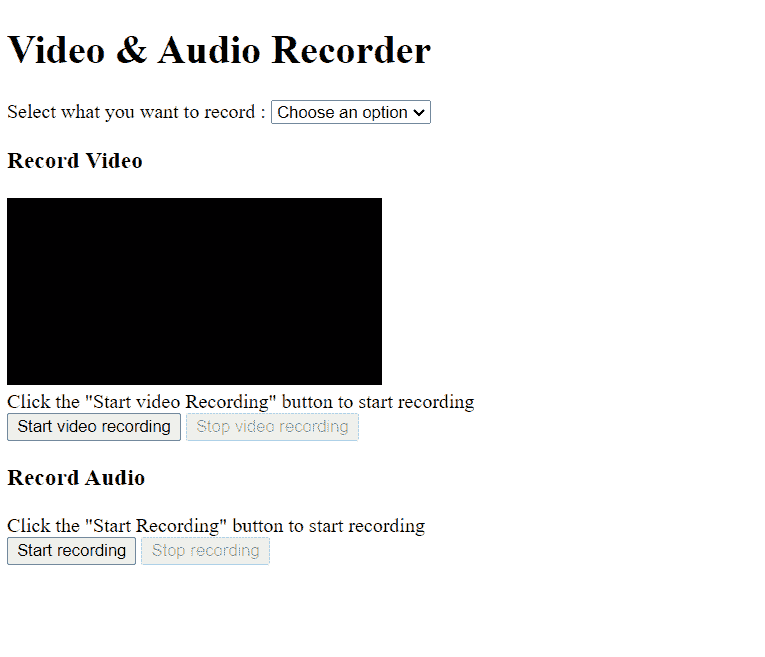
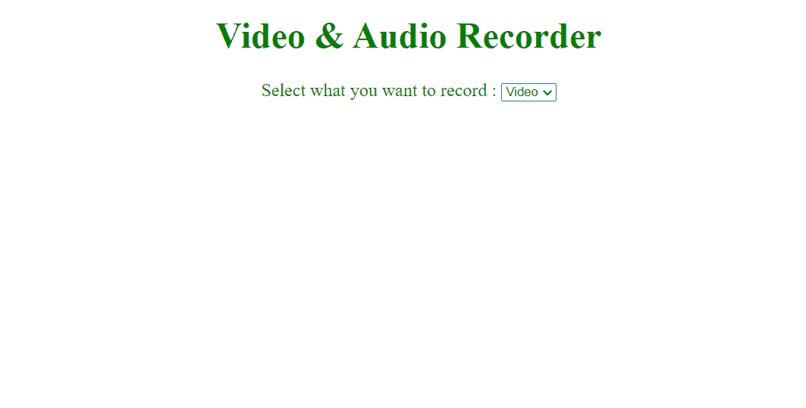
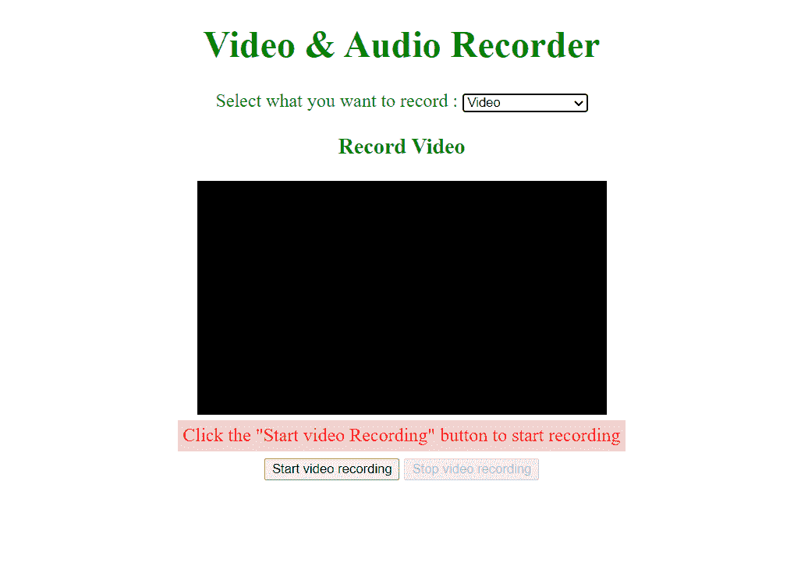
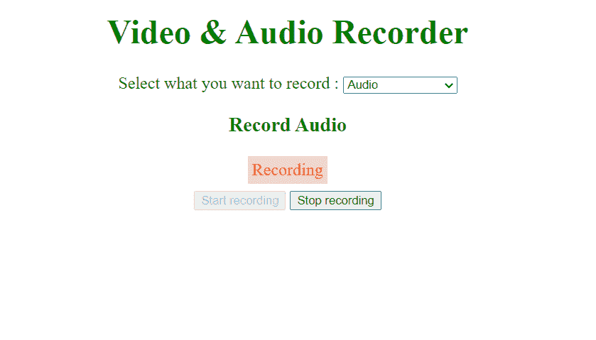
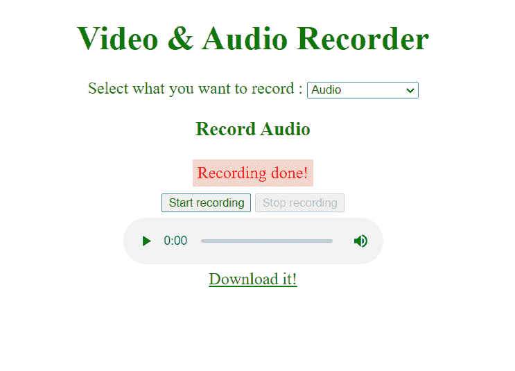

# 使用 JavaScript `MediaRecorder` API 创建视频和音频记录器

> 原文:[https://www . geesforgeks . org/create-a-video-audio-recorder-with-JavaScript-media recorder-API/](https://www.geeksforgeeks.org/create-a-video-and-audio-recorder-with-javascript-mediarecorder-api/)

WebRTC 在访问设备摄像头和设备麦克风以及在浏览器中流式传输视频或音频媒体方面非常受欢迎。但是在许多情况下，我们可能需要记录流以备将来使用或供用户使用(比如用户可能想要下载流，等等。).在这种情况下，我们可以使用 MediaRecorder API 来记录媒体流。

在本文中，我们将使用纯 JavaScript 及其 MediaRecorder API 创建一个基本的视频和音频记录器网站。

**项目描述:**我们正在建设的网站将有-

*   一个选择选项，让用户选择要录制的媒体类型(音频或带音频的视频)。
*   如果用户选择录制视频，浏览器将请求访问设备摄像头和麦克风的许可，如果用户允许，则—
    *   视频元素将显示摄像机媒体流
    *   **“开始录制”**按钮将开始录制
    *   **“停止录制”**按钮将停止录制。
    *   录制完成后，将显示包含录制媒体的新视频元素。
    *   让用户下载录制视频的链接。
*   如果用户选择只录制音频，则浏览器将请求允许访问麦克风，如果用户允许，则—
    *   **“开始录制”**按钮将开始录制
    *   **“停止录制”**按钮将停止录制
    *   录制完成后，将显示包含录制音频的新音频元素。
    *   给出一个链接，让用户下载录制的音频。

因此，让我们首先建立我们的简单的 HTML 页面——

## index.html

```html
<!DOCTYPE html>
<html lang="en">

<head>
    <meta charset="UTF-8">
    <meta http-equiv="X-UA-Compatible" 
        content="IE=edge">
    <meta name="viewport" content=
        "width=device-width, initial-scale=1.0">
    <link rel="stylesheet" href="index.css">
    <title>Video & Audio Recorder</title>
</head>

<body>
    <h1> Video & Audio Recorder </h1>
    <label for="media">
        Select what you want to record:
    </label>

    <select id="media">
        <option value="choose-an-option"> 
            Choose an option
        </option>
        <option value="vid">Video</option>
        <option value="aud">Audio</option>
    </select>

    <div class="display-none" id="vid-recorder">
        <h3>Record Video </h3>
        <video autoplay id="web-cam-container" 
            style="background-color: black;">
            Your browser doesn't support 
            the video tag
        </video>

        <div class="recording" id="vid-record-status">
            Click the "Start video Recording" 
            button to start recording
        </div>

        <!-- This button will start the video recording -->
        <button type="button" id="start-vid-recording" 
            onclick="startRecording(this, 
            document.getElementById('stop-vid-recording'))">
            Start video recording
        </button>

        <!-- This button will stop the video recording -->
        <button type="button" id="stop-vid-recording" 
            disabled onclick="stopRecording(this, 
            document.getElementById('start-vid-recording'))">
            Stop video recording
        </button>

        <!--The video element will be created using 
            JavaScript and contains recorded video-->
        <!-- <video id="recorded-video"  controls>
            Your browser doesn't support the video tag
        </video> -->

        <!-- The below link will let the
             users download the recorded video -->
        <!-- <a href="" > Download it! </a> -->
    </div>

    <div class="display-none" id="aud-recorder">
        <h3> Record Audio</h3>

        <div class="recording" id="aud-record-status">
            Click the "Start Recording" 
            button to start recording
        </div>

        <button type="button" id="start-aud-recording" 
            onclick="startRecording(this, 
            document.getElementById('stop-aud-recording'))">
            Start recording 
        </button>

        <button type="button" id="stop-aud-recording" 
            disabled onclick="stopRecording(this, 
            document.getElementById('start-aud-recording'))">
            Stop recording
        </button>

        <!-- The audio element will contain the 
            recorded audio and will be created 
            using Javascript -->
        <!-- <audio id="recorded-audio" 
            controls></audio> -->

        <!-- The below link will let the users 
             download the recorded audio -->
        <!-- <a href="" > Download it! </a> -->
    </div>

    <script src="index.js"></script>
</body>

</html>
```

**输出:**



如果您仔细查看*index.html*，您会看到视频和音频标签没有给出任何来源，我们稍后会使用 JavaScript 添加来源。现在，我们有一个选择选项，让用户选择他们想要录制的媒体类型。**“视频记录器”** div 元素中的第一个视频元素将包含网络摄像头流，评论中的视频元素将包含录制的视频。请注意，只有最后一个视频元素具有**“控件”**属性，因为第一个视频元素将包含该流，并且不需要任何控件。

在**“aud-recorder”**div 中，我们有两个按钮来开始和停止录制，评论的音频元素将包含录制的音频。

现在，让我们给网页添加一些 CSS

## index.css

```html
body {
    text-align: center;
    color: green;
    font-size: 1.2em;
}

.display-none {
    display: none;
}

.recording {
    color: red;
    background-color: rgb(241 211 211);
    padding: 5px;
    margin: 6px auto;
    width: fit-content;
}

video {
    background-color: black;
    display: block;
    margin: 6px auto;
    width: 420px;
    height: 240px;
}

audio {
    display: block;
    margin: 6px auto;
}

a {
    color: green;
}
```

**输出:**



目前，我们已经在**【视频记录器】**和**【音频记录器】**div 中添加了**【显示-无】**类。因为我们希望根据用户的选择显示正确的记录器。

现在，让我们使用 JavaScript 实现只显示用户选择的记录器的逻辑

## index.js

```html
const mediaSelector = document.getElementById("media");
let selectedMedia = null;

// Handler function to handle the "change" event
// when the user selects some option
mediaSelector.addEventListener("change", (e) => {
    selectedMedia = e.target.value;
    document.getElementById(
      `${selectedMedia}-recorder`).style.display = "block";
    document.getElementById(
      `${otherRecorder(selectedMedia)}-recorder`)
      .style.display = "none";
});

function otherRecorder(selectedMedia) {
    return selectedMedia === "vid" ? "aud" : "vid";
}
```

**输出:**当用户选择**“视频”**时，显示以下录像机——



同样，当用户选择**“音频”**选项时，录音机显示——


上述代码仅显示用户选择的录像机，即音频或视频。我们在 mediaSelector 元素中添加了一个**“change”**事件监听器，当 select 元素的值发生变化时，它会发出一个**“change”**事件，该事件由给定的回调函数处理。回调函数将所选媒体录制器的 CSS **“显示”**属性更改为**“阻止”**，其他媒体录制器更改为**“无”**。

**访问网络摄像头和麦克风:**通过 WebRTC getUserMedia API 可以访问设备摄像头和麦克风。getUserMedia()方法返回一个 Promise，该 Promise 解析为包含基于给定规范的媒体内容(媒体轨道流)的媒体流。getUserMedia()方法将 MediaStreamConstraints 对象作为参数，该参数定义了结果媒体流应该匹配的所有约束。

```html
const mediaStreamConstraints = {
   audio: true,
   video: true
};
// The above MediaStreamConstraints object 
// specifies that the resulting media must have
// both the video and audio media content or tracks.

// The mediaStreamConstraints object is passed to 
// the getUserMedia method
navigator.mediaDevices.getUserMedia( MediaStreamConstraints )
.then( resultingMediaStream => {
   // Code to use the received media stream
});
```

当调用 getUserMedia 方法时，浏览器会提示用户请求使用设备摄像头和麦克风的权限。如果用户允许，那么 getUserMedia 返回的承诺解析为结果媒体流，否则抛出**notallowederor**异常。在上述代码中，接收的媒体流包含视频和音频媒体数据。

因此，将下面几行代码添加到 index.js 文件中:

## index.js

```html
const mediaSelector = 
    document.getElementById("media");

// Added code
const webCamContainer = document
    .getElementById('web-cam-container');

let selectedMedia = null;

/* Previous code 
...
Added code */

const audioMediaConstraints = {
    audio: true,
    video: false
};

const videoMediaConstraints = {
    // or you can set audio to false 
    // to record only video
    audio: true,
    video: true
};

function startRecording(thisButton, otherButton) {

    navigator.mediaDevices.getUserMedia(
            selectedMedia === "vid" ? 
            videoMediaConstraints : 
            audioMediaConstraints)
        .then(mediaStream => {
            // Use the mediaStream in 
            // your application

            // Make the mediaStream global
            window.mediaStream = mediaStream;

            if (selectedMedia === 'vid') {

                // Remember to use the "srcObject" 
                // attribute since the "src" attribute 
                // doesn't support media stream as a value
                webCamContainer.srcObject = mediaStream;
            }

            document.getElementById(
                `${selectedMedia}-record-status`)
                .innerText = "Recording";
            thisButton.disabled = true;
            otherButton.disabled = false;
        });

}

function stopRecording(thisButton, otherButton) {

    // Stop all the tracks in the received 
    // media stream i.e. close the camera
    // and microphone
    window.mediaStream.getTracks().forEach(track => {
        track.stop();
    });

    document.getElementById(
        `${selectedMedia}-record-status`)
        .innerText = "Recording done!";

    thisButton.disabled = true;
    otherButton.disabled = false;
}
```

*开始录制*功能调用*navigator . mediadevices . getuser media()*方法访问设备摄像头和麦克风，禁用**“开始录制”**按钮，启用**“停止录制”**按钮。而 *stopRecording* 功能通过调用媒体流使用的每个媒体轨道的**“stop()”**方法关闭摄像头和麦克风，禁用**“停止录制”**按钮，启用**“开始录制”**按钮。

**实施记录仪:**到现在为止，我们只接入了网络摄像头和麦克风，没有做任何记录媒体的事情。

要录制媒体流，我们首先需要使用 MediaRecorder 构造函数创建一个 MediaRecorder 实例(用于录制媒体流的接口)。

MediaRecorder 构造函数采用两个参数—

*   **流:**流就像数据流(任何类型的数据)。在本文中，我们将使用 MediaStream，它基本上是媒体(视频或音频或两者)数据或媒体内容的流。
*   **选项(可选):**包含一些录制规范的对象。您可以设置录制媒体的 MIME 类型、音频比特率、视频比特率等。MIME-type 是一种表示录制的媒体文件格式的标准(例如，两种 MIME 类型— **“音频/webm”、“视频/mp4”**分别表示音频 webm 文件和视频 MP4 文件)。

**语法:**

```html
const mediaRecorder = new MediaRecorder(
    stream, { mimeType: "audio/webm" });
```

上面一行代码创建了一个新的 MediaRecorder 实例，该实例记录给定的流，并将其存储为音频 WebM 文件。

因此，修改您的 index.js 文件:

## index.js 文件

```html
/* Previous code 
... */

function startRecording(thisButton, otherButton) {

    navigator.mediaDevices.getUserMedia(
        selectedMedia === "vid" ?
        videoMediaConstraints :
        audioMediaConstraints)

    .then(mediaStream => {

        /* New code */
        // Create a new MediaRecorder 
        // instance that records the 
        // received mediaStream
        const mediaRecorder = 
            new MediaRecorder(mediaStream);

        // Make the mediaStream global
        window.mediaStream = mediaStream;

        // Make the mediaRecorder global
        // New line of code
        window.mediaRecorder = mediaRecorder;

        if (selectedMedia === 'vid') {

            // Remember to use the srcObject 
            // attribute since the src attribute 
            // doesn't support media stream as a value
            webCamContainer.srcObject = mediaStream;
        }

        document.getElementById(
            `${selectedMedia}-record-status`)
            .innerText = "Recording";

        thisButton.disabled = true;
        otherButton.disabled = false;
    });
}

/* Remaining code 
...*/
```

当 **startRecording()函数**被调用时，它会创建一个 MediaRecorder 实例来记录接收到的媒体流。现在，我们需要使用创建的 MediaRecorder 实例。MediaRecorder 提供了一些有用的方法，我们可以在这里使用——

*   **start():** 调用此方法时，MediaRecorder 实例开始记录给定的媒体流。可选地将**“时间片”**作为参数，指定该参数将导致在该时间片持续时间的小的独立块中记录给定的媒体。
*   **暂停():**被调用时，暂停录制
*   **恢复():**调用**暂停()方法**后调用，恢复录制。
*   **stop():** 被调用时，停止记录并触发包含保存数据的最终 Blob 的**“数据可用”**事件。
*   **requestData() :** 调用时，请求包含保存至今的数据的 Blob。

同样，媒体记录器也提供了一些有用的事件处理程序——

*   **on data available:**T2“数据可用”事件的事件处理程序。每当记录媒体数据的时间片(如果指定)毫秒或记录完成时(如果未指定时间片)，媒体记录器发出带有记录的斑点数据的**“数据可用”**事件。该数据可从**“事件”**的**“数据”**属性中获得-

```html
mediaRecorder.ondataavailable = ( event ) => {
  const recordedData = event.data;
}
```

*   **on top:**media recorder 发出的**“停止”**事件的事件处理程序。当调用 MediaRecorder.stop()方法或相应的 MediaStream 停止时，会发出此事件。
*   **一个错误:**处理程序，用于处理**“错误”**事件，该事件在使用 MediaRecorder 时发生错误时发出。事件的**“错误”**属性包含错误的详细信息—

```html
mediaRecorder.onerror = ( event ) => {
  console.log(event.error);
}
```

*   **onstart:**media recorder 开始录制时发出的“开始”事件的处理程序。
*   **onpause:** 用于“暂停”事件的处理程序。暂停录制时会发出此事件。
*   **onresume :** 恢复事件的处理程序。暂停后再次恢复录制时会发出此事件。

现在，我们需要使用其中的一些方法和事件处理程序来使我们的项目工作。

## index.js

```html
const mediaSelector = document.getElementById("media");

const webCamContainer =
    document.getElementById("web-cam-container");

let selectedMedia = null;

// This array stores the recorded media data
let chunks = [];

// Handler function to handle the "change" event
// when the user selects some option
mediaSelector.addEventListener("change", (e) => {

    // Takes the current value of the mediaSeletor
    selectedMedia = e.target.value;

    document.getElementById(
        `${selectedMedia}-recorder`)
            .style.display = "block";

    document.getElementById(
            `${otherRecorderContainer(
            selectedMedia)}-recorder`)
        .style.display = "none";
});

function otherRecorderContainer(
    selectedMedia) {

    return selectedMedia === "vid" ? 
        "aud" : "vid";
}

// This constraints object tells 
// the browser to include only 
// the audio Media Track
const audioMediaConstraints = {
    audio: true,
    video: false,
};

// This constraints object tells 
// the browser to include
// both the audio and video
// Media Tracks
const videoMediaConstraints = {

    // or you can set audio to
    // false to record
    // only video
    audio: true,
    video: true,
};

// When the user clicks the "Start 
// Recording" button this function
// gets invoked
function startRecording(
    thisButton, otherButton) {

    // Access the camera and microphone
    navigator.mediaDevices.getUserMedia(
        selectedMedia === "vid" ? 
        videoMediaConstraints :
        audioMediaConstraints)
        .then((mediaStream) => {

        // Create a new MediaRecorder instance
        const mediaRecorder = 
            new MediaRecorder(mediaStream);

        //Make the mediaStream global
        window.mediaStream = mediaStream;
        //Make the mediaRecorder global
        window.mediaRecorder = mediaRecorder;

        mediaRecorder.start();

        // Whenever (here when the recorder
        // stops recording) data is available
        // the MediaRecorder emits a "dataavailable" 
        // event with the recorded media data.
        mediaRecorder.ondataavailable = (e) => {

            // Push the recorded media data to
            // the chunks array
            chunks.push(e.data);
        };

        // When the MediaRecorder stops
        // recording, it emits "stop"
        // event
        mediaRecorder.onstop = () => {

            /* A Blob is a File like object.
            In fact, the File interface is 
            based on Blob. File inherits the 
            Blob interface and expands it to
            support the files on the user's 
            systemThe Blob constructor takes 
            the chunk of media data as the 
            first parameter and constructs 
            a Blob of the type given as the 
            second parameter*/
            const blob = new Blob(
                chunks, {
                    type: selectedMedia === "vid" ?
                        "video/mp4" : "audio/mpeg"
                });
            chunks = [];

            // Create a video or audio element
            // that stores the recorded media
            const recordedMedia = document.createElement(
                selectedMedia === "vid" ? "video" : "audio");
            recordedMedia.controls = true;

            // You can not directly set the blob as 
            // the source of the video or audio element
            // Instead, you need to create a URL for blob
            // using URL.createObjectURL() method.
            const recordedMediaURL = URL.createObjectURL(blob);

            // Now you can use the created URL as the
            // source of the video or audio element
            recordedMedia.src = recordedMediaURL;

            // Create a download button that lets the 
            // user download the recorded media
            const downloadButton = document.createElement("a");

            // Set the download attribute to true so that
            // when the user clicks the link the recorded
            // media is automatically gets downloaded.
            downloadButton.download = "Recorded-Media";

            downloadButton.href = recordedMediaURL;
            downloadButton.innerText = "Download it!";

            downloadButton.onclick = () => {

                /* After download revoke the created URL
                using URL.revokeObjectURL() method to 
                avoid possible memory leak. Though, 
                the browser automatically revokes the 
                created URL when the document is unloaded,
                but still it is good to revoke the created 
                URLs */
                URL.revokeObjectURL(recordedMedia);
            };

            document.getElementById(
                `${selectedMedia}-recorder`).append(
                recordedMedia, downloadButton);
        };

        if (selectedMedia === "vid") {

            // Remember to use the srcObject
            // attribute since the src attribute
            // doesn't support media stream as a value
            webCamContainer.srcObject = mediaStream;
        }

        document.getElementById(
                `${selectedMedia}-record-status`)
                .innerText = "Recording";

        thisButton.disabled = true;
        otherButton.disabled = false;
    });
}

function stopRecording(thisButton, otherButton) {

    // Stop the recording
    window.mediaRecorder.stop();

    // Stop all the tracks in the 
    // received media stream
    window.mediaStream.getTracks()
    .forEach((track) => {
        track.stop();
    });

    document.getElementById(
            `${selectedMedia}-record-status`)
            .innerText = "Recording done!";
    thisButton.disabled = true;
    otherButton.disabled = false;
}
```

**输出:**

假设用户选择了录音机—


现在，如果用户点击开始录制按钮，那么—



当点击**“停止录制”**按钮时——



它显示录制的音频，并提供下载录制音频的链接。

**那么，startRecording()函数是做什么的呢？**

*   它调用**navigator . mediadevices . getuser media()**方法并访问设备摄像头或麦克风或两者。此方法返回解析为媒体流的承诺。
*   接收到媒体流后，它会创建一个可以记录给定媒体流的 MediaRecorder 实例，使 MediaStream 和 MediaRecorder 都成为全局的，这样我们就可以在 startRecording 函数之外使用它们——

```html
window.mediaStream = mediaStream;
window.mediaRecorder  = mediaRecorder;
```

*   通过调用 MediaRecorder.start()方法开始给定媒体流的录制。

```html
mediaRecorder.start();
```

*   为创建的媒体录制器定义事件处理程序。**“数据可用”**事件处理函数将记录的数据推送到块数组(记录的媒体数据块数组)。**“停止”**事件处理程序功能。
    *   使用 Blob()构造函数从区块数组创建一个新的 Blob。
    *   重新初始化区块数组
    *   使用 URL.createObjectURL()方法为创建的 Blob 创建一个 URL。
    *   将新创建的**“视频”** / **“音频”**元素的来源设置为创建的 URL。
    *   创建一个链接来下载录制的媒体，并在使用 URL.revokeObjectURL()方法单击链接后撤销创建的 URL。
*   禁用“开始录制”按钮，启用**“停止录制”**按钮。

**stop recording()函数是做什么的？**

*   通过调用 **MediaRecorder.stop()方法**停止录制。
*   停止媒体流的所有媒体轨道，即关闭摄像机和麦克风
*   禁用**“停止录制”**按钮，启用**“开始录制”**按钮。