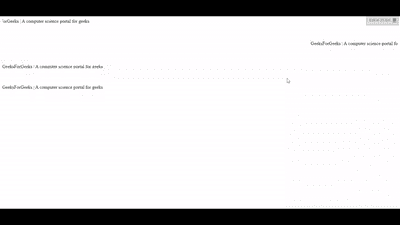
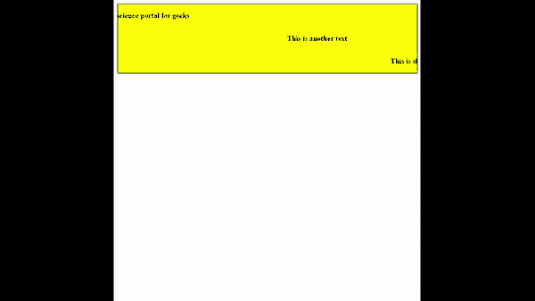

# 使用 JavaScript 创建字幕文本效果

> 原文:[https://www . geesforgeks . org/create-the-marquee-text-effect-use-JavaScript/](https://www.geeksforgeeks.org/create-the-marquee-text-effect-using-javascript/)

在本文中，我们将使用 JavaScript 创建字幕文本。使用 **<选框>** 标签可以达到这个效果，但是选框已经被**弃用**了，新网站不使用这个标签。仍然有一些浏览器支持这个标签，但是为了安全起见，你不应该使用这个标签。下面是品牌标签如何工作的例子。

**示例:**在本例中，我们将使用 [HTML 字幕标签](https://www.geeksforgeeks.org/html-marquee-tag/)。

## 超文本标记语言

```html
<!DOCTYPE html>
<html>

<head>
    <meta charset="utf-8">
    <meta name="viewport" content="width=device-width">
    <title>Marquee tag example</title>
</head>

<body>
    <marquee>
        GeeksForGeeks | A computer science portal for geeks
    </marquee>
    <br><br><br><br>
    <marquee direction="right">
        GeeksForGeeks | A computer science portal for geeks
    </marquee>
    <br><br><br><br>
    <marquee direction="up">
        GeeksForGeeks | A computer science portal for geeks
    </marquee>
    <br><br><br><br>
    <marquee direction="down">
        GeeksForGeeks | A computer science portal for geeks
    </marquee>

</body>

</html>
```

**输出:**



**注意:**不要在代码内部使用 marquee 标签，因为它已被弃用，将来可能会破坏您的代码。

**使用 Javascript :** 为了避免字幕标签被贬低，可以实现自己的 Javascript 代码来达到这个效果。首先，我们创建一个 HTML 骨架。创建一个 **div** 标签，在 div 标签中创建一些< **p** >标签来保存你的文本。

**HTML 代码:**

## 超文本标记语言

```html
<!DOCTYPE html>
<html>
<body>
    <div id="main">
        <p class="para" id="para1">
            Geeksforgeeks | 
            A computer science portal for geeks
        </p>

        <p class="para" id="para2">
            This is another text
        </p>

        <p class="para" id="para3">
            This is the third line of the 
            example line of the example.
        </p>

    </div>
</body>

</html>
```

**CSS 代码:**现在给代码添加一些 CSS。在包装 div(所有< p >标签都位于其中)中，隐藏溢出(这是必要的)并设置您选择的背景颜色、边框、宽度。而在 **< p >** 标签中应该有三个必要属性**空格、浮动**、**和清除。**空格应设置为 **nowrap** ，浮动为 **left** ，同时清除为**和您选择的其他设计属性。**

## **半铸钢ˌ钢性铸铁(Cast Semi-Steel)**

```html
<style>
  #main{
      border: 1px solid;
      background: yellow;
      width: 100%;
      overflow: hidden;
     }

    .para{
      color: black;
      font-weight: bold;
      white-space: nowrap;
      clear: both;
      float: left;
    }
</style>
```

****JavaScript 代码:**现在添加逻辑的主要部分是移动文本。我们所做的是减少< p >元素的左边距属性，当元素变得不可见时，我们再次指定左边距等于< p >元素的父元素的宽度。这些是实现这个逻辑的一步一步的过程。**

*   **创建一个名为元素宽度的变量，并指定

    元素的偏移量** 
*   **创建一个变量名 parentWidth，并指定

    元素的父元素的偏移量。** 
*   **创建标志变量并用 0 初始化它**
*   **创建一个刷新率为 10 毫秒的设置间隔。**
*   **每隔一段时间降低标志值，并将该值设置为左边距属性。**
*   **如果标志的负值等于元素的宽度，则将左边距的值设置为等于父元素的宽度。**

## **java 描述语言**

```html
const para1 = document.getElementById("para1");
const para2 = document.getElementById("para2");
const para3 = document.getElementById("para3");

animate(para1);
animate(para2);
animate(para3);

function animate(element) {
    let elementWidth = element.offsetWidth;
    let parentWidth = element.parentElement.offsetWidth;
    let flag = 0;

    setInterval(() => {
        element.style.marginLeft = --flag + "px";

        if (elementWidth == -flag) {
            flag = parentWidth;
        }
    }, 10);
}
```

****输出:**结合以上三个部分后，我们会看到类似这样的内容。**

****