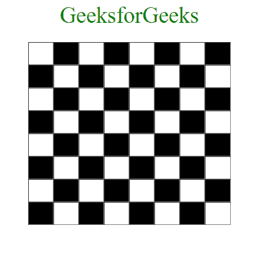

# 使用 JavaScript 和 DOM 创建棋盘图案

> 原文:[https://www . geesforgeks . org/creating-a-棋盘-pattern-with-JavaScript-and-DOM/](https://www.geeksforgeeks.org/creating-a-chessboard-pattern-with-javascript-and-dom/)

使用 JavaScript 和文档对象模块的概念可以非常容易地创建棋盘模式。使用这种方法，只需调整几个参数，就可以创建一个任意行数和列数的棋盘。此外，使用此方法编写的代码行也比使用纯 HTML 和 CSS 创建的代码行少得多，尤其是当行数和列数非常大时。

**方法:**为循环创建嵌套。让我们称外环为“I”，内环为“j”。外部循环将用于创建行，内部循环将用于在每列中创建单元格。通过这样做，将创建一个 N*M 个单元，其中 N 是行数，M 是列数。内环中 I 和 j 值的组合可用于区分如此形成的每个单元。在循环结束时，我们将创建一个表。此外，我们需要用适当的颜色给细胞着色。如果 I 和 j 的和产生一个偶数，那么这个单元必须被涂成白色，否则它必须被涂成黑色。这将创建白色和黑色交替颜色的细胞，就像在棋盘上看到的那样。表格和表格单元格的创建可以使用 DOM 完成，单元格的着色可以使用 CSS 完成。

下面是上述方法的实现。

**文件名:index.html**

## 超文本标记语言

```html
<!DOCTYPE html>
<html>

<head>
    <title>Chess board</title>
    <style>
        body {
            text-align: center;
        }

        .cell {
            height: 30px;
            width: 30px;
            border: 1.5px solid grey;
            border-style: inset;
        }

        .blackcell {
            background-color: black;
        }

        .whitecell {
            background-color: white;
        }
    </style>
</head>

<body>
    <span style="color:green; font-size:30px;">
        GeeksforGeeks
    </span>
    <br><br>

    <script type="text/javascript">

        // Create a center tag to center all the elements
        var center = document.createElement('center');

        // Create a table element
        var ChessTable = document.createElement('table');
        for (var i = 0; i < 8; i++) {

            // Create a row
            var tr = document.createElement('tr');
            for (var j = 0; j < 8; j++) {

                // Create a cell
                var td = document.createElement('td');

                // If the sum of cell coordinates is even
                // then color the cell white
                if ((i + j) % 2 == 0) {

                    // Create a class attribute for all white cells
                    td.setAttribute('class', 'cell whitecell');
                    tr.appendChild(td);
                }

                // If the sum of cell coordinates is odd then
                // color the cell black
                else {

                    // Create a class attribute for all black cells
                    td.setAttribute('class', 'cell blackcell');

                    // Append the cell to its row
                    tr.appendChild(td);
                }
            }

            // Append the row
            ChessTable.appendChild(tr);
        }
        center.appendChild(ChessTable);

        // Modifying table attribute properties
        ChessTable.setAttribute('cellspacing', '0');
        ChessTable.setAttribute('width', '270px');
        document.body.appendChild(center);
    </script>
</body>

</html>
```

**输出:**



输出

**代码说明:**将为上述代码创建一个 8×8 的棋盘。然而，仅仅通过修改 I 和 j 的终止条件，我们就能够轻松地创建一个 N×M 棋盘。使用 Javascript DOM 最初使用 createElement()创建一个表元素。我们知道 I 循环用于创建行，因此在每次迭代期间都会创建一个行元素。同样，j 循环负责创建单元格。因此，在每次迭代期间都会创建表格单元。如前所述，每个单元格的颜色可以由 I 和 j 值的总和决定。如果和是偶数，那么单元格必须被涂成白色，如果是奇数，那么单元格必须被涂成黑色。这是通过使用 setAttribute()为每个单元格创建和分配适当的类属性，并使用 CSS 根据需要分配正确的颜色、大小和其他属性来实现的。最后，所有的元素都被附加到 HTML 文档的主体中。因此，我们能够非常容易地使用 javascript 和 DOM 创建一个简单的棋盘模式。