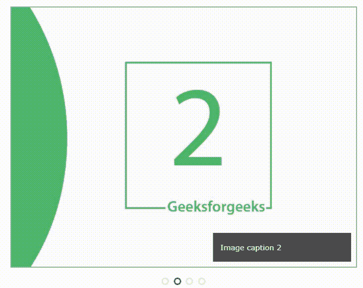

# JavaScript | 创建自定义图像滑块

> 原文:[https://www . geesforgeks . org/creating-custom-image-slider-JavaScript/](https://www.geeksforgeeks.org/creating-custom-image-slider-javascript/)

**什么是图像滑块？**

**图像滑块**或**图像转盘**是在网站上显示多个图像的一种便捷方式。诱人的浮华图片可以吸引许多访问者到网站。下图显示了一个示例图像滑块:


在这篇文章中，我们将使用 HTML、CSS 和 JavaScript 创建上面的图像滑块。让我们从创建图像滑块开始。

**步骤–1**:使用 HTML 创建图像滑块的结构，并插入来自各自来源的图像。下面是完成此操作的完整 HTML 代码:

```html
<!--HTML Code-->
<!-- Slideshow Container Div -->
<div class="container">

  <!-- Full-width images with caption text -->
  <div class="image-sliderfade fade">
    
    <div class="text">Image caption 1</div>
  </div>

  <div class="image-sliderfade fade">
    
    <div class="text">Image caption 2</div>
  </div>

  <div class="image-sliderfade fade">
    
    <div class="text">Image caption 3</div>
  </div>

  <div class="image-sliderfade fade">
    
    <div class="text">Image caption 4</div>
  </div>

</div>
<br>

<!-- The dots/circles -->
<div style="text-align:center">
  <span class="dot"></span> 
  <span class="dot"></span> 
  <span class="dot"></span> 
</div>
```

**步骤–2**:一旦我们已经为我们的图像滑块创建了 HTML 结构，下一步就是使用 CSS 为滑块设置样式。我们将为图像、背景等添加样式。我们还将设置圆点的样式，并使用 CSS 使我们的图像具有响应性和浏览器友好性。以下是用于设置图像滑块样式的完整 CSS 代码:

```html
// CSS code
* 
{
  box-sizing: border-box;
}
body 
{
  font-family: Verdana, sans-serif;
}

.image-sliderfade 
{
  display: none;
}

img 
{
  vertical-align: middle;
}

/* Slideshow container */
.container 
{
  max-width: 1000px;
  position: relative;
  margin: auto;
}

/* Caption text */
.text 
{
  color: #f2f2f2;
  font-size: 15px;
  padding: 20px 15px;
  position: absolute;
  right: 10px;
  bottom: 10px;
  width: 40%;
  background: rgba(0, 0, 0, .7);
  text-align: left;
}

/* The dots/bullets/indicators */
.dot 
{
  height: 15px;
  width: 15px;
  margin: 0 2px;
  background-color: transparent;
  border-color: #ddd;
  border-width: 5 px;
  border-style: solid;
  border-radius: 50%;
  display: inline-block;
  transition: border-color 0.6s ease;
}

.active 
{
  border-color: #666;
}

/* Animation */
.fade 
{
  -webkit-animation-name: fade-image;
  -webkit-animation-duration: 1.5s;
  animation-name: fade-image;
  animation-duration: 1.5s;
}

@-webkit-keyframes fade-image
{
  from {opacity: .4} 
  to {opacity: 1}
}

@keyframes fade-image
{
  from {opacity: .4} 
  to {opacity: 1}
}

/* On smaller screens, decrease text size */
@media only screen and (max-width: 300px) 
{
  .text {font-size: 11px}
}
```

**Step–3**:给滑块添加样式后，剩下的最后一件事就是用 javascript 添加特定时间间隔后图像自动变化的功能。
在下面的代码片段中，一开始，我们将类名为“image-sliderfade”的所有 div 元素放在一个数组中，并通过使用 getElementByClassName()侦听器对类名为“dots”的 div 进行同样的操作。之后，我们为所有包含图像的 div 设置显示。在最后一个 for 循环中，我们删除了数组点[]的每个元素的类名。完成这些后，我们将显示设置为要显示的图像块，并将类名附加到 dots[]数组的相应元素。函数 setTimeout 用于在 2 秒的时间间隔内调用函数 showslides()。

下面是完整的 JavaScript 代码:

```html
var slideIndex = 0;
showSlides(); // call showslide method

function showSlides()
{
    var i;

    // get the array of divs' with classname image-sliderfade
    var slides = document.getElementsByClassName("image-sliderfade"); 

    // get the array of divs' with classname dot
    var dots = document.getElementsByClassName("dot"); 

    for (i = 0; i < slides.length; i++) {
        // initially set the display to 
        // none for every image.
        slides[i].style.display = "none"; 
    }

     // increase by 1, Global variable
    slideIndex++; 

     // check for boundary
    if (slideIndex > slides.length) 
    {
        slideIndex = 1;
    }

    for (i = 0; i < dots.length; i++) {
        dots[i].className = dots[i].className.
                            replace(" active", "");
    }

    slides[slideIndex - 1].style.display = "block";
    dots[slideIndex - 1].className += " active";

    // Change image every 2 seconds
    setTimeout(showSlides, 2000); 
}
```

完成上述所有步骤后，我们将使滑块上升并按如下所示工作:
