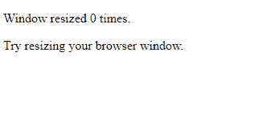
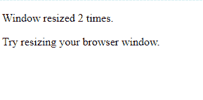
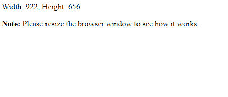
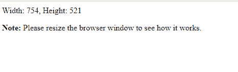

# 使用 JavaScript/jQuery 的跨浏览器窗口调整大小事件

> 原文:[https://www . geesforgeks . org/跨浏览器-窗口-调整大小-事件-使用-javascript-jquery/](https://www.geeksforgeeks.org/cross-browser-window-resize-event-using-javascript-jquery/)

**resize()方法**是 jQuery 中的一个内置方法，在浏览器窗口改变大小时使用。resize()方法触发 resize 事件或附加一个函数，以便在发生 resize 事件时运行。jQuery 有一个用于窗口调整大小事件的内置方法。

**语法:**

```
$(selector).resize(function)
```

此语法用于跨浏览器调整大小事件。

**示例 1:** 本示例使用 resize()方法统计浏览器窗口调整大小的次数。

```
<!DOCTYPE html>
<html>

<head>
    <script src=
"https://ajax.googleapis.com/ajax/libs/jquery/3.4.1/jquery.min.js">
  </script>
    <script>
        var x = 1;
        $(document).ready(function() {
            $(window).resize(function() {
                $("span").text(x += 1);
            });
        });
    </script>
</head>

<body>

    <p>Window resized <span>0</span> times.</p>
    <p>Try resizing your browser window.</p>

</body>

</html>
```

**输出:**

*   **调整浏览器窗口大小前:**
    
*   **调整浏览器窗口大小后:**
    

您可以使用 addEventListener()方法注册一个事件处理程序来侦听浏览器窗口大小调整事件，例如 window . addEventListener(' resize '，…)。

**语法:**

```
object.addEventListner("resize", myscript);
```

**示例 2:** 本示例显示调整窗口大小。

```
<!DOCTYPE html>
<html lang="en">

<head>
    <meta charset="utf-8">
    <title>JavaScript Window Resize Event</title>
</head>

<body>
    <div id="result"></div>

    <script>

        // Defining event listener function
        function displayWindowSize() {

            // Get width and height of the window
            // excluding scrollbars
            var w = document.documentElement.clientWidth;
            var h = document.documentElement.clientHeight;

            // Display result inside a div element
            document.getElementById("result").innerHTML
                  = "Width: " + w + ", " + "Height: " + h;
        }

        // Attaching the event listener function
        // to window's resize event
        window.addEventListener("resize", displayWindowSize);

        // Calling the function for the first time
        displayWindowSize();
    </script>

    <p>
        <strong>Note:</strong> Please resize the browser
        window to see how it works.
    </p>
</body>

</html>
```

**输出:**

*   **调整浏览器窗口大小前:**
    
*   **调整浏览器窗口大小后:**
    