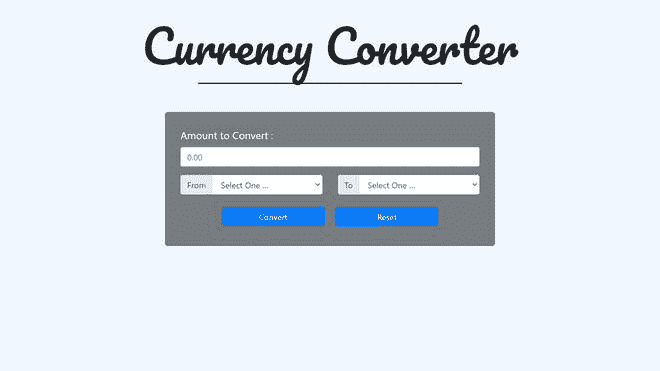
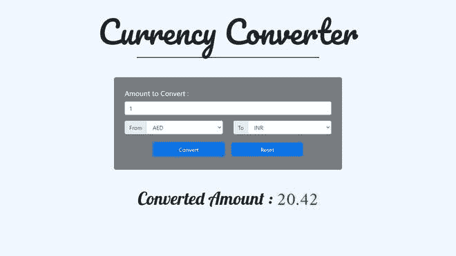

# JavaScript 中的货币转换器

> 原文:[https://www . geesforgeks . org/currency-converter-in-JavaScript/](https://www.geeksforgeeks.org/currency-converter-in-javascript/)

在本文中，我们将实现一个**货币转换器**，简单地将货币转换成任何其他国家的货币。

**先决条件:**

*   基础[HTML](https://www.geeksforgeeks.org/html-tutorials/)[CSS](https://www.geeksforgeeks.org/css-tutorials/)[JavaScript](https://www.geeksforgeeks.org/javascript-tutorial/)**。**

**进场:**

*   为用户输入金额和两种货币的图形用户界面实现了 HTML 代码。
*   选择币种，**折算**按钮显示折算金额。
*   **复位**按钮复位数据。
*   像 [addEventListener()](https://www.geeksforgeeks.org/javascript-addeventlistener-with-examples/) 一样，使用 JavaScript 函数和自定义方法实现货币转换。
*   脚本文件中使用了货币兑换 API。

**HTML 代码:**下面的 HTML 代码实现了用户输入的图形用户界面，如金额和需要进行转换的货币。

## index.html

```html
<!DOCTYPE html>
<html lang="en">

<head>
    <meta charset="UTF-8">
    <meta http-equiv="X-UA-Compatible" content="IE=edge">
    <meta name="viewport" content="width=device-width, initial-scale=1.0">

    <title>Currency Converter</title>

    <link rel="stylesheet" 
          href=
"https://maxcdn.bootstrapcdn.com/bootstrap/4.5.2/css/bootstrap.min.css">
    <script src=
"https://ajax.googleapis.com/ajax/libs/jquery/3.5.1/jquery.min.js">
    </script>
    <script src=
"https://cdnjs.cloudflare.com/ajax/libs/popper.js/1.16.0/umd/popper.min.js">
    </script>
    <script src=
"https://maxcdn.bootstrapcdn.com/bootstrap/4.5.2/js/bootstrap.min.js">
    </script>

    <link rel="preconnect" 
          href="https://fonts.gstatic.com">
    <link href=
"https://fonts.googleapis.com/css2?family=Amiri&family=Lobster&family=Pacifico&display=swap" 
          rel="stylesheet">

    <!-- linking style.css file-->
    <link rel="stylesheet" href="style.css">
</head>

<body>

    <!-- Currency Converter  -->
    <h1 class="heading text-center display-2">
        Currency Converter</h1>

    <hr>
    <div class="container">

        <div class="main">

            <div class="form-group">
                <label for="oamount">
                    Amount to Convert : 
                </label>
                <input type="text" 
                       class="form-control searchBox" 
                       placeholder="0.00" 
                       id="oamount">
            </div>

            <div class="row">
                <div class="col-sm-6">
                    <div class="input-group mb-3">
                        <div class="input-group-prepend">
                            <span class="input-group-text">From</span>
                        </div>
                        <select class="form-control from" id="sel1">
                            <option value="">Select One …</option>
                            <option value="USD">USD</option>
                            <option value="AED">AED</option>
                            <option value="ARS">ARS</option>
                            <option value="AUD">AUD</option>
                            <option value="BGN">BGN</option>
                            <option value="BRL">BRL</option>
                            <option value="BSD">BSD</option>
                            <option value="CAD">CAD</option>
                            <option value="CHF">CHF</option>
                            <option value="CLP">CLP</option>
                            <option value="CNY">CNY</option>
                            <option value="COP">COP</option>
                            <option value="CZK">CZK</option>
                            <option value="DKK">DKK</option>
                            <option value="DOP">DOP</option>
                            <option value="EGP">EGP</option>
                            <option value="EUR">EUR</option>
                            <option value="FJD">FJD</option>
                            <option value="GBP">GBP</option>
                            <option value="GTQ">GTQ</option>
                            <option value="HKD">HKD</option>
                            <option value="HRK">HRK</option>
                            <option value="HUF">HUF</option>
                            <option value="IDR">IDR</option>
                            <option value="ILS">ILS</option>
                            <option value="INR">INR</option>
                            <option value="ISK">ISK</option>
                            <option value="JPY">JPY</option>
                            <option value="KRW">KRW</option>
                            <option value="KZT">KZT</option>
                            <option value="MVR">MVR</option>
                            <option value="MXN">MXN</option>
                            <option value="MYR">MYR</option>
                            <option value="NOK">NOK</option>
                            <option value="NZD">NZD</option>
                            <option value="PAB">PAB</option>
                            <option value="PEN">PEN</option>
                            <option value="PHP">PHP</option>
                            <option value="PKR">PKR</option>
                            <option value="PLN">PLN</option>
                            <option value="PYG">PYG</option>
                            <option value="RON">RON</option>
                            <option value="RUB">RUB</option>
                            <option value="SAR">SAR</option>
                            <option value="SEK">SEK</option>
                            <option value="SGD">SGD</option>
                            <option value="THB">THB</option>
                            <option value="TRY">TRY</option>
                            <option value="TWD">TWD</option>
                            <option value="UAH">UAH</option>
                            <option value="UYU">UYU</option>
                            <option value="ZAR">ZAR</option>
                        </select>
                    </div>
                </div>

                <div class="col-sm-6">
                    <div class="input-group mb-3">
                        <div class="input-group-prepend">
                            <span class="input-group-text">To</span>
                        </div>
                        <select class="form-control to" id="sel2">
                            <option value="">Select One …</option>
                            <option value="USD">USD</option>
                            <option value="AED">AED</option>
                            <option value="ARS">ARS</option>
                            <option value="AUD">AUD</option>
                            <option value="BGN">BGN</option>
                            <option value="BRL">BRL</option>
                            <option value="BSD">BSD</option>
                            <option value="CAD">CAD</option>
                            <option value="CHF">CHF</option>
                            <option value="CLP">CLP</option>
                            <option value="CNY">CNY</option>
                            <option value="COP">COP</option>
                            <option value="CZK">CZK</option>
                            <option value="DKK">DKK</option>
                            <option value="DOP">DOP</option>
                            <option value="EGP">EGP</option>
                            <option value="EUR">EUR</option>
                            <option value="FJD">FJD</option>
                            <option value="GBP">GBP</option>
                            <option value="GTQ">GTQ</option>
                            <option value="HKD">HKD</option>
                            <option value="HRK">HRK</option>
                            <option value="HUF">HUF</option>
                            <option value="IDR">IDR</option>
                            <option value="ILS">ILS</option>
                            <option value="INR">INR</option>
                            <option value="ISK">ISK</option>
                            <option value="JPY">JPY</option>
                            <option value="KRW">KRW</option>
                            <option value="KZT">KZT</option>
                            <option value="MVR">MVR</option>
                            <option value="MXN">MXN</option>
                            <option value="MYR">MYR</option>
                            <option value="NOK">NOK</option>
                            <option value="NZD">NZD</option>
                            <option value="PAB">PAB</option>
                            <option value="PEN">PEN</option>
                            <option value="PHP">PHP</option>
                            <option value="PKR">PKR</option>
                            <option value="PLN">PLN</option>
                            <option value="PYG">PYG</option>
                            <option value="RON">RON</option>
                            <option value="RUB">RUB</option>
                            <option value="SAR">SAR</option>
                            <option value="SEK">SEK</option>
                            <option value="SGD">SGD</option>
                            <option value="THB">THB</option>
                            <option value="TRY">TRY</option>
                            <option value="TWD">TWD</option>
                            <option value="UAH">UAH</option>
                            <option value="UYU">UYU</option>
                            <option value="ZAR">ZAR</option>
                        </select>
                    </div>
                </div>
            </div>

            <div class="text-center">

                <!-- convert button -->
                <button class="btn btn-primary convert m-2" 
                        type="submit">
                     Convert
              </button>

                <!-- reset button -->
                <button class="btn btn-primary m-2" 
                        onclick="clearVal()">
                   Reset
              </button>
            </div>

        </div>

        <div id="finalAmount" class="text-center">

            <!-- Display the converted amount -->
            <h2>Converted Amount :
                <span class="finalValue" 
                      style="color:green;">
           </span>
            </h2>
        </div>
    </div>

    <!-- linking script.js file -->
    <script src="script.js"></script>
</body>

</html>
```

**CSS 代码:**以下是上述 HTML 文件中使用的文件“style.css”的内容。

## style.css

```html
body {
    background-color: aliceblue;
    background-position: center;
    background-size: cover;
    background-attachment: fixed;
    background-repeat: no-repeat;
}

.heading {
    font-family: 'Pacifico', cursive;
    margin: 35px auto 20px;
}

hr {
    border-top: 2px solid black;
    width: 40%;
    margin-bottom: 55px;
}

.main {
    width: 50vw;
    margin: auto;
    padding: 30px;
    border-radius: 5px;
    background-color: rgba(0, 0, 0, 0.5);
    color: white;
}

label {
    font-size: 20px;
}

.btn {
    width: 200px;
}

#finalAmount {
    font-family: 'Lobster', cursive;
    display: none;
    margin: 50px auto;
}

#finalAmount h2 {
    font-size: 50px;
}

.finalValue {
    font-family: 'Amiri', serif;
}

@media (max-width: 768px) {
    hr {
        width: 60%;
    }
    .main {
        width: 100%;
    }
}

@media (max-width: 400px) {
    .heading {
        font-size: 60px;
    }
    hr {
        width: 75%;
    }
    #finalAmount h2, .finalValue {
        font-size: 40px;
    }
}
```

**JavaScript 代码:**以下是上述 HTML 代码中使用的文件“script.js”的内容。

## java 描述语言

```html
// include api for currency change
const api = "https://api.exchangerate-api.com/v4/latest/USD";

// for selecting different controls
var search = document.querySelector(".searchBox");
var convert = document.querySelector(".convert");
var fromCurrecy = document.querySelector(".from");
var toCurrecy = document.querySelector(".to");
var finalValue = document.querySelector(".finalValue");
var finalAmount = document.getElementById("finalAmount");
var resultFrom;
var resultTo;
var searchValue;

// Event when currency is changed
fromCurrecy.addEventListener('change', (event) => {
    resultFrom = `${event.target.value}`;
});

// Event when currency is changed
toCurrecy.addEventListener('change', (event) => {
    resultTo = `${event.target.value}`;
});

search.addEventListener('input', updateValue);

// function for updating value
function updateValue(e) {
    searchValue = e.target.value;
}

// when user clicks, it calls function getresults 
convert.addEventListener("click", getResults);

// function getresults
function getResults() {
    fetch(`${api}`)
        .then(currency => {
            return currency.json();
        }).then(displayResults);
}

// display results after convertion
function displayResults(currency) {
    let fromRate = currency.rates[resultFrom];
    let toRate = currency.rates[resultTo];
    finalValue.innerHTML = 
       ((toRate / fromRate) * searchValue).toFixed(2);
    finalAmount.style.display = "block";
}

// when user click on reset button
function clearVal() {
    window.location.reload();
    document.getElementsByClassName("finalValue").innerHTML = "";
};
```

**输出:**

*   **点击前:**



*   **点击后:**



转换后