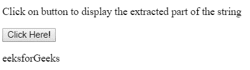

# 删除 JavaScript 中字符串的第一个字符

> 原文:[https://www . geesforgeks . org/delete-JavaScript 字符串中的第一个字符/](https://www.geeksforgeeks.org/delete-first-character-of-a-string-in-javascript/)

在 JavaScript 中有很多方法可以删除字符串的第一个字符，下面讨论其中的一些:

**方法 1:使用 [slice()方法](https://www.geeksforgeeks.org/javascript-string-slice/):**slice()方法提取字符串的一部分，并将提取的部分返回到新字符串中。如果我们想删除字符串的第一个字符，那么可以通过指定需要从中提取字符串的起始索引来完成。我们还可以对最后一个元素进行切片。

**语法:**

```
string.slice(startingindex, endingindex)
```

**示例:**

```
<!DOCTYPE html>
<html>

<head>
    <title>
        Delete first character
        of a string
    </title>
</head>

<body>

    <p>
        Click on button to display the
        extracted part of the string
    </p>

    <button onclick="myGeeks()">
        Click Here!
    </button>

    <p id="GFG"></p>

    <script>
        function myGeeks() {
            var str = "GeeksforGeeks"; 
            var result = str.slice(1);

            document.getElementById("GFG").innerHTML
                    = result;
        }
    </script>
</body>

</html>                    
```

**输出:**
**点击按钮前:**

**点击按钮后:**


**方法 2:使用 [substr()方法](https://www.geeksforgeeks.org/javascript-string-substring/):**string . substring()是 JavaScript 中的一个内置函数，用于返回给定字符串从起始索引到结束索引的部分。索引从零(0)开始。

**语法:**

```
string.substring(Startindex, Endindex)
```

**示例:**

```
<!DOCTYPE html>
<html>

<head>
    <title>
        Delete first character
        of a string
    </title>
</head>

<body>

    <p>
        Click on button to display the
        extracted part of the string
    </p>

    <button onclick="myGeeks()">
        Click Here!
    </button>

    <p id="GFG"></p>

    <script>
        function myGeeks() {
            var str = "GeeksforGeeks";
            var result = str.substr(1);
            document.getElementById("GFG").innerHTML
                    = result;
        }
    </script>
</body>

</html>                    
```

**输出:**
**点击按钮前:**

**点击按钮后:**


**方法 3:使用 [replace()方法](https://www.geeksforgeeks.org/javascript-string-replace/):**string . replace()函数是 JavaScript 中的一个内置函数，用于用其他字符串或正则表达式替换给定字符串的一部分。原始字符串将保持不变。

**语法:**

```
string.replace(searchvalue, newvalue)
```

**示例:**

```
<!DOCTYPE html>
<html>

<head>
    <title>
        Delete first character
        of a string
    </title>
</head>

<body>

    <p>
        Click on button to display the
        extracted part of the string
    </p>

    <button onclick="myGeeks()">
        Click Here!
    </button>

    <p id="GFG">GeeksforGeeks</p>

    <script>
        function myGeeks() {
            var str = document.getElementById("GFG").innerHTML; 
            var res = str.replace("GeeksforGeeks", "eeksforGeeks");
            document.getElementById("GFG").innerHTML = res;
        }
    </script>
</body>

</html>                    
```

**输出:**
**点击按钮前:**

**点击按钮后:**
