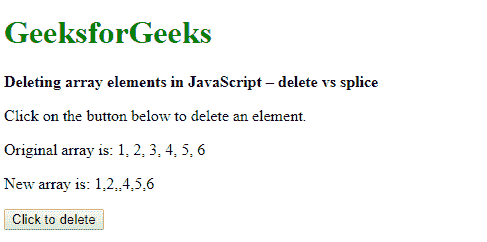
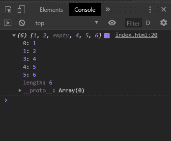
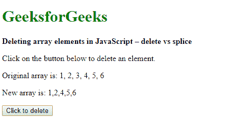
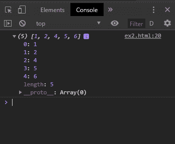

# 删除 JavaScript 中的数组元素|删除 vs 拼接

> 原文:[https://www . geesforgeks . org/delete-the-array-elements-in-JavaScript-delete-vs-splice/](https://www.geeksforgeeks.org/delete-the-array-elements-in-javascript-delete-vs-splice/)

对于删除数组中的元素，可以使用两种方法。他们在执行删除的方式上有自己的优点。

**使用删除数组[索引]:**

此方法删除指定索引处的元素，但不修改数组。这意味着在删除的索引处，元素未定义或为空。这可能会在遍历数组时导致问题，因为删除的索引不包含任何值。在这种情况下，数组的长度保持不变。

**语法:**

```
delete array[index]
```

**示例:**

```
<!DOCTYPE html>
<html>
<head>
    <title>
        Deleting array elements in JavaScript 
        – delete vs splice
    </title>
</head>
<body>
    <h1 style="color: green">GeeksforGeeks</h1>
    <b>Deleting array elements in JavaScript – delete vs splice</b>
    <p>Click on the button below to delete an element.</p>
    <p>Original array is: 1, 2, 3, 4, 5, 6</p>
    <p>New array is: <span class="output"></span></p>
    <button onclick="deleteElement()">Click to delete</button>
    <script>
        function deleteElement() {
            array = [1, 2, 3, 4, 5, 6];

            index = 2;
            delete array[index];

            console.log(array);
            document.querySelector('.output').textContent = array;
        }
    </script>
</body>
</html>
```

**输出:**

*   **显示:**
    
*   **控制台:**
    

**使用拼接方法:**

array.splice()方法用于在数组中添加或移除项。这个方法接受 3 个参数，元素 id 要插入或移除的索引，要删除的项目数和要插入的新项目。

这个方法实际上删除了索引处的元素，并移动了剩余的元素，没有留下空的索引。这很有用，因为删除后留下的数组可以正常迭代并正确显示。使用此方法，数组的长度会减少。

**语法:**

```
array.splice(index, items_to_remove, item1 ... itemX)
```

**示例:**

```
<!DOCTYPE html>
<html>
<head>
    <title>
        Deleting array elements in 
        JavaScript – delete vs splice
    </title>
</head>
<body>
    <h1 style="color: green">GeeksforGeeks</h1>
    <b>Deleting array elements in JavaScript – delete vs splice</b>
    <p>Click on the button below to delete an element.</p>
    <p>Original array is: 1, 2, 3, 4, 5, 6</p>
    <p>New array is: <span class="output"></span></p>
    <button onclick="deleteElement()">Click to delete</button>
    <script>
        function deleteElement() {
            array = [1, 2, 3, 4, 5, 6];

            index = 2;
            array.splice(index, 1);

            console.log(array);
            document.querySelector('.output').textContent = array;
        }
    </script>
</body>
</html>
```

**输出:**

*   **点击按钮前:**
    
*   **点击按钮后:**
    