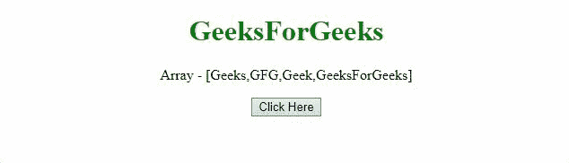

# 删除数组的第一个元素，不使用 JavaScript 中的 `shift()`方法

> 原文:[https://www . geeksforgeeks . org/delete-数组的第一个元素不使用 javascript 中的 shift-method/](https://www.geeksforgeeks.org/delete-the-first-element-of-array-without-using-shift-method-in-javascript/)

给定一个包含一些数组元素的数组，任务是从数组中移除第一个元素，从而将大小减少 1。我们将在 JavaScript 的帮助下执行 [**`shift()`方法**](https://www.geeksforgeeks.org/javascript-array-prototype-shift/) 操作，而不实际使用它。
下面讨论两种方法:

**方法 1:** 我们可以使用 [**拼接()方法**](https://www.geeksforgeeks.org/javascript-array-splice-method/) 来获取数组的部分。

*   **例:**

    ```html
    <!DOCTYPE HTML>
    <html>

    <head>
        <title>
            Delete first element from the array without
            using shift() operation in JavaScript
        </title>
    </head>

    <body style="text-align:center;">

        <h1 style="color:green;">
            GeeksForGeeks
        </h1>

        <p id="GFG_UP"></p>

        <button onclick="myGFG()">
            Click Here
        </button>

        <p id="GFG_DOWN"></p>

        <script>
            var arr = ['Geeks', 'GFG', 'Geek', 'GeeksForGeeks'];
            var up = document.getElementById("GFG_UP");
            up.innerHTML = "Array - [" + arr + "]";
            var down = document.getElementById("GFG_DOWN");
            function myGFG() {
                arr.splice(0, 1);
                down.innerHTML = "elements of array = [" + arr + "]";
            }
        </script>
    </body>

    </html>
    ```

*   **输出:**
    

**方法 2:** 我们可以使用 [**filter()方法**](https://www.geeksforgeeks.org/javascript-array-filter/) 过滤掉索引 0 处的元素。

*   **例:**

    ```html
    <!DOCTYPE HTML>
    <html>

    <head>
        <title>
            Delete first element from the array without
            using shift() operation in JavaScript
        </title>
    </head>

    <body style="text-align:center;">

        <h1 style="color:green;">
            GeeksForGeeks
        </h1>

        <p id="GFG_UP"></p>

        <button onclick="myGFG()">
            Click Here
        </button>

        <p id="GFG_DOWN"></p>

        <script>
            var arr = ['Geeks', 'GFG', 'Geek', 'GeeksForGeeks'];
            var up = document.getElementById("GFG_UP");
            up.innerHTML = "Array - [" + arr + "]";
            var down = document.getElementById("GFG_DOWN");
            function removeFirst(element, index) {
                return index > 0;
            }
            function myGFG() {
                arr = arr.filter(removeFirst);
                down.innerHTML = "elements of array = [" 
                                + arr + "]";
            }
        </script>
    </body>

    </html>
    ```

*   **输出:**
    