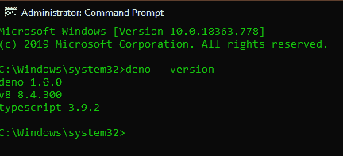
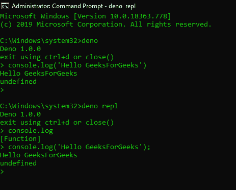
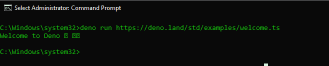
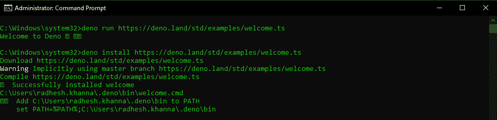
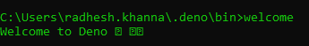
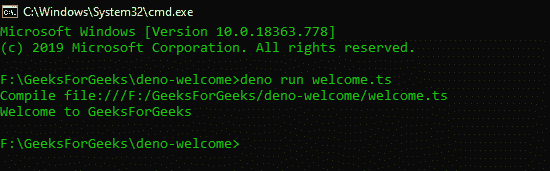

# 名词. js |导言

> 原文:[https://www.geeksforgeeks.org/deno-js-introduction/](https://www.geeksforgeeks.org/deno-js-introduction/)

**简介:** [**DenoJS**](https://deno.land/) 是一个 **Secure** 运行时，用于 [**JavaScript**](https://www.geeksforgeeks.org/javascript-tutorial/) 和 [**TypeScript**](https://www.geeksforgeeks.org/hello-world-in-typescript-language/) 基于 **V8** JavaScript 引擎(由 Chromium Project，Google 开发)[**Rust**T21】编程语言和](https://www.rust-lang.org/)[**Tokio**T25](https://tokio.rs/) [**NodeJS**](https://www.geeksforgeeks.org/introduction-to-nodejs/) 也是一个使用 V8 引擎的 JavaScript 运行时。DenoJS [1.0.0](https://deno.land/v1) 于 2020 年 5 月 13 日发布，由 Ryan Dahl 创作，他也是 NodeJS 的创作者。

DenoJS 旨在成为一个高效且安全的脚本环境，为现代开发人员提供轻松的体验。NodeJS 的创建者对 NodeJS 的功能表达了一些担忧。他们对 Node 的安全性、Node 如何处理包以及 Node 中永远不会改变的其他遗留 API 表示了担忧。Node 于 2009 年发布，从那以后 JavaScript 发生了很大的变化。他们想用现代的 JavaScript 工具和 API 制作一个更好的 NodeJS 版本。他们还想要与浏览器和服务器环境兼容的东西，因此实现了 DenoJS。

**DenoJS 的优势和特点:**

*   **默认安全:**DenoJS 最大的优点之一就是默认安全。它运行在**沙箱**环境中，除非特别允许，否则 Deno 不允许访问文件、环境或网络，而 NodeJS 中不允许。为了访问环境或网络，我们明确需要在执行 Deno 应用程序时添加安全标志和权限。如果没有添加相应的标志，它将在运行应用程序时给出一个**许可和**错误。安全标志列表如下
    *   **–允许写入:**允许写入访问
    *   **–允许读取:**允许读取访问
    *   **–允许网络:**允许网络访问
    *   **–允许-环境:**允许环境访问
    *   **–允许插件:**允许加载外部插件
    *   **–允许-HR 时间:**允许高分辨率时间测量
    *   **–允许运行:**允许子流程运行
    *   **-A:** 允许所有权限
*   **打字稿:** DenoJS 支持开箱即用的打字稿。我们可以在开发 Deno 应用程序时使用 TypeScript 或 JavaScript，因为 TypeScript 编译器也包含在 Deno 中。因此我们可以简单地创造一个新的**。ts** 文件，它将成功编译并使用 Deno 执行。
*   **单个可执行文件:** DenoJS 作为没有依赖关系的单个可执行文件发布。Deno 试图提供一个独立的工具来快速编写复杂功能的脚本。像网络浏览器一样，它知道如何获取和导入外部代码。在 Deno 中，一个文件可以定义复杂的行为，而无需任何其他工具。给定一个 Deno 程序的网址，它只需要 15 MB 的内存就可以运行。Deno 明确承担了运行时和包管理器的角色。
*   **去中心化包:**NodeJS 的一个主要缺点是如何用 NPM 包处理依赖关系。例如，如果我们想在 NodeJS 中使用 [**Express**](https://www.geeksforgeeks.org/introduction-to-express/) ，我们只需使用 [**npm**](https://www.geeksforgeeks.org/node-js-npm-node-package-manager/) 进行安装，依赖关系将转到 **node_modules** 文件夹。问题是安装**快递**的时候，根本就不是快递包裹。它还包括 Express 的依赖关系。因此，我们在 **node_modules** 中有很多文件夹，这使得处理外部包的过程变得极其困难，并且增加了应用程序的大小。DenoJS 提供去中心化包，即 Deno 不使用 **npm** 。Deno 没有 NPM 包，也没有 **package.json** 文件和**node _ modules**dependencies 文件夹。它使用标准的浏览器兼容协议通过**网址**加载模块。它从应用程序中导入通过 URL 或文件路径引用的模块。如果我们想要导入和使用外部模块，我们可以简单地从以下网址导入:

```
https://deno.land/x/[Package_Name]
```

*   **浏览器兼容性:** DenoJS 设计为浏览器兼容。完全用 JavaScript 编写的不使用全局 **Deno 命名空间**的 Deno 脚本集也可以在现代网络浏览器中使用 Deno 执行，无需任何代码更改。Deno 也遵循标准化的浏览器 JavaScript APIs。由于 Deno 与浏览器兼容，我们可以访问并使用像 [**获取**](https://www.geeksforgeeks.org/fetch-api/) 这样的 JavaScript APIs。我们还可以访问全局 JavaScript **窗口**对象。
*   **ES 模块:**与 NodeJS 不同，Deno 融入了现代 JavaScript 语法。Deno 使用 es 模块(导入**的**语法)，不支持 NodeJS 中使用的普通 JavaScript **要求的**语法。所有外部专家系统模块都是通过网址导入的，就像 **GoLang** 一样，例如:

```
import { serve } from "https://deno.land/x/http/server.ts"
```

该导入用于在 Deno 中创建一个简单的 **HTTP** 服务器。Deno 的另一个关键特性是，在这个模块被导入后，它会在加载时被缓存到硬盘上。第一次执行时，提取的远程代码将被缓存到硬盘中，并且在代码运行时带有**–重新加载**标志之前，它永远不会被更新。根据 DenoJS 官方文档，从远程 URL 加载的模块和文件是**不可变的**和**可缓存的**。

*   **标准模块:** Deno 有一套广泛的标准库模块，由 Deno 团队审核，并保证与 Deno 一起工作。这些标准模块托管在[这里](https://deno.land/std)并且像所有其他与 Deno 兼容的专家系统模块一样通过网址分发。其中一些标准库是 **fs** 、 **datetime** 、 **http** 等，很像 NodeJS 模块。Deno 还可以从网络上的任何位置导入模块，如 GitHub、个人网络服务器或 CDN(内容交付网络)。每天都有更多的标准模块和外部模块被添加到 Deno 中。
*   **顶级等待:**Deno 的另一个核心和重要特性是**顶级/一等等待**语法。在 Deno 中，我们可以在全局范围内使用等待语法，而不必将其包装在**异步**函数中。此外，Deno 中的所有异步操作都会返回一个**承诺**，该承诺可以移除/避免 Node 由于嵌套回调而导致的 [**回调地狱**](https://www.geeksforgeeks.org/what-is-callback-hell-in-node-js/) 。
*   **实用程序:** Deno 提供内置测试，并具有内置实用程序，如依赖检查器 **(deno info)** 和代码格式化程序 **(deno fmt)** 。Deno 还允许直接执行 WebAssembly [**WASM**](https://www.geeksforgeeks.org/webassembly-the-next-big-thing/) 二进制文件。NodeJS 以其 HTTP 和数据流功能而闻名，但是 Deno 能够比 Node 更有效地服务于 HTTP。

**DenoJS 的安装:**关于安装 DenoJS 的不同方式，请参考本[链接](https://deno.land/#installation)。我们将使用[T5 巧克力 T7 为*窗户*安装 Deno。要使用巧克力安装 Deno，请运行以下命令:](https://chocolatey.org/docs/installation)

```
choco install deno
```

这将把本地系统上的 Deno 安装到默认的 **$HOME/。deno** 目录。这是默认的 Deno 的基本目录，通过环境变量**引用。** 


**入门:**要检查 DenoJS 安装，请运行以下命令:

```
deno --version
```

这将为您提供 TypeScript、V8 引擎和 Deno 的版本。



如果我们简单地执行命令:

```
deno
```

它运行以下命令:

```
deno repl
```

这打开了代表“T2”的 **REPL** 界面读取 EVAL 打印循环，这意味着我们可以从命令行输入基本的 JavaScript 代码，它将编译、执行并打印结果。



我们将在本地执行一个简单的 Deno 脚本，位于标准的**deno.land/std/**网址。我们可以使用以下命令从远程网址直接运行该脚本:

```
deno run https://deno.land/std/examples/welcome.ts
```



这是官方 Deno 文档示例中**欢迎脚本的链接。我们可以通过简单地导航到该网址来查看源代码。 **deno run** 命令编译脚本并执行脚本以在控制台中显示结果。Deno 自动知道我们是通过网址运行这个脚本，还是仅仅在浏览器中查看它。**

要在本地计算机上安装脚本，我们可以运行以下命令:

```
deno install https://deno.land/std/examples/welcome.ts
```

这将把欢迎脚本安装到 **$Home/。deno/bin** 目录。该文件将作为**下载。*窗口*上的 cmd** 文件。如果安装已经存在，我们需要显式覆盖它。





**注意:**以管理员权限运行 CMD，避免 Deno 出现不必要的错误。
我们将在本地机器上创建一个 **welcome.ts** 文件，并用 Deno 执行它。
T6 欢迎

## java 描述语言

```
console.log("Welcome to GeeksForGeeks");
```

要执行此文件，请运行命令:

```
deno run welcome.ts
```

**输出:**

