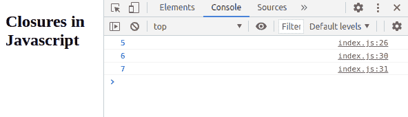
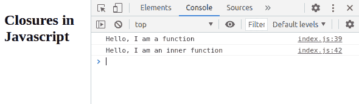
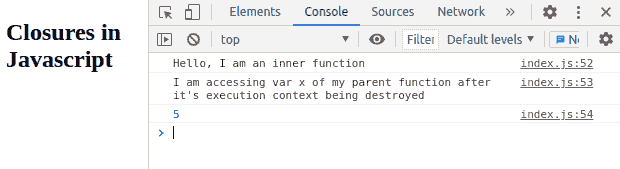
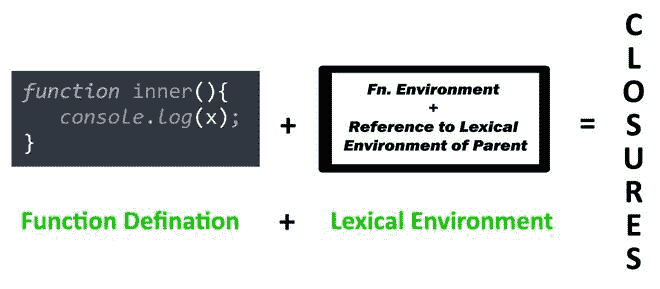
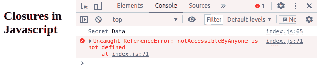
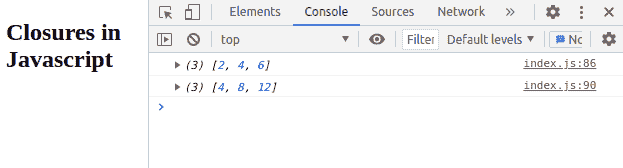

# 用 JavaScript 描述闭包概念

> 原文:[https://www . geesforgeks . org/description-closure-concept-in-JavaScript/](https://www.geeksforgeeks.org/describe-closure-concept-in-javascript/)

在本文中，您将了解 Javascript 中闭包的概念&如何将其应用于各种函数。javascript 中的闭包是一种组合所有函数的方式&将它们捆绑到词法环境中。随着本文的深入，我们将深入探讨闭包的概念。

**先决条件:**在开始我们的主要讨论之前，您应该对 javascript 函数有一个良好的工作知识，即内存分配是如何发生的、变量范围概念、javascript 中的词法环境。

让我们首先开始讨论基本的 javascript 程序示例:

如果您不知道如何在 HTML 文档中添加和执行 javascript，请参考[在一个 HTML 文档中把 JavaScript 放在哪里？](https://www.geeksforgeeks.org/where-to-put-javascript-in-an-html-document/)文章获取进一步的详细知识。

我们将很快看到 javascript 代码是如何执行的。为此，在*index.html*文件中添加

## index.html

```
<!DOCTYPE html>
<html>

<head>
    <title>Closures</title>
</head>

<body>
    <h2>Closures in Javascript</h2>
    <script src="./script.js"></script>
</body>

</html>
```

现在，我们将理解所有的基本概念，如函数如何工作，如何使用范围链在另一个函数内部声明函数，从函数返回函数，通过例子，然后将理解闭包概念。

**例 1:** 在这里，我们简单说明如下所示的功能工作:

## script.js

```
function a() {
  var x = 5;
  console.log(x);
}

function b() {
  var y = 15;
  console.log(y);
}
a();
b();
```

**说明:**

1.  首先，将创建一个全局执行上下文，然后函数定义将在内存中获得空间。
2.  javascript 一遇到，第一个函数就会调用一个()，它会创建另一个执行上下文并为变量 x 保留内存，并将 undefined 放入 x 中。
3.  然后执行阶段的线程进入图片，变量 x 得到值 5，在下一行 console.log 打印 x 的值，最后当函数执行完成时，它从调用堆栈中被移除，存储变量 x 的执行上下文被破坏，函数 b()也是如此。
4.  但是在这里，我们不能访问块外的变量 x 和 y，因为当函数完成它的执行上下文时，一个执行上下文也会被删除，而当 x 消失时，它就不在内存中了。对于函数 b()，我们不能访问该函数之外的变量 y。

**输出:**


**示例 2:** 在本节中，我们将讨论函数内部使用范围链访问变量的函数。

## script.js

```
function a() {
  var x = 5,
    y = 6;
  console.log(x);

  function b() {
    var z = 7;
    console.log(y);
    console.log(z);
  }
  b();
}
a();
```

**说明:**

1.  这里创建了一个执行上下文，然后函数 a()在内存中获取空间。
2.  然后我们调用函数 a()，这样它就获得了自己的执行上下文。
3.  还有一个变量 **x** 和**函数 b()** 在内存中获得一个空间，之后在代码执行阶段，变量 x 被打印出来
4.  一旦控制转到函数 b()的调用，就会在最后一个执行上下文中获得另一个执行上下文，var y 在遇到 console.log(x)之后获得内存空间，但是 x 不在函数 b()的执行上下文中，因此它会因为作用域链而转到父词法环境，并希望在那里找到它并打印 x 的值，
5.  变量 y 是函数内部的东西，因此无需任何额外的努力就可以打印出来。

**输出:**



**例 3:** 在这种情况下，我们将讨论函数的返回函数。

## script.js

```
function a() {
  console.log("Hello, I am a function");

  function b() {
    console.log("Hello, I am an inner function");
  }
  return b;
}
const result = a();
result();
```

**说明:**

1.  创建全局执行上下文，结果和函数 a()获得分配的内存空间。
2.  稍后在调用函数 a()时，会创建另一个执行上下文，并在该内存空间中分配函数 b()。
3.  最后，在打印一行并返回一个函数后，a()完成它的执行，并将其从调用堆栈中移除。此外，它的执行上下文被删除。
4.  函数 a()的结果存储在常量变量中。
5.  我们已经成功地调用了函数 result()，因此，返回的函数 b()中的功能得到了执行。

**输出:**



**例 4:** 闭合部分来了。假设您不仅有一个简单的 console.log，而且一些变量也在函数 b()中声明。现在，就到此为止&想想代码的输出。

## script.js

```
function outer() {
  var x = 5;

  function inner() {
    console.log("Hello, I am an inner function");
    console.log(
      "I am accessing var x of my parent function"
      + " when that parent functions execution "
      + "context destroyed"
    );
    console.log(x);
  }
  return inner;
}
const result = outer();
result();
```

**说明:**

1.  创建全局执行上下文，变量结果和函数 a()获取内存空间。
2.  在线程执行阶段，首先调用()函数。
3.  创建了一个新的执行上下文 var x，函数 b 在内存中获得了空间，就在它返回函数 b 之后，这意味着我们将结果作为函数的代码，现在函数 a()从调用堆栈中被移除，它的执行上下文也被销毁。
4.  在最后一行，当我们调用函数 result()时，它成功地开始执行其中的函数代码。但是一旦它遇到一个不在那个函数的执行上下文里面的变量，那么它就试图找出外部作用域中的 var x 但是等待，我们没有访问函数 a()的执行上下文的权限，那么这个 x 将如何执行呢？
5.  这是否意味着 var x 将变得不确定？不，因为**这是闭包的概念**每当我们从另一个函数中公开或返回函数时，不仅是正在返回的代码，而且它还伴随着一个特殊的东西，叫做词法环境，这意味着它的外部父函数的周围环境。
6.  所以函数 b()从函数返回时，它伴随着其父级的词法环境，因此总是可以访问变量 x 的引用。注意最后一行“**总是可以访问变量**的引用，而不是值。

**输出:**



**定义:**一个[闭包](https://www.geeksforgeeks.org/closure-in-javascript/)是与其词汇环境捆绑在一起的函数的组合。词汇环境是对父母词汇环境的局部功能记忆&。换句话说，即使在父函数已经被执行之后，当子函数保持父作用域的环境时，就创建了闭包。



这种对父级词法环境的引用是闭包函数能够访问外部函数变量的原因，即使这些函数不在调用堆栈中，或者我们可以说即使外部函数是封闭的。

**闭包是如何创建的:**每当在创建另一个函数时正在创建某个函数时，就会创建闭包。在上面的示例中，函数 inner 是在创建函数 a()时创建的。

**极少使用案例&闭包示例:**

**1。隐私:**每当我们不得不隐藏一些功能或变量作为封装时，我们就把它包装在父级的词法环境中。

**示例:**下面的示例是用闭包进行封装的基本模板。

**说明:**

1.  所有全局执行上下文将在内存分配阶段创建，函数 outer()& const 闭包函数将在内存中获得空间。
2.  在线程执行时，函数外部内部的代码将开始执行，因为它是代码中的第一行。
3.  现在将创建另一个执行上下文，常量 *notAccessibleByAnyone* 将获得空间，稍后外部函数返回内部函数代码，执行上下文将消失。请注意，const 变量不在执行上下文中。
4.  但是闭包函数引用了那个变量，所以这就是用闭包封装的整个概念。

## script.js

```
function outer(secret) {
  const notAccessibleByAnyone = secret;

  return function inner() {
    console.log(notAccessibleByAnyone);
  };
}

const closureFunction = outer("Secret Data");
closureFunction();
console.log(notAccessibleByAnyone);
```

**输出:**在第一行中，当闭包访问时，*秘密数据*被打印，在下一行中，当任何外部人员试图访问时，引用错误被 javascript 抛出。



**2。部分函数:**当我们必须创建某种存在共同模式的功能时，我们创建一个参数少的父函数，并创建一个参数少于父函数的内部函数。这个概念也被称为高阶函数，我们从函数中返回函数。

**示例:**下面的示例提供了一个基本的示例，展示了这个局部函数的外观。

**说明:**

1.  这里我们创建了一个父函数，它接收一个乘数作为参数，然后将其传递给一个内部函数。
2.  稍后，当我们调用父函数时，它会返回内部函数的代码，内部函数总是可以访问父函数调用期间提供的乘数。
3.  函数*Multipyby2()*保存了一个函数，该函数接受一个数组并对其运行循环，然后返回修改后的数组，其中的元素被乘以 2。
4.  函数*Multipy4()*保存了一个函数，该函数接受一个数组并对其运行循环，然后返回修改后的数组，其中元素被乘以 4。

## script.js

```
function partialApplication(multiplier) {
  return function inner(array) {
    let size = array.length;
    for (let i = 0; i < size; i++) {
      array[i] = array[i] * multiplier;
    }
    return array;
  };
}

const multiplyBy2 = partialApplication(2);
const arr1 = multiplyBy2([1, 2, 3]);
console.log(arr1);

const multiplyBy4 = partialApplication(4);
const arr2 = multiplyBy4([1, 2, 3]);
console.log(arr2);
```

**输出:**

