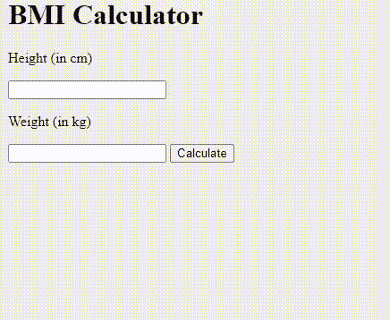

# 使用 JavaScript 设计一个BMI计算器

> 原文:[https://www . geesforgeks . org/design-a-BMI-calculator-using-JavaScript/](https://www.geeksforgeeks.org/design-a-bmi-calculator-using-javascript/)

体重指数(BMI)计算器可用于根据身高和体重计算BMI值。对于大多数人来说，BMI是一个相当可靠的身体肥胖指标。

**公式:**

```html
BMI = (weight) / (height * height)
```

**方法:**BMI是根据个体的体重和身高计算出来的数字。为了找出BMI，我们将从用户那里获取输入(包括身高和体重)，这些输入将存储在身高和体重变量中，以供进一步计算。计算过程很简单，我们简单地将重量(公斤)除以高度的平方。现在，根据BMI的计算，它将执行相应的 if-else 语句。我们还在检查用户是否在没有输入输入的情况下按下提交按钮，在这种情况下，我们正在打印提供高度或提供重量。
使用 HTML 我们给出了想要的结构，输入选项，和提交按钮。在 CSS 的帮助下，我们通过赋予颜色和想要的字体等来美化我们的结构。

在 JavaScript 部分，我们正在处理获取的输入，并在计算之后，打印相应的输出。

**示例:**

HTML:

## index.html

```html
<!DOCTYPE html>
<html>

<head>
    <!-- Include JS files -->
    <script src="app.js"></script>
</head>

<body>
    <div class="container">
        <h1>BMI Calculator</h1>

        <!-- Option for providing height 
            and weight to the user-->
        <p>Height (in cm)</p>

        <input type="text" id="height">

        <p>Weight (in kg)</p>

        <input type="text" id="weight">

        <button id="btn">Calculate</button>

        <div id="result"></div>
    </div>
</body>

</html>
```

JavaScript:

## app.js

```html
window.onload = () => {
    let button = document.querySelector("#btn");

    // Function for calculating BMI
    button.addEventListener("click", calculateBMI);
};

function calculateBMI() {

    /* Getting input from user into height variable.
    Input is string so typecasting is necessary. */
    let height = parseInt(document
            .querySelector("#height").value);

    /* Getting input from user into weight variable. 
    Input is string so typecasting is necessary.*/
    let weight = parseInt(document
            .querySelector("#weight").value);

    let result = document.querySelector("#result");

    // Checking the user providing a proper
    // value or not
    if (height === "" || isNaN(height)) 
        result.innerHTML = "Provide a valid Height!";

    else if (weight === "" || isNaN(weight)) 
        result.innerHTML = "Provide a valid Weight!";

    // If both input is valid, calculate the bmi
    else {

        // Fixing upto 2 decimal places
        let bmi = (weight / ((height * height) 
                            / 10000)).toFixed(2);

        // Dividing as per the bmi conditions
        if (bmi < 18.6) result.innerHTML =
            `Under Weight : <span>${bmi}</span>`;

        else if (bmi >= 18.6 && bmi < 24.9) 
            result.innerHTML = 
                `Normal : <span>${bmi}</span>`;

        else result.innerHTML =
            `Over Weight : <span>${bmi}</span>`;
    }
}
```

**输出:**

