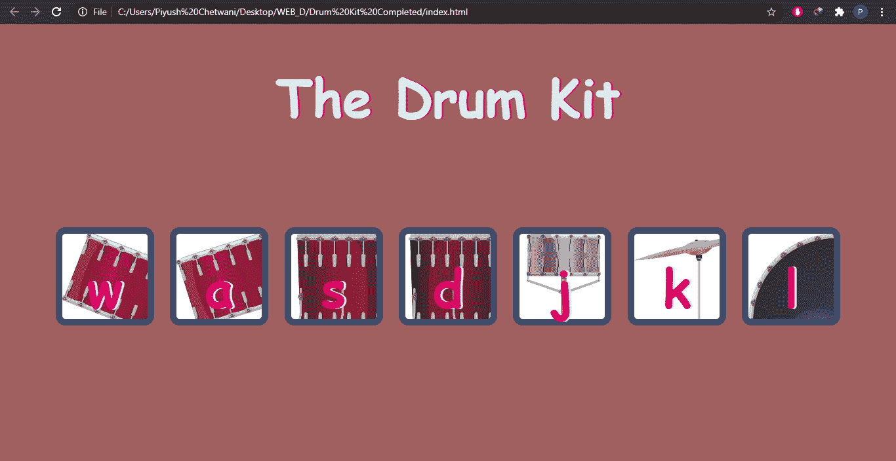
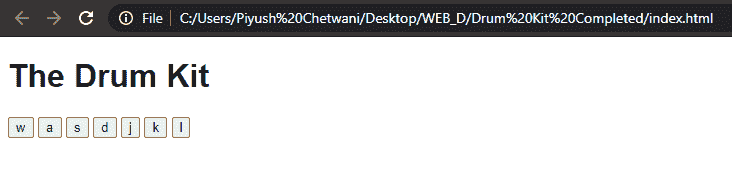

# 使用 JavaScript 设计一个架子鼓网络应用

> 原文:[https://www . geesforgeks . org/design-a-drum-kit-web-app-using-JavaScript/](https://www.geeksforgeeks.org/design-a-drum-kit-web-app-using-javascript/)

我们一定都在一些音乐会或其他地方见过架子鼓，它是鼓、钹和其他打击乐器的集合。但是你有没有想象过在某种脚本语言的帮助下自己制作架子鼓呢？那么，我们的目标是构建一个在浏览器中运行的架子鼓应用程序。文章中呈现的主要概念有 **DOM** 、**关键事件**和 **CSS 动画**。因此，到本文结束时，您不仅已经了解了如何向按钮和击键添加事件侦听器，以便您知道用户何时在键盘上敲击或单击您网站上的特定按钮，并且您可以对其做出响应，而且您还拥有了一个令人敬畏的网站，您可以用它来打动您的所有朋友。

**网站预览:**



因此，这个网站的工作方式是，我们在网页上有许多键，代表典型鼓组中的不同鼓，当您点击其中任何一个按钮时，您将获得相应的鼓的声音。此外，您还可以使用键盘上的按键来产生声音效果。

**设计 HTML 布局:**对于网站，我们在页面上只有七个按钮可以显示，点击后会播放声音。首先我们会添加 DOCTYPE HTML 格式，然后给网页一个合适的标题，在我们的例子中是**架子鼓**。在主体标签中，我们会给出一个标题，比如说，使用 **h1** 标签的架子鼓，并显示这七个按钮。相同的代码是:

## 超文本标记语言

```html
<!DOCTYPE html>
<html>

<head>
    <title>The Drum Kit</title>
</head>

<body>
    <h1>The Drum Kit</h1>

    <div class="all">
        <button>w</button>
        <button>a</button>
        <button>s</button>
        <button>d</button>
        <button>j</button>
        <button>k</button>
        <button>l</button>
    </div>
</body>

</html>
```

输出应该是这样的:



**添加 CSS 样式:** CSS 用于设置不同部分的样式，使其更具视觉吸引力。但是，这是关于开发者最喜欢哪种风格的个人观点。随意使用任何造型，但请记住以下要点:

*   给正文和标题任意颜色、背景色、字体系列、边距和字号。
*   我们给出了鼓、钹等的背景图像。以使页面更有吸引力。所有图像都在“图像”目录中。此外，我们还为所有按钮提供了一些通用样式。
*   我们还给出了类**动画中每个按钮按下后的外观样式。**只要按下一个按钮，我们就会用 JavaScript 追加这个类。

要追加这些类，我们还必须在 HTML 标签中添加类，并链接样式表。因此，修改后的 HTML 和新的 CSS 代码将是:

## 超文本标记语言

```html
<!DOCTYPE html>
<html>

<head>
    <title>The Drum Kit</title>
    <link rel="stylesheet" href="index.css">
</head>

<body>
    <h1>The Drum Kit</h1>

    <div class="all">
        <button class="w button">w</button>
        <button class="a button">a</button>
        <button class="s button">s</button>
        <button class="d button">d</button>
        <button class="j button">j</button>
        <button class="k button">k</button>
        <button class="l button">l</button>
    </div>
</body>

</html>
```

## 半铸钢ˌ钢性铸铁(Cast Semi-Steel)

```html
body {
    text-align: center;
    background-color: #a06060;
}

h1 {
    font-size: 5rem;
    color: #DBEDF3;
    font-family: cursive;
    text-shadow: 3px 0 #DA0463;
}

.w {
    background-image: url("images/w.png");
}

.a {
    background-image: url("images/a.png");
}

.s {
    background-image: url("images/s.png");
}

.d {
    background-image: url("images/d.png");
}

.j {
    background-image: url("images/j.png");
}

.k {
    background-image: url("images/k.png");
}

.l {
    background-image: url("images/l.png");
}

.all {
    margin: 10% auto;
}

.animation {
    box-shadow: 0 3px 4px 0 #DBEDF3;
    opacity: 0.5;
}

.button {
    outline: none;
    border: 10px solid #404B69;
    font-size: 5rem;
    font-family: 'Arvo', cursive;
    line-height: 2;
    font-weight: 900;
    color: #DA0463;
    text-shadow: 3px 0 #DBEDF3;
    border-radius: 15px;
    display: inline-block;
    width: 150px;
    height: 150px;
    text-align: center;
    margin: 10px;
    background-color: white;
}
```