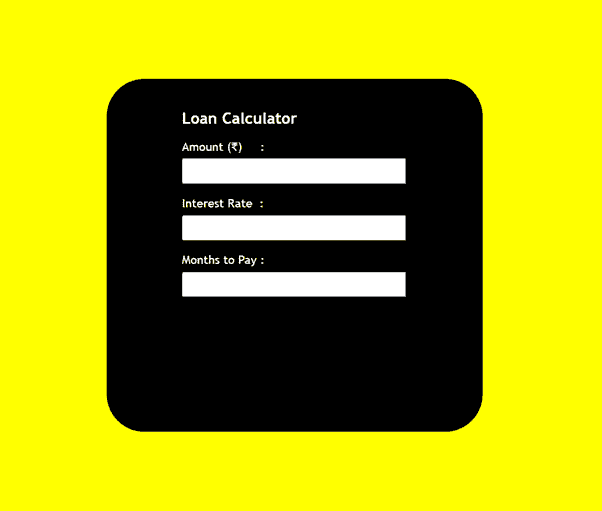
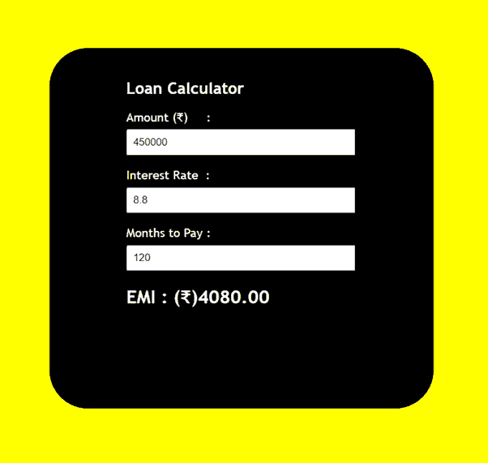

# 使用 JavaScript 设计一个贷款计算器

> 原文:[https://www . geesforgeks . org/design-a-loan-calculator-use-JavaScript/](https://www.geeksforgeeks.org/design-a-loan-calculator-using-javascript/)

贷款计算器可用于通过计算总金额、还款月数和利率来计算贷款的每月利息收入。

**方式:**方式很简单，我们从用户那里取 3 个输入，即金额(贷款总额)、利率(利率)和月数(还款月数)。利用这三个，我们可以计算出总金额。最后我们将显示总金额。

**公式:**

```html
interest = (amount * (rate * 0.01))/months;
total = ((amount/months) + interest);
```

使用 HTML 我们正在设计简单的结构，并使用 CSS(内部 CSS)给出风格。在输入时，我们调用**计算()**函数并显示结果。calculate()函数使用名为–onchange 的 HTML 属性进行输入(onchange 属性在元素值更改时触发)。

**先决条件:**HTML、CSS、JavaScript 的基础概念。

**实现:**我们将制作两个独立的文件，即 HTML 和 JavaScript，并将 JavaScript 文件链接到 HTML 文件中。

*   超文本标记语言–(index.html)
*   JavaScript-(app . js)

**HTML 文件:**

## index.html

```html
<!DOCTYPE html>
<html lang="en">

<head>
    <title>Loan Calculator</title>

    <style>
        body {
            background-color: yellow;
            font-family: 'Trebuchet MS';
        }

        h1 {
            font-size: 35px;
        }

        h1 {
            font-size: 21px;
            margin-top: 20px;
        }

        .calculator {
            width: 400px;
            height: 450px;
            background-color: black;
            position: absolute;
            left: 50%;
            top: 50%;
            transform: translateX(-50%) translateY(-50%);
            padding: 20px 0px 0px 100px;
            border-radius: 50px;
            color: white;
        }

        input {
            padding: 7px;
            width: 70%;
            margin-top: 7px;
        }
    </style>
</head>

<body>
    <div class="calculator">
        <h1>Loan Calculator</h1>

        <!-- Calling Calculate function defined in app.js -->
        <p>Amount (₹)     :
            <input id="amount" type="number" 
            onchange="Calculate()">
        </p>

        <p>Interest Rate  :
            <input id="rate" type="number" 
            onchange="Calculate()">
        </p>

        <p>Months to Pay :
            <input id="months" type="number" 
            onchange="Calculate()">
        </p>

        <h2 id="total"></h2>
    </div>

    <script src="app.js"></script>
</body>

</html>
```

**JavaScript 文件:**

## app.js

```html
function Calculate() {

    // Extracting value in the amount 
    // section in the variable
    const amount = document.querySelector("#amount").value;

    // Extracting value in the interest
    // rate section in the variable
    const rate = document.querySelector("#rate").value;

    // Extracting value in the months 
    // section in the variable
    const months = document.querySelector("#months").value;

    // Calculating interest per month
    const interest = (amount * (rate * 0.01)) / months;

    // Calculating total payment
    const total = ((amount / months) + interest).toFixed(2);

    document.querySelector("#total")
        .innerHTML = "EMI : (₹)" + total;
}  
```

**输出:**

 