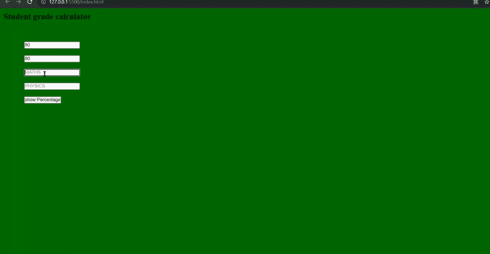

# 使用 JavaScript 设计学生成绩计算器

> 原文:[https://www . geesforgeks . org/design-a-学生-年级-计算器-使用-javascript/](https://www.geeksforgeeks.org/design-a-student-grade-calculator-using-javascript/)

学生成绩计算器(SGC)可用于根据学生的分数计算百分比。(SGC)是学生成绩的一个相当可靠的指标。

**公式:**

```html
percentage =  ( totalgrades / 400 ) *  100 ;
```

**方法:** SGC 是学生分数的百分比计算器。为了找出 SGC，我们将从用户那里获取存储在化学、印地语和数学变量中的输入(针对四个科目)，以便进一步计算。计算过程很简单，我们将简单首先我们将所有输入的分数相加，并将其存储在总成绩变量中，然后我们将它除以每个科目的最高分数之和。稍后，我们将让一个名为等级的变量存储等级。现在根据计算出的百分比，它将执行相应的 if-else 语句。打印的结果是学生的百分比和分数。使用 HTML 我们给出了想要的结构、输入选项和提交按钮。在 CSS 的帮助下，我们通过赋予颜色和想要的字体等来美化我们的结构。在 JavaScript 部分，我们正在处理获取的输入，并在计算之后，打印相应的输出。

**创建计算器的步骤:**

*   首先，我们将创建一个名为 calculate 的函数。
*   初始化所有变量并存储用户输入的值。
*   现在转换浮点数据类型中的值。
*   然后我们用简单的数学进行计算。
*   然后我们实现了 if-else 条件。
*   然后我们检查空输入的条件，如果它不是空的，那么我们将执行我们的输出。

**例:**现在开始学生成绩计算器的实现。

## index.html

```html
<!DOCTYPE html>
<html>
  <head>
    <title>student calculate</title>
    <!-- link for font  -->
    <link
      href=
"https://fonts.googleapis.com/css?family=Righteous&display=swap"
      rel="stylesheet"
    />
    <link rel="stylesheet" href="style.css" />
  </head>
  <body>
    <!-- main html  -->
    <div class="container">
      <h1>Student grade calculator</h1>
      <div class="screen-body-item">
        <div class="app">
          <div class="form-group">
            <!-- option for taking the input -->
            <input
              type="text"
              class="form-control"
              placeholder="CHEMISTRY"
              id="chemistry"
            />
          </div>
          <div class="form-group">
            <input
              type="text"
              class="form-control"
              placeholder="HINDI"
              id="hindi"
            />
          </div>
          <div class="form-group">
            <input
              type="text"
              class="form-control"
              placeholder="MATHS"
              id="maths"
            />
          </div>
          <div class="form-group">
            <input
              type="text"
              class="form-control"
              placeholder="PHYSICS"
              id="phy"
            />
          </div>
          <div>
            <input
              type="button"
              value="show Percentage"
              class="form-button"
              onclick="calculate()"
            />
          </div>
        </div>
      </div>
      <!-- for showing the result-->
      <div class="form-group showdata">
        <p id="showdata"></p>
      </div>
    </div>
    <!--adding external javascript file-->
    <script src="script.js"></script>
  </body>
</html>
```

**style.css**

## style.css

```html
* {
  margin: 0;
  padding: 0;
  box-sizing: border-box;
}
body {
  background: #006600;
  font-size: 12px;
}

.container {
  flex: 0 1 700px;
  margin: auto;
  padding: 10px;
}

.screen-body-item {
  flex: 1;
  padding: 50px;
}
input {
  margin: 10px 10px 10px;
}
.showdata {
  color: black;
  font-size: 1.2rem;
  padding-top: 10px;
  padding-bottom: 10px;
}
```

## script.js

```html
// Function for calculating grades
const calculate = () => {

  // Getting input from user into height variable.
  let chemistry = document.querySelector("#chemistry").value;
  let hindi = document.querySelector("#hindi").value;
  let maths = document.querySelector("#maths").value;
  let phy = document.querySelector("#phy").value;
  let grades = "";

  // Input is string so typecasting is necessary. */
  let totalgrades =
    parseFloat(chemistry) +
    parseFloat(hindi) +
    parseFloat(maths) +
    parseFloat(phy);

  // Checking the condition for the providing the 
  // grade to student based on percentage
  let percentage = (totalgrades / 400) * 100;
  if (percentage <= 100 && percentage >= 80) {
    grades = "A";
  } else if (percentage <= 79 && percentage >= 60) {
    grades = "B";
  } else if (percentage <= 59 && percentage >= 40) {
    grades = "C";
  } else {
    grades = "F";
  }
  // Checking the values are empty if empty than
  // show please fill them
  if (chemistry == "" || hindi == "" 
            || maths == "" || phy == "") {
    document.querySelector("#showdata").innerHTML
         = "Please enter all the fields";
  } else {

    // Checking the condition for the fail and pass
    if (percentage >= 39.5) {
      document.querySelector(
        "#showdata"
      ).innerHTML = 
        ` Out of 400 your total is  ${totalgrades} 
        and percentage is ${percentage}%. <br> 
        Your grade is ${grades}. You are Pass. `;
    } else {
      document.querySelector(
        "#showdata"
      ).innerHTML = 
        ` Out of 400 your total is  ${totalgrades} 
        and percentage is ${percentage}%. <br> 
        Your grade is ${grades}. You are Fail. `;
    }
  }
};
```

**输出:**

