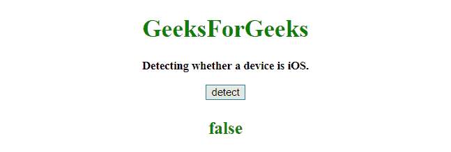
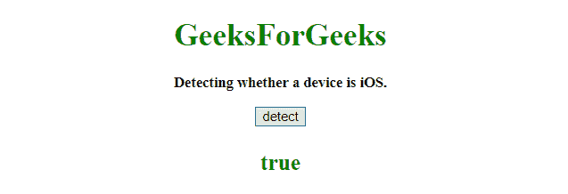

# 使用 JavaScript 检测设备是否是 iOS

> 原文:[https://www . geesforgeks . org/detect-a-device-is-IOs-or-not-use-JavaScript/](https://www.geeksforgeeks.org/detect-a-device-is-ios-or-not-using-javascript/)

为了检测一个设备是否是 **iOS** 。我们将前往**导航平台和导航用户代理属性**。

*   **Navigator userAgent property**
    This property returns the value of the user-agent header which is sent by the browser to the server.
    Returned value, have information about the name, version, and platform of browser.
    **Syntax:**

    ```
    navigator.userAgent

    ```

    **返回值:**
    返回一个字符串，表示当前工作浏览器的用户代理字符串。

*   **Navigator platform property**
    This property returns the platform for which the browser is compiled.
    **Syntax:**

    ```
    navigator.platform

    ```

    **返回值:**
    返回一个字符串，代表浏览器的平台。
    可能值。

    *   惠普用户体验
    *   Linux i686
    *   Linux armv7l
    *   麦克 68K
    *   麦克普 c
    *   SunOS(太阳)
    *   Win32
    *   等等。

**示例 1:** 本示例通过 **(navigator.userAgent)属性**检测设备，并返回 **false** 。

```
<!DOCTYPE HTML>
<html>

<head>
    <title>
        JavaScript 
      | Detecting a device is iOS.
    </title>
</head>

<body style="text-align:center;"
      id="body">
    <h1 style="color:green;">  
            GeeksForGeeks  
        </h1>
    <p id="GFG_UP" 
       style="font-size: 15px; 
              font-weight: bold;"> 
      Detecting whether a device is iOS.
    </p>
    <button onclick="gfg_Run()">
        detect
    </button>
    <p id="GFG_DOWN"
       style="color:green; 
              font-size: 23px;
              font-weight: bold;">
    </p>
    <script>
        var el_down = 
            document.getElementById("GFG_DOWN");

        function gfg_Run() {
            var iOS = 
                /iPad|iPhone|iPod/.test(navigator.userAgent) &&
                !window.MSStream;
            el_down.innerHTML = iOS;
        }
    </script>
</body>

</html>
```

**输出:**

*   **点击按钮前:**
    
*   **点击按钮后:**
    

**例 2:** 本例通过 **(navigator.platform)属性**检测设备，返回**真**。

```
<!DOCTYPE HTML>
<html>

<head>
    <title>
        JavaScript 
      | Detecting a device is iOS.
    </title>
</head>

<body style="text-align:center;" 
      id="body">
    <h1 style="color:green;">  
            GeeksForGeeks  
        </h1>
    <p id="GFG_UP" 
       style="font-size: 15px; font-weight: bold;">
      Detecting whether a device is iOS.
    </p>
    <button onclick="gfg_Run()">
        detect
    </button>
    <p id="GFG_DOWN" 
       style="color:green; 
              font-size: 23px; 
              font-weight: bold;">
    </p>
    <script>
        var el_down = 
            document.getElementById("GFG_DOWN");

        function gfg_Run() {
            var iOS = 
                !!navigator.platform &&
                /iPad|iPhone|iPod/.test(navigator.platform);
            el_down.innerHTML = iOS;
        }
    </script>
</body>

</html>
```

**输出:**

*   **点击按钮前:**
    
*   **点击按钮后:**
    

**例 3:** 本例通过 **(navigator.platform)属性**检测设备，返回**假**。

```
<!DOCTYPE HTML>
<html>

<head>
    <title>
        JavaScript 
      | Detecting a device is iOS.
    </title>
</head>

<body style="text-align:center;" 
      id="body">
    <h1 style="color:green;">  
            GeeksForGeeks  
        </h1>
    <p id="GFG_UP" 
       style="font-size: 15px; 
              font-weight: bold;">
      Detecting whether a device is iOS.
    </p>
    <button onclick="gfg_Run()">
        detect
    </button>
    <p id="GFG_DOWN" 
       style="color:green;
              font-size: 23px; 
              font-weight: bold;">
    </p>
    <script>
        var el_down = document.getElementById("GFG_DOWN");

        function gfg_Run() {
            var iOS = 
                !!navigator.platform && 
                /iPad|iPhone|iPod/.test(navigator.platform);
            el_down.innerHTML = iOS;
        }
    </script>
</body>

</html>
```

**输出:**

*   **点击按钮前:**
    
*   **点击按钮后:**
    