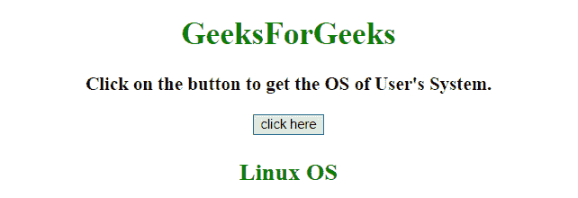

# 使用 JavaScript 检测用户的操作系统

> 原文:[https://www . geesforgeks . org/detect-操作系统-用户使用-javascript/](https://www.geeksforgeeks.org/detect-the-operating-system-of-user-using-javascript/)

任务是在 JavaScript 的帮助下检测用户的操作系统。我们将讨论一些技巧。

**进场:**

*   访问**导航器.应用版本或导航器.用户代理**属性。
*   使用 **indexOf()** 方法获取操作系统的索引。
*   如果索引不是-1，那么我们要找的就是操作系统。

**示例 1:** 在本例中， **navigator.appVersion 属性**用于获取 OS。

```
<!DOCTYPE HTML>
<html>

<head>
    <title>
        JavaScript 
      | Detecting the Operating System of User.
    </title>
</head>

<body style="text-align:center;" id="body">
    <h1 style="color:green;">  
            GeeksForGeeks
        </h1>
    <p id="GFG_UP"
       style="font-size: 19px; 
              font-weight: bold;">
    </p>
    <button onclick="GFG_Fun()">
        click here
    </button>
    <p id="GFG_DOWN" 
       style="color: green; 
              font-size: 24px; 
              font-weight: bold;">
    </p>
    <script>
        HTMLDocument.prototype.e = document.getElementById;
        var el_up = document.e("GFG_UP");
        var el_down = document.e("GFG_DOWN");
        el_up.innerHTML = "Click on the button to get the OS of User's System.";
        var Name = "Not known";
        if (navigator.appVersion.indexOf("Win") != -1) Name = 
          "Windows OS";
        if (navigator.appVersion.indexOf("Mac") != -1) Name = 
          "MacOS";
        if (navigator.appVersion.indexOf("X11") != -1) Name = 
          "UNIX OS";
        if (navigator.appVersion.indexOf("Linux") != -1) Name = 
          "Linux OS";

        function GFG_Fun() {
            el_down.innerHTML = Name;
        }
    </script>
</body>

</html>
```

**输出:**

*   **点击按钮前:**
    
*   **点击按钮后:**
    

**示例 2:** 在本例中， **navigator.userAgent 属性**用于获取 OS。

```
<!DOCTYPE HTML>
<html>

<head>
    <title>
        JavaScript 
      | Detecting the Operating System of User.
    </title>
</head>

<body style="text-align:center;" id="body">
    <h1 style="color:green;">  
            GeeksForGeeks
        </h1>
    <p id="GFG_UP" 
       style="font-size: 19px;
              font-weight: bold;">
    </p>
    <button onclick="GFG_Fun()">
        click here
    </button>
    <p id="GFG_DOWN" 
       style="color: green;
              font-size: 24px;
              font-weight: bold;">
    </p>
    <script>
        var el_up = document.getElementById("GFG_UP");
        var el_down = document.getElementById("GFG_DOWN");
        el_up.innerHTML = "Click on the button to get the OS of User's System.";
        var Name = "Unknown OS";
        if (navigator.userAgent.indexOf("Win") != -1) Name = 
          "Windows OS";
        if (navigator.userAgent.indexOf("Mac") != -1) Name = 
          "Macintosh";
        if (navigator.userAgent.indexOf("Linux") != -1) Name = 
          "Linux OS";
        if (navigator.userAgent.indexOf("Android") != -1) Name = 
          "Android OS";
        if (navigator.userAgent.indexOf("like Mac") != -1) Name = 
          "iOS";

        function GFG_Fun() {
            el_down.innerHTML = Name;
        }
    </script>
</body>

</html>
```

**输出:**

*   **点击按钮前:**
    
*   **点击按钮后:**
    