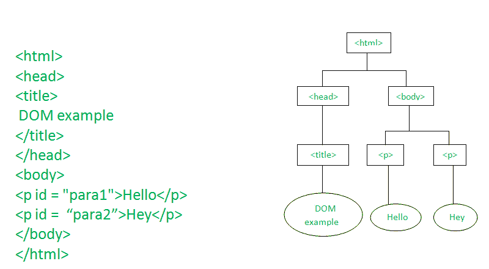
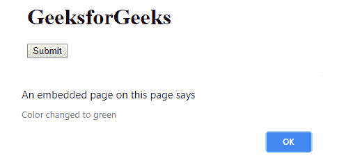
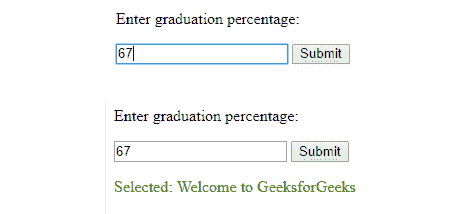

# DHTML JavaScript

> 原文:[https://www.geeksforgeeks.org/dhtml-javascript/](https://www.geeksforgeeks.org/dhtml-javascript/)

DHTML 代表动态 HTML。动态意味着网页的内容可以根据用户输入来定制或改变，即与用户交互的页面。在早期，HTML 被用来创建静态页面。它只定义了页面上显示的内容的结构。在 CSS 的帮助下，我们可以通过改变文本大小、背景颜色等各种属性来美化网页。HTML 和 CSS 可以在静态页面之间导航，但不能做其他任何事情。如果 1000 个用户查看一个包含他们的信息的页面，比如承认卡，那么就有问题了，因为这个应用程序构建的 1000 个静态页面无法工作。随着用户数量的增加，问题也会增加，在某个时候，处理这个问题变得不可能。

为了克服这个问题，DHTML 应运而生。DHTML 包含了 JavaScript 以及 HTML 和 CSS，以使页面动态化。这个组合使网页变得动态，并消除了为每个用户创建静态页面的问题。为了将 JavaScript 集成到 HTML 中，为 HTML 文档创建了一个文档对象模型。在 DOM 中，文档被表示为节点和对象，这些节点和对象被不同的语言访问，如 JavaScript 来操作文档。


**html 文档包含 JavaScript::** 使用 HTML 标记将 JavaScript 文档包含在我们的 HTML 页面中。< src >标签用于指定外部 JavaScript 文件的来源。
以下是一些可以用 JavaScript 执行的任务:

*   执行 html 任务
*   执行 CSS 任务
*   处理事件
*   验证输入

**示例 1:** 示例了解如何在 DHTML 中使用 JavaScript。

```html
<html>
    <head>
        <title>DOM programming</title>
    </head>

    <body>
        <h1>GeeksforGeeks</h1>
        <p id = "geeks">Hello Geeks!</p>
        <script style = "text/javascript">
        document.getElementById("geeks").innerHTML = 
              "A computer science portal for geeks";
        </script>
    </body>
</html>                    
```

**输出:**

**解释:**在上面的例子中，使用 id 更改段落的文本。文档是显示在当前窗口或 DOM 对象中的 html 对象。getElementById(Id)给出了元素 id。innerHTML 定义了 id 元素中的内容。id 属性用于更改 HTML 文档及其属性。文档 id 更改了段落内容。例如:document.getElementById(“极客”)style.color = " blue 它用于使用元素 id 设置段落颜色。

**示例 2:** 单击按钮时创建警报。

```html
<html>
    <head>
        <title>Create an alert</title>
    </head>

    <body>
        <h1 id = "para1">GeeksforGeeks</h1>
        <input type = "Submit" onclick = "Click()"/>
        <script style = "text/javascript">
            function Click() {
                document.getElementById("para1").style.color = "#009900";
                window.alert("Color changed to green");
            }
        </script>
    </body>
</html>                    
```

**输出:**

**解释:**在本例中，创建一个将在点击按钮时被调用的函数，它改变文本的颜色并在屏幕上显示警报。窗口是当前窗口的一个对象，它的内置方法 alert()在 Click()函数中被调用。

**示例 3:** 使用 JavaScript 验证输入数据。

```html
<html>
    <head>
        <title>Validate input data</title>
    </head>

    <body>
        <p>Enter graduation percentage:</p>
        <input id="perc">
        <button type="button" onclick="Validate()">Submit</button>
        <p id="demo"></p>
        <script>
            function Validate() {
                var x, text;
                x = document.getElementById("perc").value;
                if (isNaN(x) || x < 60) {
                    window.alert("Not selected in GeeksforGeeks");
                } else {
                document.getElementById("demo").innerHTML = 
                              "Selected: Welcome to GeeksforGeeks";
                document.getElementById("demo").style.color = "#009900";
                }
            }
        </script>
    </body>
</html>                    
```

**输出:**

**说明:**在本例中，做一个 validate()函数，保证用户是否难以辨认。如果用户输入> 60，则选择否则不选择。