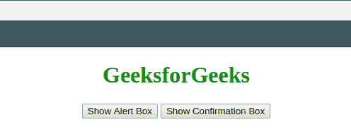

# JavaScript 中提醒框和确认框的区别

> 原文:[https://www . geesforgeks . org/JavaScript 中警告框和确认框的区别/](https://www.geeksforgeeks.org/difference-between-alert-box-and-confirmation-box-in-javascript/)

这两个框都显示为弹出框，或者您可以将其称为弹出框。弹出框有三种类型，通过阅读[可以有基本的了解，JavaScript 中有哪些类型的弹出框？](https://www.geeksforgeeks.org/what-are-the-types-of-popup-box-available-in-javascript/)和 [JavaScript |对话框](https://www.geeksforgeeks.org/javascript-dialogue-boxes/)文章。

1.  **警告框**
2.  **确认框**
3.  **提示框**

所有这些弹出窗口都会打开一个模态窗口，这意味着如果用户不首先响应这个窗口，就无法与网页的其他组件进行交互。在本文中，我们将讨论最容易混淆的两个弹出框**警报**和**确认框**之间的区别。

**警告框:**

*   警报框用于通知/提醒用户某个事件。
*   这种弹出框只有一个名为“确定”的按钮，没有返回值。
*   可以使用功能**报警(“消息”)**调用报警框。

**确认框:**

*   确认框用于向用户提供关于事件的选择。
*   这种类型的弹出框有两个按钮，名为“确定”和“取消”，当单击相应的按钮时返回“真”和“假”。
*   可以使用**确认(“消息”)功能调用确认框。**

以下示例说明了警报框和确认框之间的区别。

**示例:**

```html
<!DOCTYPE HTML> 
<html> 

<head> 
    <title> 
        Alert Box vs Confirmation Box
    </title> 
</head> 

<body style="text-align:center;" id="body"> 

    <h1 style="color:green;"> 
        GeeksforGeeks 
    </h1> 

    <button onclick="alertBox()">
        Show Alert Box
    </button> 
    <button onclick="confirmationBox()">
        Show Confirmation Box
    </button>

    <script> 
        function alertBox(){
            alert("GeeksforGeeks: This" +
                       " is an Alert Box.");
        }

        function confirmationBox(){
            confirm("GeeksforGeeks: This" +
                     " is a Confirmation Box.");
        }
    </script> 
</body> 

</html>                    
```

**输出:**


基于操作的确认框返回不同的值。但是报警框只返回用户同意值-

*   在确认框中按下“确定”按钮，功能**确认()**返回“真”，按下“取消”返回“假”。
*   下面是一个简单的 If-Else 语句，用于检查返回类型。
*   我们通过修改上面代码片段中的函数**‘confirmation box()’**来实现这一点。

```html
function confirmationBox(){
    if(confirm("GeeksForGeeks: This is a Confirmation Box")){
        console.log("'OK' button was pressed.");
    }else{
        console.log("'Cancel' button was pressed.");
    }
}
```

**输出:**按下“确定”和随后的“取消”按钮时，浏览器控制台中的输出。
T3】