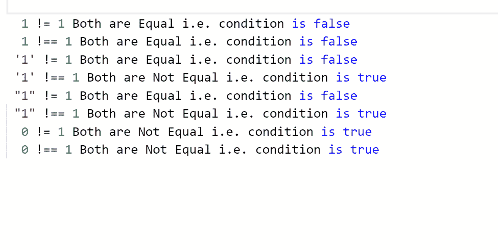

# 区别！=还有！= = JavaScript 中的运算符

> 原文:[https://www . geesforgeks . org/JavaScript-2 中运算符与运算符的区别/](https://www.geeksforgeeks.org/difference-between-and-operator-in-javascript-2/)

*   **！=操作员**
    *   不等式运算符(！=)是等式运算符的逻辑反义词。它的意思是*“不相等”*，当相等会返回假时返回真，反之亦然。
    *   像相等运算符一样，不等运算符将在比较时转换值的数据类型。
    *   比如 1！=“1”将返回 false，因为发生了数据类型转换，所以 1 和“1”被视为相等。
*   **！==操作员**
    *   严格不等式运算符(！==)是严格等式运算符的逻辑对立面。意思是*“严格不相等”*，当严格相等会返回假时返回真，反之亦然。
    *   严格不等式不会转换数据类型。
    *   比如 1！= =“1”将返回 true，因为 1 是整数，“1”是字符，并且不会发生数据类型转换。

**示例:**

```
<script>
    function NotEqual(val) {
        if (val != 1) {
            return "Both are Not Equal i.e. condition is true";
        } else {
            return "Both are Equal i.e. condition is false";
        }
    }

function StrictlyNotEqual(val) {
    if (val !== 1) {
        return "Both are Not Equal i.e. condition is true";
    } else {
        return "Both are Equal i.e. condition is false";
    }
}

//Passing integer

console.log("  1 != 1 " + NotEqual(1));
console.log("  1 !== 1 " + StrictlyNotEqual(1));

//Passing character

console.log(" '1' != 1 " + NotEqual('1'));
console.log(" '1' !== 1 " + StrictlyNotEqual('1'));

//Passing string

console.log(" \"1\" != 1 " + NotEqual("1"));
console.log(" \"1\" !== 1 " + StrictlyNotEqual("1"));

//Passing false value i.e. 0

console.log("  0 != 1 " + NotEqual(0));
console.log("  0 !== 1 " + StrictlyNotEqual(0)); 
</script>
```

**输出:**
