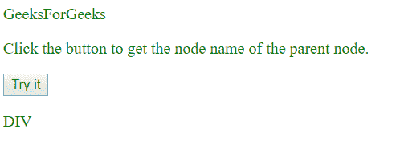
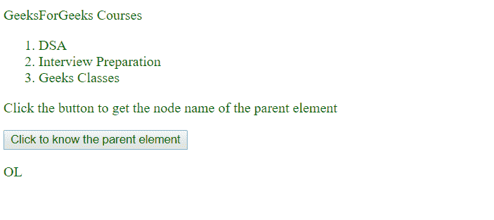

# JavaScript 中 DOM parentNode 和 parentElement 的区别

> 原文:[https://www . geesforgeks . org/DOM-parent node-和-parent element-in-JavaScript/](https://www.geeksforgeeks.org/difference-between-dom-parentnode-and-parentelement-in-javascript/)之间的区别

*   **[parentNode:](https://www.geeksforgeeks.org/html-dom-parentnode-property/)**
    The parent node property is read only property which returns us the name of the parent node of the selected node as a node object. The Node object represents a single node in the document tree and a node can be an element node, text node or more.

    **语法:**

    ```
    node.parentNode
    ```

    **返回值:**父节点属性返回父节点对象(如果存在)，否则将返回*“空”*。

    **示例:**

    ```
    <!DOCTYPE html>
    <html>

    <body>
        <!--setting styles for our document-->
        <style>
            p {
                color: green;
            }
        </style>

        <p>GeeksForGeeks</p>

        <div>

            <p id="gfg">Click the button to get the
              node name of the parent node.</p>
            <!--here 'p' element is inside 'div' element 
            meaning that 'div' is the parent of 'p' element here-->

        </div>

        <button onclick="myParentNode()">Try it</button>

        <p id="text"></p>

        <script>
            function myParentNode() {
                var geek = document.getElementById("gfg").parentNode.nodeName;

                /*appending parent node to the 'p' element with id named text*/
                document.getElementById("text").innerHTML = geek; 
            }
        </script>

    </body>

    </html>
    ```

    **输出:**
    

*   **[parentElement:](https://www.geeksforgeeks.org/html-dom-parentelement-property/)**
    The parent element is read only property which returns the parent element of the selected element.The element object represents an HTML element, like P, DIV, etc.

    **语法:**

    ```
    node.parentElement
    ```

    **返回值:**ParentElement 属性返回表示父元素的元素对象(如果存在)，否则将返回空值。

    **示例:**

    ```
    <!DOCTYPE html>
    <html>

    <body>
        <!--setting styles for our document-->

        <style>
            p,
            ol {
                color: green;
            }
        </style>

        <p>GeeksForGeeks Courses</p>

        <ol>
            <li id="geek">DSA</li>
            <li>Interview Preparation</li>
            <li>Geeks Classes</li>
        </ol>

        <p>Click the button to get the node 
          name of the parent element</p>

        <button onclick="myParentElement()">
          Click to know the parent element
      </button>
        <!--here 'li' element is inside 'ol' element meaning
          that 'ol' is the parent of 'li' element here-->
        <p id="gfg"></p>

        <script>
            function myParentElement() {
                var text = document.getElementById(
                  "geek").parentElement.nodeName;
                document.getElementById("gfg").innerHTML = text;
            }
        </script>

    </body>

    </html>
    ```

    **输出:**
    

    **区别:**
    如果父元素不是元素节点，那么 parentElement 返回 null，这就是 Parent Element 和 parentNode 的主要区别。在许多情况下，人们可以使用它们中的任何一个，在大多数情况下，它们是相同的。例如:

    ```
    // returns the document node
    document.documentElement.parentNode; 

    // returns null
    document.documentElement.parentElement; 

    ```

    HTML 元素(document.documentElement)没有作为元素的父元素，它是一个节点，因此，父元素为空。

    **支持的浏览器:**以下列出了**父节点**和 **DOM 父元素属性**支持的浏览器:

    *   谷歌 Chrome
    *   微软公司出品的 web 浏览器
    *   火狐浏览器
    *   苹果 Safari
    *   歌剧