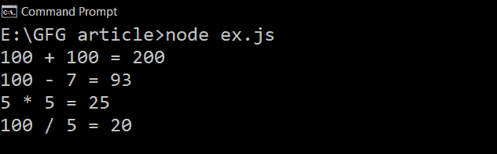

# JavaScript 中一级函数和高阶函数的区别

> 原文:[https://www . geeksforgeeks . org/JavaScript 中一级函数和高阶函数的区别/](https://www.geeksforgeeks.org/difference-between-first-class-and-higher-order-functions-in-javascript/)

**一级函数:**如果一种编程语言中的函数被视为其他变量，则称该语言具有**一级函数**。因此，这些函数可以赋给任何其他变量，或者作为参数传递，或者由另一个函数返回。
JavaScript 将函数视为一等公民。这意味着函数只是一个值，只是对象的另一种**类型**。

**举例:**我们举个例子，多了解一下一级函数。

## java 描述语言

```
const Arithmetics = {
    add:(a, b) => {
        return `${a} + ${b} = ${a+b}`;
    },
    subtract:(a, b) => {
        return `${a} - ${b} = ${a-b}`
    },
    multiply:(a, b) => {
        return `${a} * ${b} = ${a*b}`
    },
    division:(a, b) => {
        if(b!=0) return `${a} / ${b} = ${a/b}`;
        return `Cannot Divide by Zero!!!`;
    }

}

console.log(Arithmetics.add(100, 100));
console.log(Arithmetics.subtract(100, 7));
console.log(Arithmetics.multiply(5, 5));
console.log(Arithmetics.division(100, 5));
```

**输出:**在上述程序中，函数作为变量存储在对象中。



一级函数

**高阶函数:**接收另一个函数作为参数或返回新函数或两者都有的函数称为高阶函数。高阶函数是可能的，因为一级函数。

让我们举一些例子来更好地理解:

**示例 1:** 返回另一个函数的函数。

## java 描述语言

```
const greet =  function(name){
    return function(m){

        console.log(`Hi!! ${name}, ${m}`);
    }
}

const greet_message = greet('ABC');
greet_message("Welcome To GeeksForGeeks")
```

**注意:**我们也可以这样调用这个函数——**问候(【ABC】)(【欢迎来到 geeks forgeeks】)**，它也会给出同样的输出。

**输出:**

```
Hi!! ABC, Welcome To GeeksForGeeks
```

**示例 2:** 将函数作为参数传递。

## java 描述语言

```
function greet(name){
    return `Hi!! ${name} `;
}

function greet_name(greeting,message,name){
       console.log(`${greeting(name)} ${message}`);
}

greet_name(greet,'Welcome To GeeksForGeeks','JavaScript');
```

**注意**:我们作为参数传递给另一个函数的函数叫做[回调](https://www.geeksforgeeks.org/javascript-callbacks/#:~:text=If%20we%20want%20to%20execute,any%20other%20function%20while%20calling.)函数。

**输出:**

```
Hi!! JavaScript  Welcome To GeeksForGeeks
```

**注:**函数如[滤波器()](https://www.geeksforgeeks.org/javascript-array-filter-method/)、[映射()](https://www.geeksforgeeks.org/javascript-array-map-method/)、 [reduce()、](https://www.geeksforgeeks.org/javascript-array-reduce-method/) [some()](https://www.geeksforgeeks.org/javascript-array-some-method/) 等，这些都是高阶函数的例子。

**一阶函数与高阶函数的主要区别:-**

<figure class="table">

| first derivative | higher-order function |
| The function is treated as a variable and can be assigned to any other variable or passed as a parameter. | The function takes another function as a parameter, or returns a new first-order function, or both. |
| The concept of "first-class" is only related to functions in the programming language. | Generally speaking, the concept of "higher order" can be applied to functions, just like functions in the mathematical sense. |
| The existence of first-order function means the existence of higher-order function. | The existence of higher-order functions does not mean the existence of first-order functions. |

</figure>