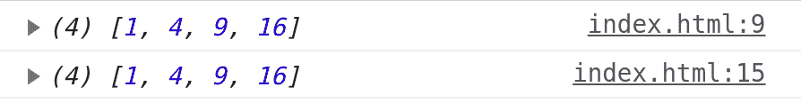

# JavaScript 中 forEach()和 map()循环的区别

> 原文:[https://www . geeksforgeeks . org/foreach-and-map-in-loop-in-JavaScript/](https://www.geeksforgeeks.org/difference-between-foreach-and-map-loop-in-javascript/)

当我们使用数组时，在数组上迭代以访问元素并对这些元素执行某种功能以完成任何任务是必不可少的步骤。
例如，如果你有一组 20 个学生获得的分数，你想计算他们的 GPA，如果你有一组图像，你想在前端渲染，等等。为了管理这种情况，您必须对如何访问数组的元素以及如何对它们进行操作有适当的了解。

除了基本的语言构造，即循环、 [while 循环](https://www.geeksforgeeks.org/javascript-while-loop/)和 [do-while 循环](https://www.geeksforgeeks.org/loops-in-javascript/)的[之外，还有两种广泛使用的迭代方法。](https://www.geeksforgeeks.org/javascript-for-loop/)

**。forEach()和。map():** 这些是用于在数组上迭代的方法，更严格地说，它们为数组的每个元素调用提供的回调函数。

**语法:**

```
forEach((currentElement, indexOfElement, array) => { ... } )
```

```
map((currentElement, indexOfElement, array) => { ... } )
```

**参数:**

*   **当前元素:**这是回调中正在处理的当前元素。
*   **indexOfElement:** 数组中当前元素的索引。
*   **数组:**正在执行整个操作的数组。

**示例 1:** 我们的目标是创建这样一种功能，它可以给出给定数组元素的平方值。我们创建了两个数组，一个是使用 [**forEach()**](https://www.geeksforgeeks.org/javascript-array-foreach-method/) 的数组，另一个是使用[**map()**](https://www.geeksforgeeks.org/javascript-array-map-method/) 的数组，两个数组都产生相同的结果。元素和索引在回调函数中被访问，我们在索引处分配每个元素的平方。

## Java Script 语言

```
<script>
    /* forEach method */
    let myArray1 = [1, 2, 3, 4];
    myArray1.forEach((element, index) => {
        myArray1[index] = element * element;
    })
    console.log(myArray1);

    /* map method */
    let myArray2 = [1, 2, 3, 4];
    myArray2.map((element, index) => {
        myArray2[index] = element * element;
    })
    console.log(myArray2);
</script>
```

**输出:**通过下面的输出图像，我们可以推导出两种方法的工作原理。



**示例 2:** 我们正在执行相同的功能，但是 **forEach()** 的返回值为“未定义”，而 **map()** 方法的返回值为数组。

## Java Script 语言

```
<script>
    let myArray = [1, 2, 3, 4];

    const returnValue = myArray.forEach((element) => {
        return element * element;
    });
    console.log(returnValue);
</script>
```