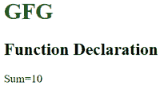
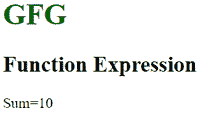

# JavaScript 中“函数声明”和“函数表达式”的区别

> 原文:[https://www . geesforgeks . org/函数声明和函数表达式在 javascript 中的区别/](https://www.geeksforgeeks.org/difference-between-function-declaration-and-function-expression-in-javascript/)

JavaScript 中的函数允许我们执行一些动作、重要决策或计算，甚至使我们的网站更具交互性。我们大多数编码爱好者都知道函数是什么。但是我们知道函数声明和函数表达式有什么区别吗？这篇文章让我们了解‘函数声明’和‘函数表达式’的区别。相似之处在于都使用了关键字 function，最突出的区别是 function 声明有一个 function name，而后者没有。

**功能声明:**

*   函数声明也称为函数语句，用函数关键字声明函数。函数声明必须有函数名。
*   函数声明不需要变量赋值，因为它们是独立的构造，不能嵌套在功能块中。
*   这些在任何其他代码之前执行。
*   函数声明中的函数可以在函数定义前后访问。

**语法:**

```
function geeksforGeeks(paramA, paramB) {
    // Set of statements
}
```

**函数表达式:**

*   函数表达式类似于没有函数名的函数声明。
*   函数表达式可以存储在变量赋值中。
*   函数表达式只有在程序解释器到达代码行时才加载和执行。
*   函数声明中的函数只有在函数定义之后才能被访问。

**语法:**

```
var geeksforGeeks= function(paramA, paramB) {
    // Set of statements
}
```

**例 1:功能声明**

下面的例子说明了一个函数声明，其中我们做了两个数字的加法。

## 超文本标记语言

```
<!DOCTYPE html>
<html>

<head>
    <title>Function Declaration</title>
</head>

<body>
    <h1 style="color:green">GFG</h1>
    <h2>Function Declaration</h2>

    <script>

        // Function Declaration
        function geeksforGeeks(paramA, paramB) {
            return paramA + paramB;
        }

        var result = geeksforGeeks(5, 5);
        document.write('Sum=', result);
    </script>
</body>

</html>
```

**输出:**



**例 2:函数表达式**

下面的例子说明了一个函数表达式，其中我们做了两个数字的加法。

## 超文本标记语言

```
<!DOCTYPE html>
<html>

<head>
    <title>Function Declaration</title>
</head>

<body>
    <h1 style="color:green">GFG</h1>
    <h2>Function Expression</h2>

    <script>

        // Function Expression
        var geeksforGeeks = function (paramA, paramB) {
            return paramA + paramB;
        }

        var result = geeksforGeeks(5, 5);
        document.write('Sum=', result);
    </script>
</body>

</html>
```

**输出:**



**函数声明与函数表达式的区别:**

<figure class="table">

|  | **Function declaration** | **Functional expression** |
| 1。 | Function declaration must have a function name. | Function expressions are similar to function declarations without function names. |
| 2。 | Function declaration does not require variable assignment. | Function expressions can be stored in a variable assignment. |
| 3。 | These are executed before any other code. | The function expression is loaded and executed only when the program interpreter reaches the code line. |
| 4。 | Functions in function declarations can be accessed before and after function definition. | The function in the function declaration can only be accessed after the function is defined. |
| 5。 | Function declaration is suspended. | Function expression is not suspended. |
| 6。 | **(英文):**
魏冄 geeks forgeeks(stop，param){
//哟哟哟哟哟哟哟哟哟哟哟哟哟哟哟哟哟哟哟哟哟哟哟哟哟哟哟哟哟哟哟哟哟哟哟哟哟哟哟哟哟哟哟哟哟哟哟哟哟哟哟哟哟哟哟哟哟哟哟哟
 | **(英文):**
var geeksforGeeks=魏冄(param，param b){
//哟哟哟哟哟哟哟哟哟哟哟哟哟哟哟哟哟哟哟哟哟哟哟哟哟哟哟哟哟哟哟哟哟哟哟哟哟哟哟哟哟哟哟哟哟哟哟哟哟哟哟哟哟哟哟哟哟哟哟哟
 |

T77</figure>