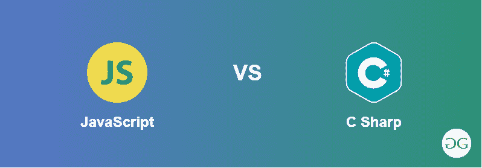

# 【JavaScript 和 C 夏普的区别

> 原文:[https://www . geesforgeks . org/JavaScript 和-c-sharp 之间的区别/](https://www.geeksforgeeks.org/difference-between-javascript-and-c-sharp/)

如今，没有人会因为学习一种方言而缺席，无论你从哪种方言开始。从长远来看，同时拥有 JavaScript 和 C#的信息是有利的。一般来说，一个人必须像 Java 一样在 C#中输入如此多的代码行来引导事情的完成，而在 JavaScript 中却不是这样。

[**JavaScript(JS):**](https://www.geeksforgeeks.org/javascript-tutorial/)JavaScript 可能是一种高级编程方言。它通常用于网络浏览器。除了 HTML 和 CSS，JavaScript 是万维网的建立。它使得客户端和服务器之间的交互变得可以想象。大量的网站使用 JavaScript，几乎所有尖端的网络浏览器都有一个 JavaScript 引擎。JavaScript 支持事件驱动的、有用的和基本的编程风格，它可能是一种多范例方言。它可以处理内容、集群、习惯表达式、日期，并且可以对文档对象模型(DOM)进行必要的控制。

[**C Sharp(c#)**](https://www.geeksforgeeks.org/csharp-programming-language/)T4:它可能是一种通用的、面向对象的编程方言。它期待一种简单、高级和通用的方言。已经计划构建一个从小功能扩展到扩展工作框架的程序。此外，它是一种多范式方言，是扎实的书面，基本的，启示性的，有用的和成分安排。

【JavaScript 和 C 夏普的区别:

<figure class="table">

| Java Script 语言 | csharp |
| --- | --- |
| JavaScript runs in the largest browser without any plug-in prerequisites. | C# requires a plug-in. |
| Unable to check or enter records in the client machine. | You can check and write records with the permission of the silver plate. |
| JavaScript is written dynamically. | Write quietly. |
| There is a JavaScript isolation library to do local questions like underline. js | C# has LINQ, and one is valid. NET component, with which you can ask local questions. |
| JavaScript becomes overburdened without an administrator. | C# has the capacity of administrator and transformation overload. |
| The main purpose of JavaScript is to form an intuitive web application. | C# can be used in a wide variety of applications. |
| The scope of JavaScript is limited, and this dialect has some pitfalls. | C# may be a really vibrant dialect, and engineers tend to use it all over the world. |
| Javascript is a single-threaded language. | C sharp supports multithreading. |

</figure>