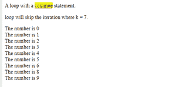
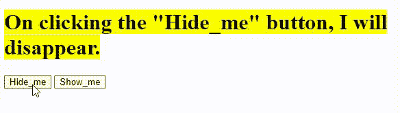

# 【JavaScript 和 jQuery 的区别

> 原文:[https://www . geesforgeks . org/JavaScript 和-jquery 的区别/](https://www.geeksforgeeks.org/difference-between-javascript-and-jquery/)

在本文中，我们将通过示例学习 Javascript 和 jQuery 以及它们的基本区别。

[**JavaScript**](https://www.geeksforgeeks.org/javascript-tutorial/)**:**它是一种主要的脚本编程语言，用于使网站更具响应性和交互性。它是 [HTML](https://www.geeksforgeeks.org/html-tutorials/) 和 [CSS](https://www.geeksforgeeks.org/css-tutorials/) 旁边用来创建网页的枢转部分之一。如果说 HTML & CSS 如此修饰和设计网页，那么 Javascript 让网页变得动态(我们可以说它赋予了网页生命)。JavaScript 是一种主要的客户端语言。它不仅局限于网站开发，还被用于许多桌面和服务器程序(Node.js 是最著名的例子)，一些数据库，如 MongoDB 和 CouchDB，也使用 JavaScript。每当您的浏览器解析网页时，它的职责就是在内存中创建一个树形结构的表示。

**示例:**本示例使用 Javascript 循环概念打印数字。

## 超文本标记语言

```
<!DOCTYPE html>
<html>

<body>

<p>A loop with a
        <mark>continue</mark> statement.
    </p>

    <p>loop will skip the iteration where k = 7.</p>

    <p id="maddy"></p>

    <script>
        var text = "";
        var k;
        for (k = 0; k < 10; k++) {
            if (k === 7) {
                continue;
            }
            text += "The number is " + k + "<br>";
        }
        document.getElementById("maddy").innerHTML = text;
    </script>
</body>

</html>
```

**输出:**



JavaScript 输出

**jQuery:** JQuery 是从 JavaScript 发展而来的一个 javaScript 框架。它是约翰·辞职发明的最受欢迎的 JavaScript 库，于 2006 年 1 月在纽约的 BarCamp 发布。这是一个免费的开源库，它是一个快速、简洁、功能丰富的 JavaScript 库，并且具有跨浏览器兼容性。jQuery 的目的是让大众的生活更轻松，这样他们就可以使用 javaScript 轻松开发网站和基于浏览器的应用程序。简洁地说，我们可以说“JQuery 是一个库，借助其功能丰富的库为开发人员提供更好的客户端网页开发”环境。

*   **DOM 操作:** DOM 元素可以轻松遍历、修改。
*   动画许多内置的动画功能。
*   HTML 事件处理和操纵。
*   Ajax 更简单，它有一个易于使用的应用编程接口，可以跨多种浏览器工作。
*   CSS 操作
*   拥有高级 UI 小部件库。
*   **跨浏览器支持:**在 Chrome、Opera 等浏览器上运行良好。
*   **轻量级:**只有 19kb 大小。
*   和其他常用工具

**示例:**本示例使用 [show()方法](https://www.geeksforgeeks.org/jquery-ui-show-method/) & [hide()方法](https://www.geeksforgeeks.org/jquery-hide-with-examples/)来切换要显示的元素。

## 超文本标记语言

```
<!DOCTYPE html>
<html>

<head>
    <script src=
"https://ajax.googleapis.com/ajax/libs/jquery/3.5.1/jquery.min.js">
    </script>

    <script>
        $(document).ready(function () {
            $("#hide").click(function () {
                $("h1").hide();
            });
            $("#show").click(function () {
                $("h1").show();
            });
        });
    </script>
</head>

<body>
    <h1>
        <mark>
            On clicking the "Hide_me" button, I will disappear.
        </mark>
    </h1>
    <button id="hide">Hide_me</button>
    <button id="show">Show_me</button>
</body>

</html>
```

**输出:**当我们点击 Hide_me 按钮时，上面标记的标题将消失，但是一旦我们点击 Show_me 按钮，它将再次出现。



切换以查看隐藏元素

**JavaScript 与 JQuery 的关键区别如下:**

<figure class="table">

| **JavaScript**T3] |  | 

#### **【jquery】**

 |
| --- | --- | --- |
| 1。 | JavaScript 使用 JIT【适时编译器】，JIT 是解释器和编译器的结合，用 c 语言编写，是 ECMA 脚本和 DOM (Document Object Model)的结合。 |  | 而 JQuery 则利用 JavaScript 提供的资源让事情变得更简单。它是一个轻量级的 JavaScript 库。它只有 DOM。 |
| 2。 | JavaScript 使用长行代码，就像个人必须自己编写代码一样。

 |  | 有了 JQuery，一个人要写的代码行就比 JavaScript 少了。我们只需要导入库，并在我们的代码中只使用库的特定函数或方法。 |
| 3。 | 在 JavaScript 中，我们必须编写额外的代码或四处移动才能具有跨浏览器兼容性。 |  | JQuery 具有跨浏览器兼容的内置特性。为了使我们的代码与任何浏览器兼容，我们不需要担心编写额外的代码行或四处移动。 |
| 4。 | JavaScript 对开发人员来说可能是一个负担，因为它可能需要几行冗长的代码来实现功能。 |  | 与 JavaScript 不同，JQuery 更为用户友好，只需编写几行代码就能拥有其功能。 |
| 5。 | JavaScript 冗长，因为要编写自己的脚本代码，很费时间。 |  | JQuery 简洁明了，不需要写太多，因为脚本已经存在。 |
| 6。 | 纯 JavaScript 可以比 JQuery 更快地进行 DOM 选择/操作，因为 JavaScript 是由浏览器直接处理的，而且它减少了 jQuery 实际拥有的开销。 |  | JQuery 也快与现代浏览器和现代电脑接轨了。JQuery 必须转换成 JavaScript 才能在浏览器中运行。 |
| 7。 | 我们可以用多行代码在 JavaScript 中制作动画。动画主要是通过操纵 Html 页面的样式来完成的。 |  | 在 JQuery 中，我们可以用更少的代码行轻松添加动画效果。 |
| 8。 | JavaScript 是一种语言，显然，它会比 JQuery 更重。 |  | 而 JQuery 是一个库，派生自 JavaScript 遂，它是轻量级的。 |
| 9。 | JavaScript 是一种独立的语言，可以独立存在。 |  | JQuery 是一个 JavaScript 库。如果没有 JavaScript，它就不会被发明出来。jQuery 仍然依赖于 JavaScript，因为它必须转换为 JavaScript，浏览器内置的 JavaScript 引擎才能解释和运行它。 |

</figure>

jQuery 是一个开源的 JavaScript 库，它简化了一个 HTML/CSS 文档之间的交互，它以**“少写多做”**的理念而闻名。详情请参考 [jQuery 教程](https://www.geeksforgeeks.org/jquery-tutorials/)和 [jQuery 示例](https://www.geeksforgeeks.org/jquery-examples/)文章。