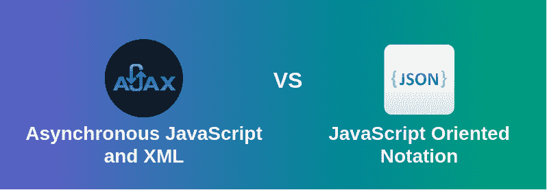

# 【JSON 和 AJAX 的区别

> 原文:[https://www . geesforgeks . org/JSON 和-ajax 的区别/](https://www.geeksforgeeks.org/difference-between-json-and-ajax/)

**[AJAX:](https://www.geeksforgeeks.org/ajax-introduction/)** Ajax 是异步 Javascript 和 XML 的缩写。它用于在不刷新网页的情况下与服务器通信，从而增加用户体验和更好的性能。

有两种类型的请求同步和异步。同步请求是按顺序执行的请求，即如果一个进程正在运行，同时另一个进程想要执行，则不允许，这意味着一次只能执行一个进程。这是不好的，因为在这种类型中，大多数时间中央处理器保持空闲，例如在进程中的输入/输出操作期间，这比中央处理器处理指令慢一个数量级。因此，为了充分利用中央处理器和其他资源，使用异步调用。

**AJAX 的优势:**

*   速度得到了提高，因为不需要再次重新加载页面。
*   AJAX 对 web 服务器进行异步调用，这意味着客户端浏览器避免在开始呈现之前等待所有数据到达。
*   表单验证可以通过它成功完成。
*   带宽利用率–当从同一页面提取数据时，它可以节省内存。

**AJAX 的缺点:**

*   Ajax 依赖于 Javascript。如果浏览器或操作系统有一些 Javascript 问题，Ajax 将不支持。
*   Ajax 在搜索引擎中可能会有问题，因为它的大部分部分都使用了 JavaScript。
*   用 AJAX 编写的源代码很容易被人阅读。Ajax 中会有一些安全问题。
*   使用支持 AJAX 的页面时浏览器后退按钮出现问题。

**[JSON:](https://www.geeksforgeeks.org/json-full-form/)** JSON 代表 JavaScript 对象符号。它是一种基于文本的数据交换格式，用于维护数据的结构。JSON 是 JSON 中 XML 数据交换格式的替代。与 XML 相比，结构化数据很容易。它支持像数组和对象这样的数据结构，以及在服务器上快速执行的 JSON 文档。它也是一种独立于语言的格式，来源于 JavaScript。JSON 的官方媒体类型是 application/json，用于保存这些文件。json 扩展。

**JSON 的优势:**

*   JSON 将所有数据存储在一个数组中，因此数据传输更加容易。这就是为什么 JSON 最适合共享任何大小的数据，甚至是音频、视频等。
*   它的语法非常容易使用。它的语法非常小并且很轻，这就是它执行和响应速度更快的原因。
*   JSON 具有广泛的浏览器支持与操作系统的兼容性。它不需要太多的努力就能让所有浏览器兼容。
*   在服务器端解析这一开发人员最想要的部分，如果解析在服务器端会很快，那么用户就可以得到快速的响应，所以在这种情况下，JSON 服务器端解析是相比其他解析的强项。

**JSON 的缺点:**

*   JSON 的主要缺点是 JSON 中没有错误处理，如果 JSON 脚本中有一个小错误，那么您将无法获得结构化数据。
*   当你在一些未经授权的浏览器上使用 JSON 时，它变得相当危险。就像 JSON 服务返回一个用函数调用包装的 JSON 文件，浏览器必须执行这个函数调用。如果浏览器未经授权，那么你的数据就会被黑客攻击。
*   JSON 有有限的支持工具，我们可以在 JSON 开发过程中使用。

| 创建交互式、快速动态网页应用的网页开发技术 | JSON |
| --- | --- |
| AJAX 正在适当地利用来规划互联网页面，特别是当页面需要一些服务器端信息而又不能恢复时。 | JSON 不仅仅用于规划网页。事实上，JSON 在某些时候根本没有用于网络应用程序。 |
| AJAX 消息完全充满活力，它没有任何特定的结构。它通过 XHTML 和 JavaScript 编程将请求发送到服务器端。服务器端给出的反应可以由设计师根据商业需要进行调整。 | JSON 消息基本上保持在一个定义良好的 Procure 结构中，该结构主要由集群 Procure 的 JavaScript 简单集合来计划，但是可以被任何编程方言重用。JSON 主要流行于休息网络福利。 |
| AJAX 可能是一些创新和过程的混合，它们一起工作，为页面进行大踏步的循环旅行，并根据需要更新页面的一些部分，而无需再次堆叠整个页面。 | JSON 可能是一个基于文本的开放标准，为人类可读的信息兼容性而概述，它利用客户端来存储和恢复信息。 |
| 实际上，它暗指浏览器为了在当前页面上运行一些脚本而提出的任何不寻常的请求(任何使用 XmlHttpRequest 的请求)，无论返回什么内容类型。 | 它的格式像:{“key”:“value 1”，“key 2”:{“number”:1，“cluster”:[0，1，2]}} JSON 信息可能是通过 AJAX ask 获得的，尽管它在其他设置中作为轻量级、可扩展和易于解析的信息交易组织器非常常用。 |