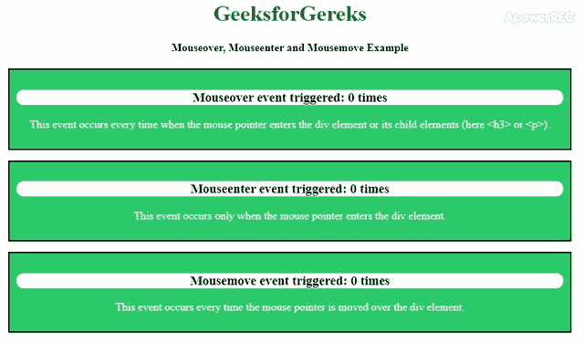

# JavaScript 中鼠标悬停、鼠标进入和鼠标移动事件的区别

> 原文:[https://www . geeksforgeeks . org/mouse over-mouse enter-and-mouse move-events-in-JavaScript/](https://www.geeksforgeeks.org/difference-between-mouseover-mouseenter-and-mousemove-events-in-javascript/)之间的区别

JavaScript 中的事件为网页提供了一个动态界面。有各种各样的事件，例如用户**点击**、**将鼠标移动到某个元素上等等。当鼠标与 HTML 文档交互时发生的事件属于 MouseEvent 属性的范畴。**

*   **鼠标悬停:**当鼠标指针进入一个元素或其任何一个子元素时，onmouseover 事件触发。

    ```
    <element onmouseover="myfunction()">
    ```

*   **mouse enter:**onmouse enter 事件仅在鼠标指针碰到元素时触发。

    ```
    <element onmouseenter="myfunction()">
    ```

*   **鼠标移动:**当鼠标指针在一个元素上移动时，onmousemove 事件每次都会被触发。

    ```
    <element onmousemove="myfunction()">
    ```

**注意:**每次用户将鼠标移动一个像素时，都会发生 mousemove 事件。

**示例:**以下示例演示了在 JavaScript 中使用的 onmousemove、onmouseenter 和 onmouseover 事件之间的区别:

```
<!DOCTYPE html>
<html>

<head>
    <title>
        Difference between mouseover,
        mouseenter and mousemove events
    </title>

    <style>
        body {
            text-align: center;
        }

        h1 {
            color: green;
        }

        div {
            margin: 15px 50px 0px 50px;
            border: 2px solid black;
            padding: 10px;
            text-align: center;
            background-color: #2ec96c;
        }

        p {
            color: white;
        }

        h3 {
            background-color: white;
            border-radius: 10px;
        }
    </style>

    <script>
        function over(e) {
            document.getElementById("sover").innerHTML++;
        }

        function enter(e) {
            document.getElementById("senter").innerHTML++;
        }

        function move(e) {
            document.getElementById("smove").innerHTML++;
        }
    </script>
</head>

<body>
    <h1>GeeksforGereks</h1>
    <h4>Mouseover, Mouseenter and Mousemove Example</h4>
    <div class="over" onmouseover="over(this)">
        <h3>Mouseover event triggered: 
          <span id="sover">0</span> 
          times
        </h3>
        <p>
          This event occurs every time when the mouse pointer
          enters the div element or its child elements
          (here <h3> or <p>).
        </p>
    </div>

    <div class="enter" onmouseenter="enter(this)">
        <h3>Mouseenter event triggered:
          <span id="senter">0</span>
          times
        </h3>
        <p>
          This event occurs only when the mouse pointer enters
          the div element.
        </p>
    </div>

    <div class="move" onmousemove="move(this)">
        <h3>Mousemove event triggered: 
          <span id="smove">0</span> 
          times
        </h3>
        <p>
          This event occurs every time the mouse pointer is
          moved over the div element.
        </p>
    </div>

</body>

</html>
```

**输出:**


**注意:**onmouseenter 和 onmouseover 元素都是相似的，只是 onmouseenter 事件不会在文档层次结构中向上传播。