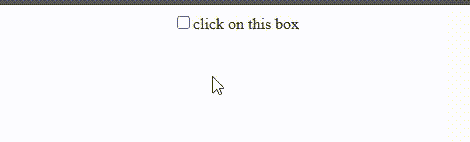
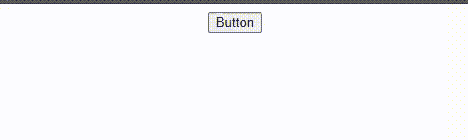

# JavaScript 中 preventDefault()和 stopPropagation()方法的区别

> 原文:[https://www . geeksforgeeks . org/difference-preventdefault-and-stop propagation-methods-in-JavaScript/](https://www.geeksforgeeks.org/difference-between-preventdefault-and-stoppropagation-methods-in-javascript/)

在本文中，我们将讨论 PreventDefault & stopPropagation 方法，并为每个条件提供合适的代码示例&然后我们将看到 PreventDefault 与 stopperpagement 之间的区别。

**preventDefault()方法:**是事件界面中存在的方法。此方法防止浏览器执行选定元素的默认行为。只有当事件可取消时，此方法才能取消事件。例如，有些事件是无法避免的，例如滚动和滚轮事件。

**语法:**

```
event.preventDefault();
```

**参数:**此方法不接受任何参数。

借助示例，我们将看到应用这两种方法的方法。

**示例 1:** 阻止链接跟随 URL，使浏览器无法转到另一个页面。

## 超文本标记语言

```
<!DOCTYPE html>
<html lang="en">

<head>

    <!-- Using jquery library -->
    <script src=
"https://code.jquery.com/jquery-git.js">
    </script>
</head>

<body>
    <a id="first" href="www.geeksforgeeks.com">
        GeeksForGeeks
    </a>

    <script>
        $("#first").click(function () {
            event.preventDefault();
            alert("Event prevented, Can't go there.");
        });
    </script>
</body>

</html>
```

**输出:**


**示例 2:** 它阻止用户选中复选框。通常，当我们单击复选框时，在调用 preventDefault()方法后，它会切换，但不会起作用。

## 超文本标记语言

```
<!DOCTYPE html>
<html lang="en">

<head>

    <!-- Using jquery library -->
    <script src=
"https://code.jquery.com/jquery-git.js">
    </script>
</head>

<body>
    <input type="checkbox" id="f" />
    click on this box

    <script>
        $("#f").click(function () {
            event.preventDefault();
            alert("Event prevented");
        });
    </script>
</body>

</html>
```

**输出:**



**stopperpagation()事件方法:**此方法用于防止父元素访问事件。基本上，此方法用于防止同一事件的传播被调用。例如，我们在 **div** 标签中有一个**按钮**元素，并且两者上都有一个 **onclick** 事件，那么每当我们试图激活附加到**按钮**元素的事件时，附加到 **div** 元素的事件也会被执行，因为 **div 是按钮元素的父元素。**

**语法:**

```
event.stopPropagation();
```

我们可以通过使用**stopperpagation()**方法来解决这个问题，因为这将阻止父级访问事件。

**例 1:**

## 超文本标记语言

```
<!DOCTYPE html>
<html>

<head>

    <!-- jQuery library -->
    <script src=
"https://code.jquery.com/jquery-git.js">
    </script>
</head>

<body>
    <div class="first" onclick="functionFirst()">
        <button onclick="functionSecond()">
            Button
        </button>
    </div>

    <script>
        function functionSecond() {
            alert("button hello");
        }
        function functionFirst() {
            alert("div hello");
        }
    </script>
</body>

</html>
```

**输出:**


这里，点击按钮后，两个功能都将被执行。

**例 2:**

## 超文本标记语言

```
<!DOCTYPE html>
<html>

<head>

    <!-- jQuery library -->
    <script src=
"https://code.jquery.com/jquery-git.js">
    </script>
</head>

<body>
    <div class="first" onclick="functionFirst()">
        <button onclick="functionSecond()">
            Button
        </button>
    </div>

    <script>
        function functionSecond() {
            event.stopPropagation();
            alert("button hello");
        }
        function functionFirst() {
            alert("div hello");
        }
    </script>
</body>

</html>
```

**输出:**



现在，在这种情况下，我们添加了一个**event . stopperpagation()**方法，然后将执行**按钮**元素的唯一功能。

#### preventDefault()和 stopPropagation()方法之间的区别:

<figure class="table">

| 

event.preventDefault()方法

 | 

事件停止传播()方法

 |
| --- | --- |
| 阻止浏览器对该事件采取默认操作。 | 防止父元素或子元素进一步传播当前事件。 |
| 它是事件接口中的一个方法。 | 此方法也存在于事件界面中。 |
| 例如，它阻止浏览器跟随链接。 | 它无法阻止浏览器的默认行为。 |

</figure>