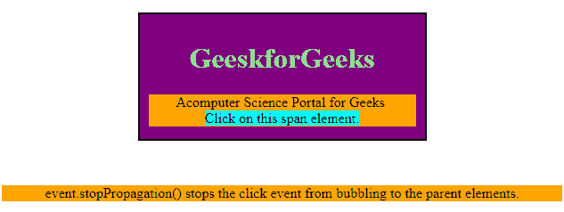
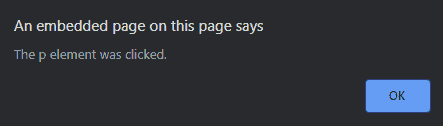
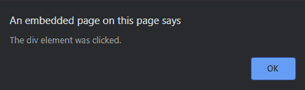
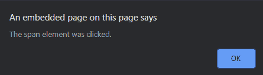
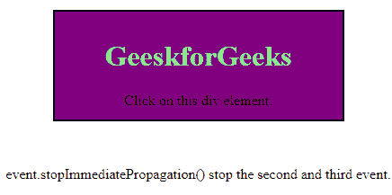
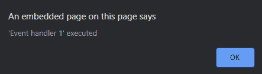

# 停止传播和停止即时传播在 JavaScript 中的区别

> 原文:[https://www . geeksforgeeks . org/difference-stop propagation-vs-stop immediate propagation-in-JavaScript/](https://www.geeksforgeeks.org/difference-between-stoppropagation-vs-stopimmediatepropagation-in-javascript/)

每次调用注册的事件时，事件都会传播或冒泡到窗口对象级别。**例如，**让我们考虑一个父 div 元素(“Div Parent”)，它包含另一个子 Div 元素(“Div child”)，对于这两个元素，都注册了一个 click 事件。如果单击子 div，事件将在所有地方触发，即父对象和子对象。

**stopperpagation()事件方法:**防止顶层 DOM 层次结构的任何处理程序传播执行。它阻止 click 事件冒泡到父元素。

**示例:**在此方法中，单击< div >元素后，第一个事件处理程序将发生，之后将不会发生任何事情。如果您单击< p >元素，那么将出现第二个和第一个事件处理程序，因为< p >元素在< div >元素内，但是如果您单击< span >元素，将只出现第三个事件处理程序，这将导致 StopPropagation()事件方法阻止事件冒泡到父元素。

## 超文本标记语言

```
<!DOCTYPE html>
<html>

<head>
    <script src=
"https://ajax.googleapis.com/ajax/libs/jquery/3.4.1/jquery.min.js">
    </script>

    <script>
        $(document).ready(function() {
            $("span").click(function(event) {
                event.stopPropagation();
                alert("The span element was clicked.");
            });

            $("p").click(function(event) {
                alert("The p element was clicked.");
            });

            $("div").click(function() {
                alert("The div element was clicked.");
            });
        });
    </script>

    <style>
        div {
            height: 120px;
            width: 300px;
            padding: 10px;
            margin: 50px;
            border: 2px solid black;
            background-color: purple;
        }
        p {
            background-color: orange;
        }
        span {
            background-color: cyan;
        }
    </style>
</head>

<body>
    <center>
        <div>
            <h1 style="color:lightgreen;">
                GeeskforGeeks
            </h1>

            <p>
                Acomputer Science Portal for Geeks<br>
                <span>Click on this span element.</span>
            </p>
        </div>

        <p>
            event.stopPropagation() stops the click event
            from bubbling to the parent elements.
        </p>
    </center>
</body>

</html>
```

**Output:**

*   **点击元素前:**
    
*   **点击<分区>元素后:**
    T3】
*   **点击< p >元素后:**
    
    
*   **点击<后跨>元素:**
    

**StopImmediatePropagation()事件方法:**防止任何其他处理程序和顶级 DOM 层次结构的处理程序传播。它会停止在此事件之后分配的其他事件。

**示例:**StOpimitempropagement()事件停止下一个事件。

## 超文本标记语言

```
<!DOCTYPE html>
<html>

<head>
    <script src=
"https://ajax.googleapis.com/ajax/libs/jquery/3.4.1/jquery.min.js">
    </script>

    <script>
        $(document).ready(function() {
            $("div").click(function(event) {
                alert("'Event handler 1' executed");
                event.stopImmediatePropagation();
            });

            $("div").click(function(event) {
                alert("'Event handler 2' executed");
            });

            $("div").click(function(event) {
                alert("'Event handler 3' executed");
            });
        });
    </script>

    <style>
        div {
            height: 100px;
            width: 300px;
            padding: 10px;
            margin: 50px;
            border: 2px solid black;
            background-color: purple;
        }
    </style>
</head>

<body>
    <center>
        <div>
            <h1 style="color:lightgreen;">
                GeeskforGeeks
            </h1>
            Click on this div element.
        </div>

        <p>
            event.stopImmediatePropagation() stop 
            the second and third event.
        </p>
    </center>
</body>

</html>
```

**Output:**

*   **点击 div 元素前:**
    
*   **点击 div 元素后:**
    

**停止传播与停止即时传播**

| 停止传播 | 停止即时传输 |
| 它将允许同一元素上的其他处理程序被执行，防止父元素上的处理程序运行。 | 它将阻止每个事件运行。 |
| 它将允许一个接一个地执行多个 handeler。 | 这将取决于你在哪里使用这个，汉德勒将是最后一个被执行。 |
| 如果创建一个包含、和

&#124; 的表格。如果您为 &#124; 设置了三个事件处理程序，那么其他两个事件处理程序也将与这个一起运行。 &#124;

 | 但是在这种情况下，如果你做同样的事情，另外两个选手就不会跑了。 |