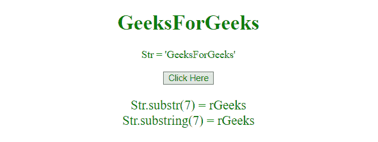
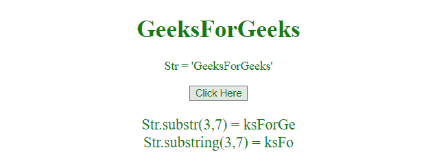

# JavaScript 中 substr()和 substring()的区别

> 原文:[https://www . geesforgeks . org/substr 和 substring-in-javascript 之差/](https://www.geeksforgeeks.org/difference-between-substr-and-substring-in-javascript/)

这两个函数都用于获取字符串的指定部分，但它们之间略有不同。
**str.substr()函数:**str . substr()函数从给定字符串的指定索引中返回指定数量的字符。

语法:

```
str.substr(start, len)
```

**参数:**

*   **启动:**为必输参数。它指定开始提取的位置。第一个字符的索引是 0。如果 start 参数为正，并且大于或等于字符串的长度，则此函数返回一个空字符串。如果 start 参数为负，则此函数将其用作字符串末尾的索引。如果 start 参数为负或大于字符串长度，start 参数将设置为 0。
*   **len:** 为可选参数。它指定要提取的字符数。如果没有通过，则提取整个字符串。

**str.substring()** 这个方法从一个字符串中获取两个指定索引之间的字符，并返回新的字符串。

**语法:**

```
str.substring(start, end)
```

**参数:**

*   **启动:**为必输参数。它指定开始提取的位置。第一个字符的索引是 0。
*   **结束:**为可选参数。它指定结束提取的位置(直到，但不包括)。如果不使用，它将提取整个字符串。

**示例 1:** 本示例对两个函数仅使用一个参数，并产生相同的输出。

```
<!DOCTYPE html> 
<html> 

<head> 
    <title> 
        Difference between substr()
        and substring() function
    </title> 
</head> 

<body style = "text-align:center;"> 

    <h1 style = "color:green;" > 
        GeeksForGeeks 
    </h1> 

    <p id="Geek_up" style="color:green;"></p>

    <button onclick = "Geeks()"> 
        Click Here 
    </button> 

    <p id="Geek_down" 
        style="color:green; font-size:20px;"></p>

    <script>
        var up = document.getElementById("Geek_up");
        var a = "GeeksForGeeks";
        up.innerHTML = "Str = " + "'" + a + "'";

        function Geeks() { 
            var down = document.getElementById("Geek_down");
            down.innerHTML = "Str.substr(7) = " + a.substr(7) + 
            "<br>" + "Str.substring(7) = " + a.substring(7); 
        }
    </script> 
</body> 

</html>                    
```

**输出:**

*   **点击按钮前:**
    
*   **点击按钮后:**
    

**示例 2:** 本示例对两个函数使用参数 **(3，7)** ，并返回输出。

```
<!DOCTYPE html> 
<html> 

<head> 
    <title> 
        JavaScript | Difference between
        substr() and substring() function
    </title> 
</head> 

<body style = "text-align:center;"> 

    <h1 style = "color:green;" > 
        GeeksForGeeks 
    </h1> 

    <p id="Geek_up" style="color:green;"></p>

    <button onclick = "Geeks()"> 
        Click Here 
    </button> 

    <p id="Geek_down" 
        style="color:green; font-size:20px;"></p>

    <script>
        var up = document.getElementById("Geek_up");
        var a = "GeeksForGeeks";
        up.innerHTML = "Str = " + "'" + a + "'";

        function Geeks() { 
            var down = document.getElementById("Geek_down");
            down.innerHTML = "Str.substr(3, 7) = " + a.substr(3, 7) + 
            "<br>" + "Str.substring(3, 7) = " + a.substring(3, 7); 
        }
    </script> 
</body> 

</html>                    
```

**输出:**

*   **点击按钮前:**
    
*   **点击按钮后:**
    