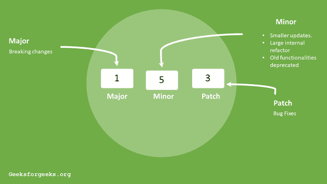

# package . JSON 中颚化符(~)和插入符号(^)之间的差异

> 原文:[https://www . geesforgeks . org/tilde-and-caret-in-package-JSON/](https://www.geeksforgeeks.org/difference-between-tilde-and-caret-in-package-json/)之间的差异

当我们打开 package.json 文件并搜索依赖属性时，我们会在其中找到作为依赖属性 ***的嵌套对象列出的包-名称:package-version*** **。**现在看包装版本，我们发现一些数字用三个点隔开(如 **2.6.2** )。

NPM 版本是用三个点分开的数字写的，左边第一个数字表示主要版本，左边第二个数字表示次要版本，第三个数字表示软件包的补丁版本。

**语法:**NPM 版本的语法如下。

```
Major.Minor.Patch
```

**Tilde (~)表示法:**用于匹配最新的补丁版本。插入符号冻结主要版本和次要版本。正如我们所知，补丁更新是错误修复，这就是为什么我们可以说~符号允许我们自动接受错误修复。

**示例:**1 . 2 . 0 ~将更新所有未来的补丁更新。我们只需要编写~1.2.0 和所有接下来的补丁更新依赖项。比如 1.2。 **1、** 1.2。 **2，** 1.2。**5**…………1.2 . x。

**注意:**补丁更新是一个包中非常小的安全改动，这就是为什么**~版本**与版本大致相当。

**插入符号(^)符号:**用于自动更新小更新和补丁更新。

**示例:****^1.2.4 将更新所有未来的**次要**和**补丁**更新，例如，如果发生任何更新，^1.2.4 将自动将依赖关系更改为 **1.x.x** 。**

**使用插入符号，定期查看我们的代码是否与最新版本兼容是很重要的。**

****

****在 package.json 中颚化符(~)和插入符号(^)之间的区别:****

<figure class="table"> **| **颚化符(~)符号** | **caret(^)符号** |
| Used to be roughly equivalent to the version. | For compatible versions. |
| It will update you to all future patch versions without incrementing minor versions. ~1.2.3 will use versions from 1.2.3 to < 1.3. | It will update you to all future minor/patch versions without adding major versions. 2.3.4 will use versions from 2.3.4 to < 3.0.0. |
| It gives you a bug fix version. | It also provides you with new features for backward compatibility. |
| Will be updated in decimal places. | It will be digitally updated to the latest version. |
| Is not the default symbol used by NPM. | Used by NPM as the default symbol. |
| Example: ~1.0.2 | Example: 1.0.2 |** </figure>

****参考文献:**T2】https://docs.npmjs.com/about-semantic-versioning**