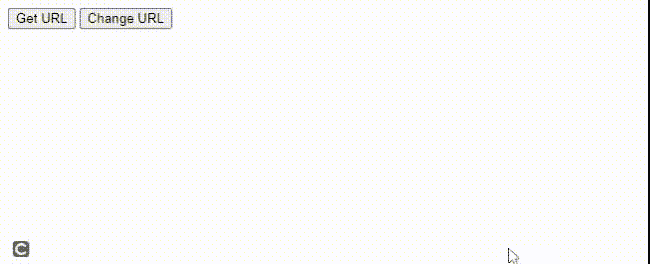
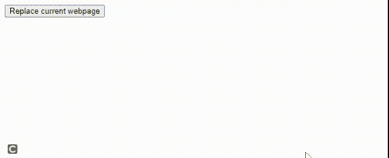
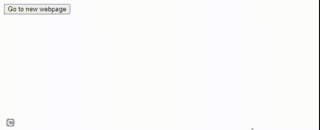

# 在 JavaScript 中 window.location.href、window.location.replace 和 window.location.assign 的区别

> 原文:[https://www . geesforgeks . org/window-location-href-window-location-replace-and-window-location-assign-in-JavaScript/](https://www.geeksforgeeks.org/difference-between-window-location-href-window-location-replace-and-window-location-assign-in-javascript/)

Window.location 是一个属性，它返回一个带有文档当前位置信息的**位置对象**。这个位置对象代表它链接到的对象的位置(网址)，即保存关于当前文档位置的所有信息(主机、href、端口、协议等)。)

这三个命令都用于将页面重定向到另一个页面/网站，但在对浏览器历史记录的影响方面有所不同。

**window.location.href 属性:**

*   位置对象上的 **href** 属性存储当前网页的网址。
*   在更改 **href** 属性时，用户可以导航到新的网址，即转到新的网页。
*   它将一个项目添加到历史列表中(这样，当用户单击“后退”按钮时，他/她可以返回到当前页面)。
*   更新 href 属性被认为比使用 assign()函数更快(因为调用函数比访问属性慢)。

**语法:**

```
window.location.href = 'https://www.geeksforgeeks.org';
```

**示例:**

## 超文本标记语言

```
<!DOCTYPE html>
<html>

<body>
    <button onclick="getCurrentLocation()">
        Get URL
    </button>
    <button onclick="setCurrentLocation()">
        Change URL
    </button>

    <script>
        function getCurrentLocation() {

            // Get current location
            var loc = window.location.href;
            alert(loc);
        }
        function setCurrentLocation() {

            // Change current location
            var newloc = "https://www.geeksforgeeks.org/";
            window.location.href = newloc;
        }
    </script>
</body>

</html>
```

**输出:**



**注意:**以下两行代码执行相同的目的。

## java 描述语言

```
// Less favoured
window.location = 'https://www.geeksforgeeks.org' 

// More favoured
window.location.href = 'https://www.geeksforgeeks.org' 
```

**窗口.位置.替换属性:**

*   **替换**功能用于导航到新的网址，而无需向历史记录中添加新记录。
*   顾名思义，该函数通过用新条目覆盖历史堆栈中的最顶层条目来“替换”历史堆栈中的最顶层条目，即从历史列表中移除最顶层条目。
*   因此，当用户点击“返回”按钮时，他/她将无法返回到当前页面。
*   因此，assign()和 replace()方法之间的主要区别在于 replace()函数将从会话历史中删除当前页面。
*   替换功能不会清除整个页面历史记录，也不会使“后退”按钮不起作用。

**语法:**

```
window.location.replace("https://geeksforgeeks.org/web-development/")
```

**示例:**

## 超文本标记语言

```
<!DOCTYPE html>
<html>

<body>
    <button onclick="replaceLocation()">
        Replace current webpage
    </button>
    <script>
        function replaceLocation() {

            // Replace the current location
            // with new location
            var newloc = "https://www.geeksforgeeks.org/";
            window.location.replace(newloc);
        }
    </script>
</body>

</html>
```

**输出:**



**窗口.位置.分配属性:**

*   **分配**功能类似于 href 属性，因为它也用于导航到新的网址。
*   但是，assign 方法不显示当前位置，它仅用于转到新位置。
*   与替换方法不同，赋值方法向历史记录中添加一条新记录(这样，当用户单击“后退”按钮时，他/她可以返回到当前页面)。
*   然而，比起更新 href 属性，调用函数被认为更安全、更可读。
*   assign()方法也优于 href，因为它允许用户在测试时模拟函数并检查 URL 输入参数。

**语法:**

```
window.location.assign("https://geeksforgeeks.org/")
```

**示例:**

## 超文本标记语言

```
<!DOCTYPE html>
<html>

<body>
    <button onclick="assignLocation()">
        Go to new webpage
    </button>

    <script>
        function assignLocation() {

            // Go to another webpage (geeksforgeeks)
            var newloc = "https://www.geeksforgeeks.org/";
            window.location.assign(newloc);
        }
    </script>
</body>

</html>
```

**输出:**



**window . location . replace、window.location.assign 和 window.location.href 属性:**

<figure class="table">

| 窗户。位置。href | 窗户。位置。替换 | 窗户。位置。分配 |
| --- | --- | --- |
| The URL used to return the current page. | Used to replace the current document. | Used to load new documents. |
| The web address where the current web page is stored. | Do not display the current location. | Do not display the current location. |
| It adds a new record to the history list. | Do not display new records in the history list. | It adds a new record to the history list. |
| It will not delete the current page from the session history. | Delete the current page from the session history. | The current page will not be deleted from the session history. |
| It is faster than using assignment (). | Used when the current web page needs to be removed from the history list. | It is safer and more readable than using href. |

</figure>