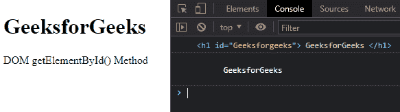
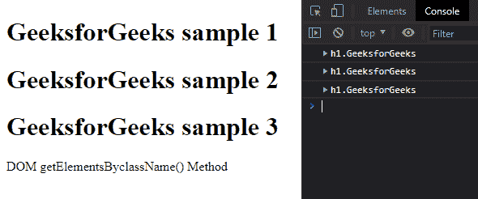
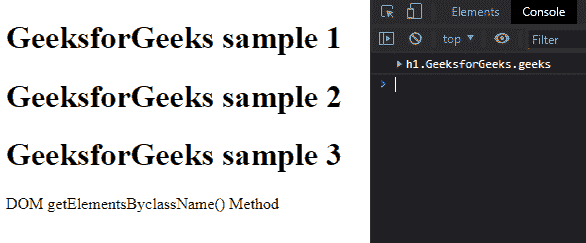
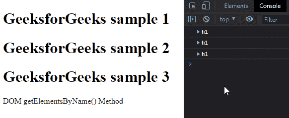
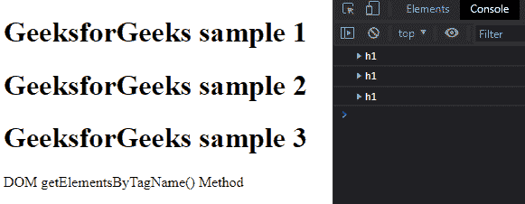
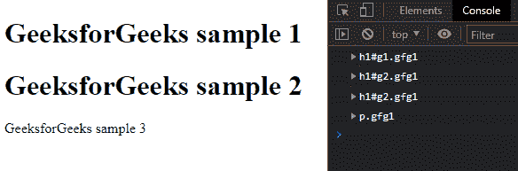
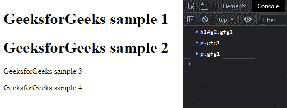

# 使用 JavaScript 访问 HTML 元素的不同方式

> 原文:[https://www . geesforgeks . org/不同的访问方式-html-elements-使用-javascript/](https://www.geeksforgeeks.org/different-ways-to-access-html-elements-using-javascript/)

有时，用户需要在不改变 HTML 代码的情况下操作 HTML 元素。在这种情况下，用户可以使用 JavaScript 来更改 HTML 元素，而不会覆盖它们。在我们继续使用 JavaScript 更改 HTML 元素之前，用户应该学会从 [DOM](https://www.geeksforgeeks.org/dom-document-object-model/) (文档对象模型)中访问它。这里，DOM 是网页的结构。

从 DOM 中，用户可以在 JavaScript 中以五种不同的方式访问 HTML 元素。

*   按标识获取 HTML 元素
*   按类名获取 HTML 元素
*   按名称获取 HTML 元素
*   按标记名获取 HTML 元素
*   通过 CSS 选择器获取 HTML 元素

在下面，用户可以通过示例代码看到上述方法的演示。

**按 Id 获取 HTML 元素:**一般来说，大多数开发人员在整个 HTML 文档中都使用唯一的 Id。用户必须在访问带有 id 的 HTML 元素之前，将 id 添加到特定的 HTML 元素中。用户可以使用 [**getElementById()方法**](https://www.geeksforgeeks.org/html-dom-getelementbyid-method/) 使用该 Id 访问 HTML 元素。如果传递给 getElementById 方法的 id 中不存在任何元素，它将返回空值。

**语法:**

```
document.getElementById(element_ID);
```

**参数:**取用户想要访问的元素的 id。

**返回值:**返回特定 id 的对象。如果找不到具有特定 id 的元素，它将返回空值。

**示例:**这个示例演示了 getElementsById 方法的使用。此外，它将返回对象的内部 HTML 打印到浏览器的控制台中。用户可以通过按下 *ctrl + shift + I* 将控制台打开到 chrome 网络浏览器中。

## 超文本标记语言

```
<!DOCTYPE html>
<html>

<head>
    <title>DOM getElementById() Method</title>
</head>

<body>

    <!-- Heading element with GeeksforGeeks id-->
    <h1 id="Geeksforgeeks">
        GeeksforGeeks
    </h1>

<p>DOM getElementById() Method</p>

    <script>

        // Accessing the element by getElementById method
        var temp = document.getElementById("Geeksforgeeks");

        console.log(temp);
        console.log(temp.innerHTML);
    </script>
</body>

</html>
```

**输出:**



[**按类名获取 HTML 元素**](https://www.geeksforgeeks.org/html-dom-getelementsbyclassname-method/) **:** 在 javascript 中，***getElementsByClassName()*****方法**对于使用类名访问 HTML 元素非常有用。开发人员可以在一个特定的 HTML 文档中多次使用同一个类名。当用户试图使用类名访问一个元素时，它会返回包含特定类的所有对象的集合。

**语法:**

```
document.getElementsByClassName(element_classnames);
```

**参数:**取用户想要访问的元素的多个类名。

**返回值:**返回具有特定类名的对象集合。用户可以使用从 0 开始的索引从集合对象中获取每个元素。

**示例 1:** 该示例演示了 *getElementsByClassName()* 方法的使用。它将返回的集合对象的每个元素打印到控制台中。用户可以通过按下 *ctrl + shift + I* 将控制台打开到 chrome 网络浏览器中。

## 超文本标记语言

```
<!DOCTYPE html>
<html>

<head>
    <title>DOM getElementsByClassName() Method</title>
</head>

<body>

    <!-- Multiple html element with GeeksforGeeks class name -->
    <h1 class="GeeksforGeeks">GeeksforGeeks sample 1</h1>
    <h1 class="GeeksforGeeks">GeeksforGeeks sample 2</h1>
    <h1 class="GeeksforGeeks">GeeksforGeeks sample 3</h1>

<p>DOM getElementsByclassName() Method</p>

    <script>

        // Accessing the element by getElementsByclassName method
        var temp = document.getElementsByClassName("GeeksforGeeks");
        console.log(temp[0]);
        console.log(temp[1]);
        console.log(temp[2]);
    </script>
</body>

</html>
```

**输出:**



**示例 2:** 如果一个特定的元素包含多个类，用户可以通过传递类的以空格分隔的名称作为方法的参数来访问它。用户可以通过按下 *ctrl + shift + I* 将控制台打开到 chrome 网络浏览器中。

## 超文本标记语言

```
<!DOCTYPE html>
<html>

<head>
    <title>DOM getElementByClassName() Method</title>
</head>

<body>

    <!-- Multiple html element with GeeksforGeeks class name -->
    <h1 class="GeeksforGeeks geeks">GeeksforGeeks sample 1</h1>
    <h1 class="GeeksforGeeks">GeeksforGeeks sample 2</h1>
    <h1 class="GeeksforGeeks">GeeksforGeeks sample 3</h1>

<p>DOM getElementsByclassName() Method</p>

    <script>

        // Accessing the element by getElementsByclassName
        // method with multiple class
        var temp = document.getElementsByClassName(
                "GeeksforGeeks geeks");

        console.log(temp[0]);
    </script>
</body>

</html>
```

**输出:**



[**按名称获取 HTML 元素**](https://www.geeksforgeeks.org/html-dom-getelementsbyname-method/) **:** 在 javascript 中，***getElementsByName()*****方法对于使用名称访问 HTML 元素非常有用。这里，名称暗示了 HTML 元素的名称属性。此方法返回包含特定名称的 HTML 元素集合。用户可以使用内置长度方法获取集合的长度。**

****语法:****

```
document.getElementsByName(element_name);
```

****参数**:取用户想要访问的元素名称。**

****返回值:**返回具有特定名称的元素集合。**

****示例:**该示例演示了 getElementsByName 方法的使用。它将带有特定名称的每个元素打印到控制台中。用户可以通过按下 *ctrl + shift + I* 将控制台打开到 chrome 网络浏览器中。**

## **超文本标记语言**

```
<!DOCTYPE html>
<html>

<head>
    <title>DOM getElementByName() Method</title>
</head>

<body>

    <!-- Multiple html element with GeeksforGeeks name -->
    <h1 name="GeeksforGeeks">GeeksforGeeks sample 1</h1>
    <h1 name="GeeksforGeeks">GeeksforGeeks sample 2</h1>
    <h1 name="GeeksforGeeks">GeeksforGeeks sample 3</h1>

<p>DOM getElementsByName() Method</p>

    <script>

        // Accessing the element by getElementsByName method
        var temp = document.getElementsByName("GeeksforGeeks");
        console.log(temp[0]);
        console.log(temp[1]);
        console.log(temp[2]);
    </script>
</body>

</html>
```

****输出:****

****

**[**通过标记名**](https://www.geeksforgeeks.org/html-dom-getelementsbytagname-method/) **:** 在 javascript 中，***getElementsByTagName()*****方法对于使用标记名访问 HTML 元素非常有用。该方法与 *getElementsByName* 方法相同。这里，我们使用标记名而不是元素名来访问元素。****

******语法:******

```
**document.getElementsByTagName(Tag_name);**
```

******参数:**取单个参数，即标签名。****

******返回值:**返回包含作为参数传递的标签的元素集合。****

******示例:**该示例演示了 getElementsByTagName 方法的使用。它将带有特定标签的每个元素打印到控制台中。用户可以通过按下 *ctrl + shift + I* 将控制台打开到 chrome 网络浏览器中。****

## ****超文本标记语言****

```
**<!DOCTYPE html>
<html>

<head>
    <title>DOM getElementByTagName() Method</title>
</head>

<body>

    <!-- Multiple html element with h1 tag -->
    <h1>GeeksforGeeks sample 1</h1>
    <h1>GeeksforGeeks sample 2</h1>
    <h1>GeeksforGeeks sample 3</h1>

<p>DOM getElementsByTagName() Method</p>

    <script>

        // Accessing the element by 
        // getElementsByTagName method
        var temp = document.getElementsByTagName("h1");
        console.log(temp[0]);
        console.log(temp[1]);
        console.log(temp[2]);
    </script>
</body>

</html>**
```

******输出:******

********

******通过 CSS 选择器获取 HTML 元素:**用户可以使用类、id、标签名等不同的 CSS 选择器一次选择 HTML 元素。HTML 元素可以通过两种方式使用 CSS 选择器进行检索。[*query selector()*](https://www.geeksforgeeks.org/html-dom-queryselector-method/)*方法返回与特定 CSS 选择器匹配的第一个元素。[*query selectorall()*](https://www.geeksforgeeks.org/html-dom-queryselectorall-method/)方法返回与特定 CSS 选择器匹配的所有元素。*****

*****要使用 id/class 作为参数，用户必须添加“**#**”/“**”。**'在它前面签名。用户可以直接将标签名传递给以上 2 种方法。用户在传递多个 CSS 选择器作为参数时，不需要分离 CSS 选择器。*****

*******语法:*******

```
***document.querySelector(selectors);
document.querySelectorAll(selectors);***
```

*******参数:**作为一个参数，它接受不同的 CSS 选择器，比如类、标签名、id。*****

*******返回值:**query selector()方法返回第一个匹配 CSS 选择器的对象，而 querySelectorAll()方法返回所有匹配 CSS 选择器的对象的集合。*****

*******示例 1:** 此示例演示了 querySelector 方法的使用。在下面的代码中，我们使用了不同的 CSS 选择器来访问 DOM 中的 HTML 元素。*****

## *****超文本标记语言*****

```
***<!DOCTYPE html>
<html>

<head>
    <title>DOM querySelector() Method</title>
</head>

<body>

    <!-- html element with classnames and id -->
    <h1 class="gfg1" id="g1">GeeksforGeeks sample 1</h1>
    <h1 class="gfg1" id="g2">GeeksforGeeks sample 2</h1>
    <p class="gfg1">GeeksforGeeks sample 3</p>

    <script>

        // Accessing the element by class name 
        // using querySelector
        var temp = document.querySelector(".gfg1");
        console.log(temp);

        // Accessing the element by id using querySelector
        temp = document.querySelector("#g2");
        console.log(temp);

        // Accessing the element by class name and
        // id using querySelector
        temp = document.querySelector(".gfg1#g2");
        console.log(temp);

        // Accessing the element by tag name that
        // includes the particular class
        temp = document.querySelector("p.gfg1");
        console.log(temp);
    </script>
</body>

</html>***
```

*******输出:*******

**********

*******示例 2:** 此示例演示了 querySelectorAll 方法的使用。方法返回与 CSS 选择器匹配的所有对象的节点列表。用户可以使用从 0 开始的索引来访问 CSS 节点列表的所有元素。*****

## *****超文本标记语言*****

```
***<!DOCTYPE html>
<html>

<head>
    <title>DOM querySelectorAll() Method</title>
</head>

<body>

    <!-- html element with classnames and id -->
    <h1 class="gfg1" id="g1">GeeksforGeeks sample 1</h1>
    <h1 class="gfg1" id="g2">GeeksforGeeks sample 2</h1>
    <p class="gfg1">GeeksforGeeks sample 3</p>

    <p class="gfg1">GeeksforGeeks sample 4</p>

    <script>

        // Accessing the element by class name, id and
        // tag name using querySelectorAll
        var temp = document.querySelectorAll("h1.gfg1#g2");
        console.log(temp[0]);

        // Accessing the element by tag name using 
        // querySelectorAll
        temp = document.querySelectorAll("p");
        console.log(temp[0]);
        console.log(temp[1]);
    </script>
</body>

</html>***
```

*******输出:*******

**********