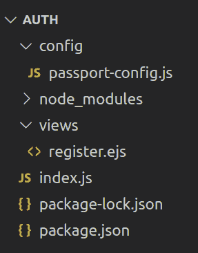
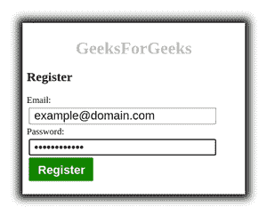
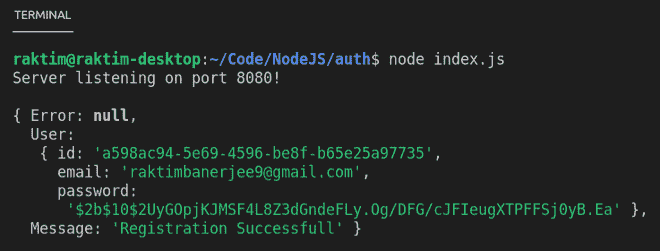

# 在 Passport.js 中禁用会话

> 原文:[https://www . geesforgeks . org/disable-sessions-in-passport-js/](https://www.geeksforgeeks.org/disabling-sessions-in-passport-js/)

在常见的 web 应用程序中，用于验证用户身份的凭据将仅在登录请求期间传输。Passport 将在身份验证成功后建立持久的登录会话。该会话通过用户浏览器中的 cookie 来维护。

但是，在某些情况下，不需要会话支持。例如，应用编程接口服务器为每个要验证的请求提供所需的凭据。在这种情况下，您可以禁用会话支持。您需要将*会话*选项设置为*假*。

```
app.post('/auth',
  passport.authenticate('local-signin', {
    successRedirect : '/dashboard',
    failureRedirect : '/login',
    session: false
  })
)
```

或者，可以提供自定义回调来允许应用程序处理成功或失败。

```
app.get('/auth', function(req, res, next) {
  passport.authenticate('local', function(err, user, info) {
    // your logic to how you serve your user
  })(req, res, next);
});
```

在上面的例子中， *passport.authenticate()* 是从路由处理器内部调用的，而不是用作路由中间件。这使得回调可以通过闭包访问 *req 和 res* 对象以及 *next* 方法。

**示例:**在典型的 web 应用程序中，用户注册后会重定向到登录页面。因此，这里我们不需要在新注册后创建会话。让我们看看实现。

**项目设置:**创建一个新的 NodeJS 项目，并将其命名为 **Auth** 。

```
mkdir Auth && cd Auth
npm init -y 
```

**安装依赖项:**

*   我们可以使用主体解析器中间件来解析请求主体。

    ```
    npm i express body-parser
    ```

*   我们可以使用任何模板引擎，在我们的例子中是 *ejs* 。

    ```
    npm i ejs 
    ```

*   我们可以使用 *uuid 模块*创建一个唯一的用户 id。

    ```
    npm i uuid
    ```

*   我们存储用户密码的散列，而不是直接存储用户输入的密码。我们可以使用*加密模块*生成密码的散列。

    ```
    npm i bcrypt
    ```

*   我们需要安装*护照模块*来使用它的功能

    ```
    npm i passport
    ```

*   护照提供了很多策略，这里我们将使用*护照-本地*策略。

    ```
    npm i passport-local
    ```

**项目结构:**会是这样的。



*   **passport-config.js:** 这是 passport 配置文件。
*   **register.ejs:** 这是注册页面的视图。
*   **index.js:** 这个主服务器设置文件。

## 选项卡。例如

```
<html lang="en">
<head>
    <meta charset="UTF-8">
    <meta http-equiv="X-UA-Compatible" content="IE=edge">
    <meta name="viewport" content="width=device-width, initial-scale=1.0">
    <title>Document</title>

    <style>
        .container{
            position: relative;
            width: 400px;
            padding: 8px;
            top: 50%;
            left: 50%;
            transform: translate(-50%, -50%);
            box-shadow: black 0 0 14px 8px;
        }
        label{
            font-size: 17px;
            display: block;
        }
        input{
            display: block;
            margin: 4px;
            padding: 4px 8px;
            height: 31px;
            width: 350px;
            font-size: 22px;
        }
        .btn-submit{
            border-radius: 2px;
            padding: 10px 17px;
            background-color: green;
            border: none;
            color: white;
            font-weight: bold;
            cursor: pointer;
            width: 120px;
            height: 44px;
        }
        .btn-submit:hover{
            opacity: 0.8;
        }
        .brand{
            text-align: center;
            color: #c2bfbf;
        }
    </style>
</head>
<body>
    <div class="container">
        <h1 class="brand">GeeksForGeeks</h1>
        <h2>Register</h2>

        <form action="/register" method="POST">

            <label for="email">Email: </label>
            <input id="userEmail" name="email" type="email">

            <label for="password">Password: </label>
            <input id="userPassword" name="password" type="password">

            <input class="btn-submit" type="submit" value="Register">

        </form>
    </div>
</body>
</html>
```

## passport-config.js

```
const LocalStrategy = require('passport-local').Strategy
const bcrypt = require('bcrypt')
const { v4: uuid } = require('uuid')

const initialize = (passport, getUserByEmail, save) => {

    // Verify callback function implementation
    const register = async (email, password, done) => {

        // Check wheather user is already registered or not
        const user = getUserByEmail(email)

        // If user is registered, invoke done()
        if (user != null)
            return done(null, user, { 
                message: "You are already registered" })

        // Generate user password's hash
        const hashedPassword = await bcrypt.hash(password, 10)

        // Create new user 
        const newUser = {
            // Generate user id
            id: uuid(),
            email: email,
            password: hashedPassword
        }

        // Save newly created user to database 
        save(newUser)

        // Invoke done()
        return done(null, newUser, { 
            message: "Registration Successful" })
    }

    // Middleware 
    passport.use('local-signup', new LocalStrategy({
        usernameField: 'email',
        passwordField: 'password'
    }, register))
}

module.exports = initialize
```

## index.js

```
// Import Modules
const express = require('express')
const bodyParser = require('body-parser')
const passport = require('passport')
const ejs = require('ejs')

const intializePassport = require('./config/passport-config')

const app = express()
const port = 8080

// Dummy in-memory user database
const Users = []

// Returns middleware that only parses urlencoded bodies
// A new body object contained pasrse data add to the
// request object 
app.use( bodyParser.urlencoded( { extended: false } ) )

// Pass require logic 
intializePassport(
    passport,
    email => Users.find(user => user.email === email),
    user => Users.push(user)
)

// Set EJS as view engine
app.set('view engine', 'ejs')

// API endpoint
app.get('/', (req, res)=> res.render('register.ejs'))

app.post('/register', (req, res, next)=> {

        // Invoke implementation of local strategy 
        passport.authenticate('local-signup', 
                     (err, user, info)=>{

            // If any error
            if (err)
                res
                    .status(500)
                    .send("<H1> Server Erro! </H1>")
            else{

                // Display the user object
                console.log({
                    Error: err,
                    User: user,
                    Message: info.message
                })

                // Send message to user 
                res.send(`<H1> ${ info.message } <H1>`)
            }

        // Pass req, res and next as closure
        })(req, res, next) 
    })

// Start server
app.listen(port, () => console.log(`Server listening on port ${port}!`))
```

**运行应用程序的步骤:**使用以下命令运行 index.js 文件:

```
node index.js
```

**输出:**我们将在终端屏幕上看到以下输出。

```
Server listening on port 8080
```

现在打开任意浏览器，转到 ***http://localhost:8080/，*** 我们会看到如下输出:



登记表

提交表单后，我们会在浏览器上看到 ***注册成功*** ，在终端屏幕上也会看到如下输出:



服务器终端