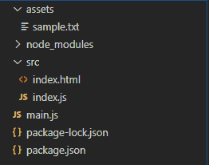
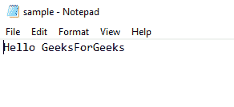
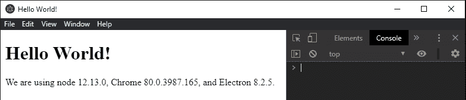

# 在电子 JS 中动态执行 JavaScript

> 原文:[https://www . geesforgeks . org/dynamic-execute-JavaScript-in-electronijs/](https://www.geeksforgeeks.org/dynamically-execute-javascript-in-electronjs/)

[**electronijs**](https://www.geeksforgeeks.org/introduction-to-electronjs/)是一个开源框架，用于使用能够在 Windows、macOS 和 Linux 操作系统上运行的 HTML、CSS 和 JavaScript 等网络技术构建跨平台的本机桌面应用程序。它将铬引擎和[T5 节点 T7】结合成一个单一的运行时。
在电子商务中，每个**浏览器窗口**实例都可以被认为是应用程序中的单个网页。电子使用**浏览器窗口**对象和**网络内容**属性创建和控制这些**浏览器窗口**实例。在传统的网络应用中，我们可以在浏览器的控制台内输入 **JavaScript** 代码，以便在网页上执行。为了通过脚本达到同样的效果，我们需要使用浏览器插件或扩展。在 electronic 中， **webContents** 属性为我们提供了某些实例方法，通过这些方法，我们可以在运行时在**浏览器窗口**实例中动态注入 JavaScript 代码。本教程将演示如何使用**网络内容**属性的实例方法。
我们假设您熟悉上述链接中介绍的先决条件。电子工作需要在系统中预装](https://www.geeksforgeeks.org/introduction-to-nodejs/) [**节点**](https://www.geeksforgeeks.org/introduction-to-nodejs/) 和 [**npm**](https://www.geeksforgeeks.org/node-js-npm-node-package-manager/) 。

*   **项目结构:**



**示例:**按照**中给出的步骤，使用电子 JS** 构建桌面应用程序，以设置基本的电子应用程序。复制文章中提供的 **main.js** 文件和**index.html**文件的样板代码。此外，对**包. json** 文件进行必要的更改，以启动电子应用程序。我们将继续使用相同的代码库构建我们的应用程序。

**package.json:**

```
{
  "name": "electron-execute",
  "version": "1.0.0",
  "description": "Inject JS Code in Page ",
  "main": "main.js",
  "scripts": {
    "start": "electron ."
  },
  "keywords": [
    "electron"
  ],
  "author": "Radhesh Khanna",
  "license": "ISC",
  "dependencies": {
    "electron": "^8.3.0"
  }
}
```

根据项目结构创建**资产**文件夹。在**资源**文件夹中创建**示例. txt** 文件，用于演示目的。
**sample.txt:**



**输出:**此时，我们的基本电子应用程序设置完毕。启动应用程序后，我们应该会看到以下输出:



**在电子中动态注入 JS:****浏览器窗口**实例和**网站内容**属性是**主进程**的一部分。要在**渲染器进程**中导入和使用浏览器窗口，我们将使用电子**远程**模块。
**index.html:** 在该文件中添加以下代码片段。

## 超文本标记语言

```
<h3>Dynamically Inject JS</h3>
  <button id="inject">Read sample.txt File</button>
  <button id="print">Print an Array</button>
```

**读取样本. txt 文件**和**打印数组**按钮还没有任何相关功能。要进行更改，请在 **index.js** 文件中添加以下代码。
**index.js:**

## java 描述语言

```
const electron = require('electron')

// Importing BrowserWindow from Main Process using Electron remote
const BrowserWindow = electron.remote.BrowserWindow;

var inject = document.getElementById('inject');
let win = BrowserWindow.getFocusedWindow();
// let win = BrowserWindow.getAllWindows()[0];

inject.addEventListener('click', (event) => {
    win.webContents.executeJavaScript('const path = require("path");'
        + 'const fs = require("fs");'
        + 'fs.readFile(path.join(__dirname, "../assets/sample.txt"), '
        + '{encoding: "utf-8"}, function(err, data) {'
        + 'if (!err) { console.log("received data: " + data); }'
        + 'else { console.log(err); } });', true)
        .then(console.log('JavaScript Executed Successfully'));
});

var print = document.getElementById('print');
print.addEventListener('click', (event) => {

    var webSource = {
        code: 'var numbers = [1, 2, 3, 4, 5];'
        + 'function filters(num) { return num > 2; }'
        + 'console.log(numbers.filter(filters));',
        url: '',
        startLine: 1
    }

    win.webContents.executeJavaScriptInIsolatedWorld(1, [webSource], true)
        .then(console.log('JavaScript Executed Successfully'));
});
```