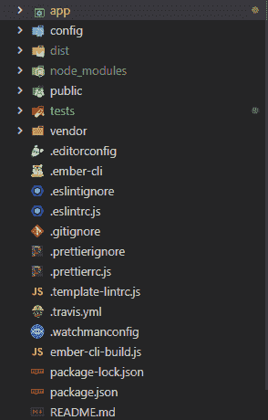
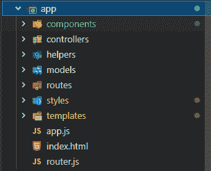
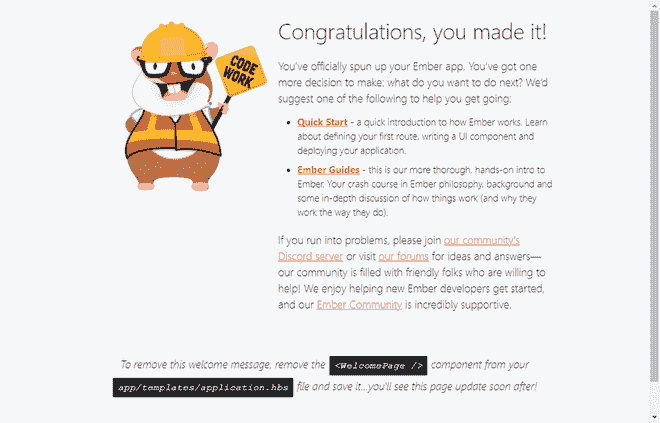
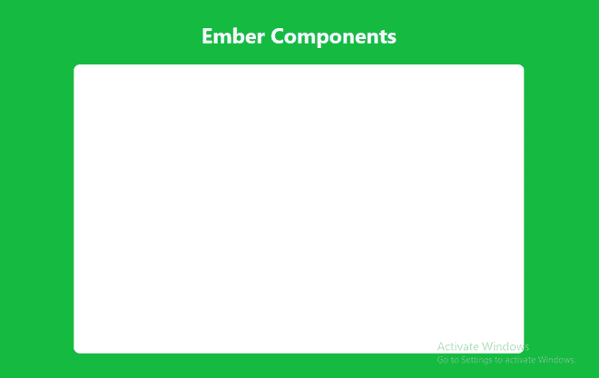
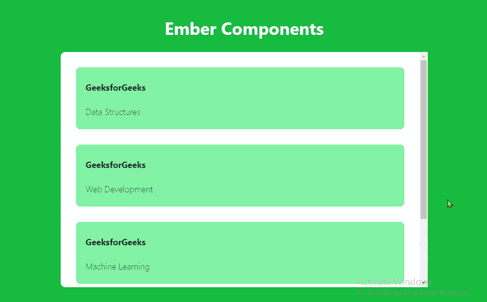

# 烬 js 组件

> 原文:[https://www.geeksforgeeks.org/ember-js-components/](https://www.geeksforgeeks.org/ember-js-components/)

Ember.js 是一个开源框架，用于快速轻松地构建现代 web 应用程序。它的应用遵循 MVC 结构。Ember.js 还附带了一个命令行界面来管理它的配置。Ember.js 中的组件允许重用元素或使模板可重用。它是一个模板，可以接受参数并放置各自的值。例如，我们可以想到一个待办应用程序，它使用相同的组件来显示任务。每个任务都有一个方框和一些文字。我们可以根据应用的上下文渲染任何东西。

**创建项目:**输入以下命令创建新项目。

```
ember new components-tutorial-gfg
```

**项目结构:**项目结构看起来应该类似如下。



应用程序文件夹结构应该如下所示。



现在运行项目。

```
cd components-tutorial-gfg
ember serve
```

项目成功构建后，导航到该网址

```
http://localhost:4200/
```

您应该会收到以下输出。



**示例:**在本例中，我们将为我们的 Ember.js 应用程序创建一个组件，然后使用该组件显示项目列表。

下面是分步实施。

**第一步:**我们将构建一个单页应用程序，所以我们所有的代码都将放在**app \ templates \ application . HBS**文件中。我们将创建一个待办事项应用程序。所以我们的**应用程序. hbs** 文件将包含要显示的项目。

## app emplatespplication . hbs

```
{{page-title 'Ember App'}}
<h1 id='title'>
  Ember App
</h1>
<div id='items'>
</div>
{{outlet}}
```

**步骤 2:** 我们将对代码进行风格化，使其看起来更好，并清晰地显示任务。

## appstylespp.css

```
body {
  margin: 2rem;
  background-color: rgb(22, 187, 64);
#title {
  text-align: center;
  color: aliceblue;
}
#items {
  margin: auto;
  width: 80%;
  height: 75vh;
  bottom: 5rem;
  background-color: white;
  border-radius: 10px;
  text-align: center;
  overflow-x: hidden;
  overflow-y: auto;
}
```

运行上面的**代码**，您应该会看到如下类似的输出。



**步骤 3:** 我们将使用相同的组件显示我们的待办任务。Ember 提供了一个命令来轻松地为我们的网页创建组件。在终端中运行以下命令来创建任务组件。

```
ember generate component task
```

等待命令生成所需的文件。文件创建后，导航至 **app\components\task.hbs** 并输入以下代码。我们正在为任务创建组件。它将以任务和描述作为参数。我们将它们放在 div 元素中，因为我们想要为组件设置样式。

> 因此，接受参数的语法是{{@task}}。

## appcomponents ask.hbs

```
<div class='task-item'>
  <h4>
    {{@task}}
  </h4>

<p>{{@description}}</p>

</div>
```

将以下代码添加到**app \ style \ app . CSS**文件中。

## appstylespp.css

```
.task-item {
  margin: 2rem;
  padding: 5px 20px;
  background-color: bisque;
  border-radius: 10px;
}
```

**第 4 步:**现在我们将一些任务传递给任务组件。我们不需要将任何文件导入 application.hbs 文件。只需创建组件的一个元素并传递值，如下例所示。

## app emplatespplication . hbs

```
{{page-title 'Ember App'}}
<h1 id='title'>
  Ember App
</h1>
<div id='items'>
  <Task @task='GeeksforGeeks' @description='Data Structures' />
  <Task @task='GeeksforGeeks' @description='Web Development' />
  <Task @task='GeeksforGeeks' @description='Machine Learning' />
  <Task @task='GeeksforGeeks' @description='Competitive Programming' />

</div>
```

**第五步:**这是**CSS**的完整代码。我们**不需要将 CSS 文件** **导入**到 **task.hbs 组件**中。一切**在 Ember.js** 中自动工作。

## appstylespp.css

```
body {
  margin: 2rem;
  background-color: rgb(22, 187, 64);
}
#title {
  text-align: center;
  color: aliceblue;
}
#items {
  margin: auto;
  width: 80%;
  height: 75vh;
  bottom: 5rem;
  background-color: white;
  border-radius: 10px;
  overflow-x: hidden;
  overflow-y: auto;
}
.task-item {
  margin: 2rem;
  padding: 5px 20px;
  background-color: rgb(131, 243, 164);
  border-radius: 10px;
}
```

**第六步:**是我们创建的任务组件。确保代码与以下示例中的代码相同。

## appcomponents ask.hbs

```
<div class='task-item'>
  <h4>
    {{@task}}
  </h4>

<p>{{@description}}</p>

</div>
```

**第 7 步:**然后我们可以通过在命令提示符下输入以下代码来启动烬**开发服务器**:

```
ember serve
```

### 输出:



因此，我们可以非常容易地在 Ember.js 中创建组件，并且我们已经在我们的网页中使用了该组件。我们不需要导入任何文件来使用组件。一切都在 Ember.js 中自动工作，这使得在 Ember 中进行 web 开发变得非常容易。