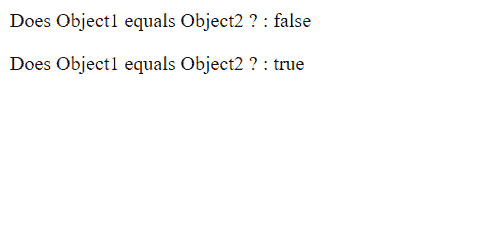
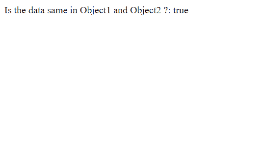
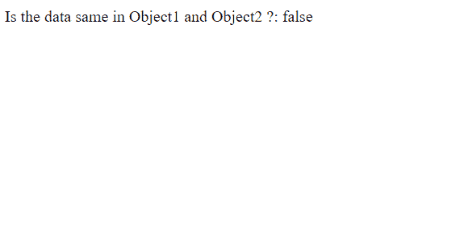

# 两个 JavaScript 对象相等

> 原文:[https://www . geesforgeks . org/equality-for-two-JavaScript-objects/](https://www.geeksforgeeks.org/equality-for-two-javascript-objects/)

对象是 JavaScript 中的引用类型，也是命名的值对，其中值可以决定属性或行为。它们被广泛使用是因为现在网络发展已经发生了巨大的变化。本文描述了如何比较以下格式的两个 JavaScript 对象:

*   基于引用比较 JavaScript 对象
*   基于包含的数据比较两个 JavaScript 对象

**方法 1:** **基于引用比较两个对象:**在比较对象的情况下，**严格等于** (===)运算符比较内存位置。

**示例:**

## Java Script 语言

```
<script>

    // Creating two Objects with same data
    object1 = { 
        name: "GeeksForGeeks", 
        founder: "SandeepJain" 
    };

    object2 = {
        name: "GeeksForGeeks", 
        founder: "SandeepJain" 
    };

    // In this case, obj1 and obj2 
    // have different memory locations
    // therefore === returns false

    check = (object1 === object2);

    document.write("Does Object1 "
        + "equals Object2 ? : " + check);

    // Going to the next line
    document.write("< p > </ >");

    // Pointing to same reference now
    object1 = object2;

    check = (object1 === object2);

    document.write("Does Object1 equals"
        + " Object2 ? : " + check);
</script>
```

**输出:**



**方法二:** **根据数据对比两个 JavaScript 对象:**

**例 1:**

## Java Script 语言

```
<script>
<script>

    // Creating two objects with 
    // a method inside it
    object1 = {
        name: "GeeksForGeeks", 
        author: "Jagannath",
        greet: () => {
            document.write("Hello Geeks");
        }
    };

    object2 = {
        name: "GeeksForGeeks", 
        author: "Jagannath",
        greet: () => {
            document.write("Hello Geeks");
        }
    };

    string1 = JSON.stringify(object1);
    string2 = JSON.stringify(object2);

    check = (string1 === string2);

    document.write("Is the data same in"
        + " Object1 and Object2 ?: " + check);

</script>
```

**输出:**



**例 2:** 使用 JSON.stringify()方法的缺点。如果对象内部的数据顺序发生变化，则上述方法无法正常工作。这是使用 JSON.stringify()方法的缺点，如下所示。

## Java Script 语言

```
<script>

    // Creating two objects with
    // a method inside it
    object1 = {
        name: "GeeksForGeeks",
        author: "Jagannath",
        greet: () => {
            document.write("Hello Geeks");
        }
    };

    // Changing the order of the
    // values defined in the 
    // second object
    object2 = {
        author: "Jagannath",
        name: "GeeksForGeeks",
        greet: () => {
            document.write("Hello Geeks");
        }
    };

    string1 = JSON.stringify(object1);
    string2 = JSON.stringify(object2);

    check = (string1 === string2);

    document.write("Is the data same in "
        + "Object1 and Object2 ?: " + check);
</script>
```

**输出:**

