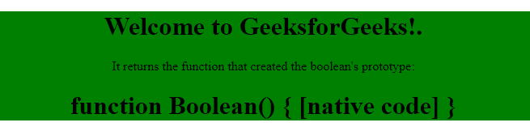

# 为 6 | Boolean

> 哎哎哎:# t0]https://www . geeksforgeeks . org/es 6-boolean/

ES6 的**布尔和其他布尔对象没什么区别。它还表示两个值“真”或“假”。在 ES6 JavaScript 中有两个属性和三个方法来构建这个对象。**

**布尔对象的属性:**

*   **constructor:** In ES6 JavaScript, the constructor property returns the constructor function for an object. For ES6 JavaScript Boolean, the constructor property returns function **Boolean() { [native code] }**.

    **语法:**

    ```
    boolean.constructor
    ```

    **返回值:**返回函数**布尔(){[本机代码] }** 。

    **示例:**

    ```
    <!DOCTYPE html> 
    <html> 

    <head> 
        <title> 
            JavaScript Boolean constructor Property 
        </title> 
    </head> 

    <body style="text-align:center;"> 

        <div style="background-color: green;"> 

            <h1>Welcome to GeeksforGeeks!.</h1> 

            <p> 
                It returns the function that created 
                the boolean's prototype: 
            </p> 

            <h1 id="GFG"></h1> 

        </div> 

        <!-- Script to use boolean constructor -->
        <script> 
            var bool = false; 
            document.getElementById("GFG").innerHTML 
                    = bool.constructor; 
        </script> 
    </body> 

    </html>                     
    ```

    **输出:**
    

*   **prototype:** The Boolean.prototype is an inbuilt property in ES6 JavaScript which is used to add a new property to the all Boolean instances. There is a constructor prototype that is used to add properties or methods to all Boolean objects.

    **语法:**

    ```
    Boolean.prototype.name = value
    ```

    **返回值:**

    *   **boolean . prototype . value of():**它只是返回布尔对象的值。
    *   **Boolean . prototype . tostring():**这个方法根据布尔值返回一个字符串。

    **示例:**

    ```
    <script> 

        function check(v1) { 
            if (v1 == true) 
                return (v1 + " is True."); 
            else
                return (v1 + " is False."); 
        } 

        // Adding a new property 
        Boolean.prototype.myVar = false; 

        // Adding a new method 
        Boolean.prototype.myMethod = check; 

        // Creating a new boolean object 
        var Obj1 = new Boolean(); 

        document.write(Obj1.myMethod(1) + "<br>"); 
        document.write(Obj1.myMethod(0) + "<br>"); 
        document.write("myVar = " + Obj1.myVar); 
    </script>
    ```

    **输出:**

    ```
    1 is True.
    0 is False.
    myVar = false
    ```

**布尔对象的方法:**

*   **valueOf() Method:** The Boolean.valueOf() method is an inbuilt methods in ES6 javascript which is used to return a boolean value either “true” or “false” depending upon the value of the specified boolean object.

    **语法:**

    ```
    boolean.valueOf()
    ```

    **返回值:**如果字符串参数为空，则返回假，否则返回真。

    **示例:**

    ```
    <script> 
    // Here Boolean object obj is created 
    // for the value true. 
    var obj = new Boolean(true); 

    // Here boolean.valueOf() function is 
    // used for the created object obj. 
    document.write(obj.valueOf()); 
    </script> 
    ```

    **输出:**

    ```
    true
    ```

*   **toString() Method:** The boolean.toString() is an inbuilt method in ES6 javascript which is used to return a string either “true” or “false” depending upon the value of the specified boolean object.

    **语法:**

    ```
    boolean.toString()
    ```

    **返回值:**根据指定布尔对象的值，返回一个字符串“真”或“假”。

    **示例:**

    ```
    <script> 
    // Here Boolean object obj is 
    // created for the value true. 
    var obj = new Boolean(true); 

    // Here boolean.toString() function 
    // is used for the created object obj. 
    document.write(obj.toString()); 
    </script> 
    ```

    **输出:**

    ```
    true
    ```

*   **toSource() Method:**The boolean.toSource() is an inbuilt method in ES6 JavaScript which is used to return a string representing the source code of the object.

    **语法:**

    ```
    boolean.toSource()
    ```

    **返回值:**返回一个代表对象源代码的字符串。

    **示例:**

    ```
    <script> 
    // Here Boolean object obj is 
    // created for the value true. 
    var obj = new Boolean(true); 

    // Here boolean.toSource() function 
    // is used for the created object obj. 
    document.write(obj.toSource()); 
    </script>
    ```

    **输出:**

    ```
    (new Boolean(true)) 
    ```

    **注意:**这个方法并不兼容所有的浏览器。