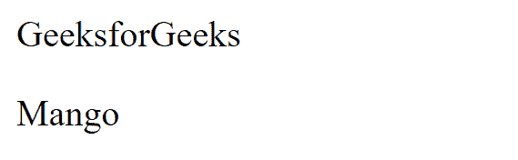
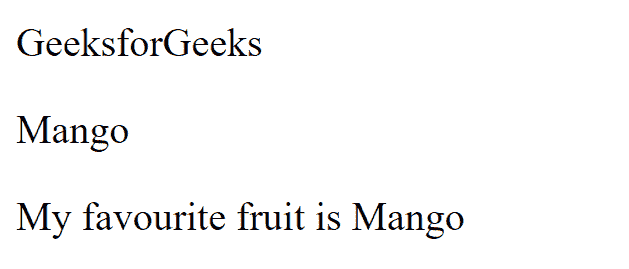
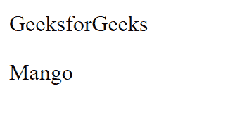

# ES6 |类变量替代

> 原文:[https://www . geesforgeks . org/es6-类-变量-替代项/](https://www.geeksforgeeks.org/es6-class-variable-alternatives/)

使用 class 关键字创建一个类。每当初始化对象时，都会为该对象调用类方法。以下示例显示了类变量的替代方案:

**使用 Class:**Class 关键字允许用户创建一个类。类关键字对于在 JavaScript 中创建类是必不可少的。

*   **程序:**

    ```
    <!DOCTYPE html>
    <html>

    <head>
        <h1>GeeksforGeeks</h1>
    </head>

    <body>

        <p id="gfg"></p>

        <script>
            class Fruit {
                constructor(fname) {
                    this.fruit1 = fname;
                }
            }

            Fru = new Fruit("Mango");

            document.getElementById("gfg").innerHTML
                    = Fru.fruit1;
        </script>
    </body>

    </html>
    ```

*   **输出:**
    

**使用方法:**每次创建类的实例时。它是使用构造函数()方法初始化的。如果用户没有定义构造函数()方法，那么 JavaScript 会自动定义它。

*   **程序:**

    ```
    <!DOCTYPE html>
    <html>

    <head>
        <h1>GeeksforGeeks</h1>
    </head>

    <body>
        <p id="gfg"></p>
        <p id="gfg1"></p>

        <script>
            class Fruit {
                constructor(fname) {
                    this.fruit1 = fname;
                }
                present() {
                    return "My favourite fruit is "
                            + this.fruit1;
                }
            }

            Fru = new Fruit("Mango");

            document.getElementById("gfg").innerHTML
                        = Fru.fruit1;
            document.getElementById("gfg1").innerHTML
                        = Fru.present();
        </script>
    </body>

    </html>
    ```

*   **输出:**
    

**使用静态方法:**这个方法很简单，它们是在类上调用的，而不是在类的对象上调用的。

*   **程序:**

    ```
    <!DOCTYPE html>
    <html>

    <head>
        <h1>GeeksforGeeks</h1>
    </head>

    <body>
        <p id="gfg1"></p>

        <script>
            class Fruit {
                constructor(fname) {
                    this.fruit1 = fname;
                }
                static new() {
                    return "Mango!!!!";
                }
            }

            Fru = new Fruit("Mango");

            document.getElementById("gfg1").innerHTML
                    = Fruit.new();
        </script>
    </body>

    </html>
    ```

*   **输出:**
    

**使用继承:**继承允许子类继承父类的属性。关键字“extends”用于此目的。

*   **程序:**

    ```
    <!DOCTYPE html>
    <html>

    <head>
        <h1>GeeksforGeeks</h1>
    </head>

    <body>
        <p id="gfg1"></p>

        <script>
            class Fruit {
                constructor(fname) {
                    this.fruit1 = fname;
                }
                present() {
                    return "My favourite fruit is "
                            + this.fruit1;
                }

            }
            class Healthy extends Fruit {
                constructor(fname, mod) {
                    super(fname);
                    this.healthy = mod;
                }
                show() {
                    return this.present() + ', it is very '
                             + this.healthy;
                }
            }

            fru = new Healthy("Mango", "healthy");
            document.getElementById("gfg1").innerHTML
                       = fru.show();
        </script>
    </body>

    </html>
    ```

*   **输出:**
    

**使用 Get- Set 方法:**getter 允许获取 ES6 类变量的值，Setters 允许在适当的字段中分别设置这些值。

*   **程序:**

    ```
    <!DOCTYPE html>
    <html>

    <head>
        <h1>GeeksforGeeks</h1>
    </head>

    <body>
        <p id="gfg1"></p>

        <script>
            class Fruit {
                constructor(fname) {
                    this.fruit1 = fname;
                }

                get fruitss() {
                    return this.fruit1;
                }
                set fruitss(x) {
                    this.fruit1 = x;
                }

            }
            Fru = new Fruit("Mango");

            document.getElementById("gfg1").innerHTML
                       = Fru.fruitss;
        </script>
    </body>

    </html>
    ```

*   **输出:**
    

**支持的浏览器:****ES6 类变量替代**支持的浏览器如下:

*   谷歌 Chrome 49
*   Firefox 45
*   互联网浏览器边缘 12
*   歌剧 36
*   Safari 9