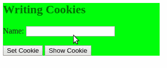
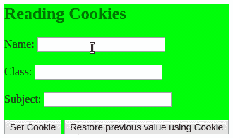
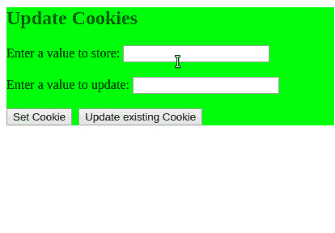
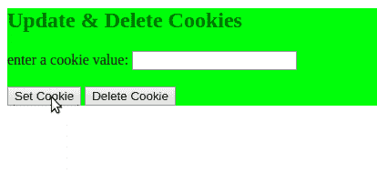

# 是 6 | cookie

> 哎哎哎:# t0]https://www . geeksforgeeks . org/es 6-cookies/

**Cookies** 基本上是网页浏览器的存储设施。它属于浏览器的网络存储，浏览器是本地或客户端存储设备。数据在浏览器中即使在浏览器窗口关闭之后，在许多网站中也需要记住会话信息，例如，当我们从同一台电脑多次登录到电子邮件、脸书等时，也在另一个商业网站中，对于 cookies，我们可以轻松地登录到该会话中，而且我们登录的时间是有限制的，无论我们使用该网站时浏览器是否一直关闭。使用**文档对象**的 **cookie 属性**在 JavaScript 中使用 cookie。这个属性可读写。
cookie 是一种古老的技术，在网络浏览器中用作客户端存储，通过 ASP、PHP 等服务器端脚本语言工作。Cookies 可以被创建、修改和访问。cookie 是 **CGI(通用网关接口)编程**的一部分，cookie 是使用 CGI 在浏览器和服务器之间传输数据。
**cookie 的工作方式:**cookie 像文本一样存储在浏览器的本地存储器中。Cookies 是从服务器端发送的数据，带有任何网页或网站上访问者的信息，并在访问者离开网页时存储到硬盘上。之后，当访问者再次访问网站时，将从客户端检索 cookie，并将带有 cookie 的请求发送到服务器端，服务器会记住之前存储的内容。Cookies 具有存储数据或信息的某种属性。

*   **名称&价值:**这是饼干的主要必备之物。它是会话的主要值，是在访问网站期间作为键值对存储和检索的。
*   **域名:**域名是我们在其中冲浪的网站的域名。这不是一个强制性的东西，它不需要在编写 cookies 时声明域。默认情况下，它可以由 web 浏览器声明。
*   **路径:**路径无非是网站，我们在冲浪。默认情况下，它也可以由 web 浏览器设置。
*   **过期:**定义保存的 cookies 过期时间的属性。如果在设置 cookie 时没有声明，那么 cookie 将在浏览器关闭时过期。
*   **安全:**该字段仅包含一个单词，名称为**“安全”**，如果其为空，则在任何非安全服务器中检索 cookie，但是如果该字段不为空，则仅在不安全的服务器中检索 cookie。

**JavaScript 中访问 cookie 属性的一些语法:**

*   **写饼干:**

```
// For normal use without the optional fields 
document.cookie = "name= value";
```

*   或者

```
// For all the fields
document.cookie = "name= value; expires=date; 
domain=domain_name; path=website_name; secure"; 
```

*   **读取 cookie:**cookie 可以通过多种方式读取，见下图-

```
var cookieVal=document.cookie;
```

*   或者

```
console.log(document.cookie);
```

*   或者

```
alert(document.cookie);
```

**示例:**以下是可以在 cookies 上执行的所有任务的示例。

*   **写饼干:**在这个节目中我们将写饼干。

## java 描述语言

```
<!DOCTYPE html>
<html>

<head>
    <title>GeeksforGeeks</title>
    <script type="text/javascript">
        // Function to setting cookies
        function setCookies() {

            // Using cookie property
            cookieVal = document.cookieFrm.nameVal.value + ";";
            document.cookie = "name = " + cookieVal;
        }

        // Function to reading cookies
        function showCookies() {

            // Display the cookie value when pressing
            // the "showCookies" button
            document.getElementById("ShowC").innerHTML =
              ("Cookie value = " + cookieVal);
        }
    </script>
</head>

<body>

    <div style="background-color:#7FFF00; width: 50%;">
        <h2 style="color:#006400;">Writing Cookies</h2>

        <form action="" name="cookieFrm">

            <!-- Write a value to store a cookie in Name box -->
            Name:
            <input type="text" name="nameVal" />

            <br>
            <br>

            <!--Button for set cookies-->
            <input type="button" value="Set Cookie"
                   onclick="setCookies();" />

            <!--Button for show cookies-->

            <input type="button" value="Show Cookie"
                   onclick="showCookies();" />
        </form>
        <span id="ShowC"> </span>
        <!--after the press the show cookie button
            the value of the cookie will appear here-->
    </div>
</body>

</html>
```

*   **输出:**



*   **阅读饼干:**在这个节目中我们将阅读饼干。

## java 描述语言

```
<!DOCTYPE html>
<html>

<head>
    <title>GeeksforGeeks</title>
    <script type="text/javascript">
        // Function to setting cookies
        function setCookies() {
            document.cookie = "name = "
            + document.cookieFrm.nameVal.value + ";";
            document.cookie = "class = "
            + document.cookieFrm.cls.value + ";"
            document.cookie = "subject = "
            + document.cookieFrm.sub.value + ";"
        }

        //Function to reading cookies
        function showCookies() {
            var arrCookie = document.cookie.split(";");
            /* To store the cookie value in an array separately
                here use "split()" method, which splits the values
                where ";" is located, such as
                arrCookie[0]="name=geeksforgeeks"
                arrCookie[1]="class=3rd year" */

            for (var i = 0; i < arrCookie.length; i++) {
                var valArr = arrCookie[i].split("=");
                /* here "valArr" is use to store the acctual value
                   of a particular cookie field, such as
                   valArr[0]=name
                   valArr[1]=geeksforgeeks */

                if (valArr[0].trim() == 'name')
                /* The "trim()" is used for remove unwanted white
                   spaces, otherwise there maybe some mismatch in
                   the values search for "name" */
                {
                    document.cookieFrm.nameVal.value = valArr[1];
                }

                if (valArr[0].trim() == 'class') {
                    document.cookieFrm.cls.value = valArr[1];
                }

                if (valArr[0].trim() == 'subject') {
                    document.cookieFrm.sub.value = valArr[1];
                }

            }

        }
    </script>
</head>

<body>

    <div style="background-color:#7FFF00; width: 50%;">
        <h2 style="color:#006400;">Reading Cookies</h2>

        <form action="" name="cookieFrm">
            <!--write value to store as cookie in Name box-->
            Name:
            <input type="text" name="nameVal" />
            <br>
            <br> Class:
            <input type="text" name="cls" />
            <br>
            <br> Subject:
            <input type="text" name="sub" />

            <br>
            <br>

            <!-- Button for set cookies-->
            <input type="button" value="Set Cookie"
                   onclick="setCookies();" />

            <!-- Button for show cookies-->
            <input type="button"
                   value="Restore previous value using Cookie"
                   onclick="showCookies();" />
        </form>
        <span id="ShowC"> </span>
    </div>
</body>

</html>
```

*   **输出:**



**注意:**在这两个例子中，我们可以分别使用 **escape()** 和 **unescape()** 方法来写入和读取 cookie 值。cookie 值不能包含空格或特殊字符，如分号(；)，在这种情况下，我们不能分离 cookies 的值来存储它们，所以如果我们使用这两种方法，那么这个问题就会得到解决。escape()在存储 cookie 值时使用，unescape()在检索 cookie 值时使用。只需将语句放入 escape()和 unescape()方法中，如下所示-

```
escape(document.cookieFrm.nameVal.value)
```

```
unescape(document.cookie)
```

**更新和删除现有 cookie:**更新 cookie 值非常容易，用新值替换以前的值。但是删除一个 cookie 值并不像更新那么容易，但也是一件容易的事情。当达到 cookie 的过期时间时，会自动删除 cookie 值。但是如果我们想在过期之前删除 cookie 值，那么我们必须用过去的日期和时间替换过期字段，然后 cookie 将被删除。

*   **更新 cookie:**在这个程序中，我们将更新 cookie。

## java 描述语言

```
<!DOCTYPE html>
<html>

<head>
    <title>GeeksforGeeks</title>
    <script type="text/javascript">

        // Function to setting cookies
        function setCookies() {
            cookVal = "name = "
            + escape(document.cookieFrm.nameVal.value) + ";";
            document.cookie = cookVal;
            document.getElementById("ShowC").innerHTML =
                ("Cookie value : <br>" + document.cookie);
        }

        // Function to update cookies
        function updateCookies() {

            // Updating the cookie value
            upCoo = "name = "
            + escape(document.cookieFrm.updateCoo.value) + ";";
            document.cookie = upCoo;

            // Showing updated cookie value
            document.getElementById("ShowCC").innerHTML =
                ("<br><br>Updated Cookie value : <br>"
                 + document.cookie);
        }
    </script>
</head>

<body>

    <div style="background-color:#7FFF00; width: 60%;">
        <h2 style="color:#006400;">Update Cookies</h2>

        <form action="" name="cookieFrm">
            Enter a value to store:
            <input type="text" name="nameVal" />
            <br>
            <br>
            Enter a value to update:
            <input type="text" name="updateCoo" />
            <br>
            <br>

            <!-- Button for set cookies-->
            <input type="button" value="Set Cookie"
                   onclick="setCookies();" /> 
            <input type="button" value="Update existing Cookie"
                   onclick="updateCookies();" /> 
        </form>
        <span id="ShowC"> </span>
        <span id="ShowCC"> </span>
    </div>
</body>

</html>
```

*   **输出:**



*   **删除 cookie:**在这个程序中，我们将删除 cookie。

## java 描述语言

```
<!DOCTYPE html>
<html>

<head>
    <title>GeeksforGeeks</title>
    <script type="text/javascript">

        // Setting cookies
        function setCookies() {
            cookVal = "name = "
            + escape(document.cookieFrm.nameVal.value) + ";";
            document.cookie = cookVal +
              "expires = Sun, 01-May-2021 14:00:00 GMT";

            // Add expiration date &print the cookie value
            document.getElementById("ShowC").innerHTML =
              ("Cookie value : <br>" + document.cookie);
        }

        // Function to setting cookies
        function dltCookies() {
            document.cookie = cookVal +
              "expires = Sun, 01-May-2019 14:00:00 GMT";

            // Change the expiration date
            document.getElementById("ShowC").innerHTML =
              ("After delete, Cookie value : <br>" + document.cookie + "<br>");
        }
    </script>
</head>

<body>

    <div style="background-color:#7FFF00; width: 55%;">
        <h2 style="color:#006400;">
          Update & Delete Cookies
        </h2>

        <form action="" name="cookieFrm">
            enter a cookie value:
            <input type="text" name="nameVal" /> 
            <br>
            <br>
            <input type="button" value="Set Cookie"
                   onclick="setCookies();" />
            <input type="button" value="Delete Cookie"
                   onclick="dltCookies();" />
        </form>
        <span id="ShowC"> </span>
        <span id="ShowCC"> </span>
    </div>
</body>

</html>
```

*   **输出:**

