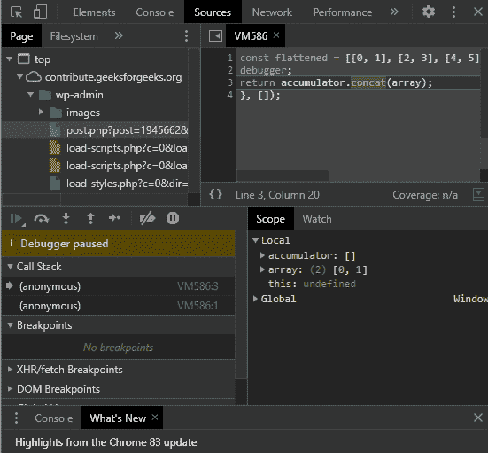

# 是 6 |调试

> 原文:[https://www.geeksforgeeks.org/es6-debugging/](https://www.geeksforgeeks.org/es6-debugging/)

我们前面已经看到了 [ES6 的入门概念。](https://www.geeksforgeeks.org/introduction-to-es6/)。调试是查看整个代码，了解它在做什么，并弄清楚为什么程序没有按预期运行的行为。
在下面的例子中，console.log()函数用于代码调试。为了理解程序中每一步发生了什么，我们使用 console.log()函数进行计算，该函数将程序中每一步的数组和累加器输出到控制台。

```
const flattened = [[0, 1], [2, 3], [4, 5]]
        .reduce((accumulator, array) => {
    document.write('array', array);
    document.write('accumulator', acccumulator);
    return accumulator.concat(array);
}, []);
```

为了避免每次都登录到控制台，ES6 提供了调试工具——调试器。调试器允许用户深入任何功能，并以循序渐进的方式监控一切。当 JavaScript Engine 和浏览器运行到 word 调试器时，它会停止并为我们打开窗口。
下面的例子演示了调试器的使用。JavaScript 引擎在调试器处停止，并打开窗口，如下所示。该窗口提供有关程序中数组和累加器的信息。

```
// JavaScript code
const flattened = [[0, 1], [2, 3], [4, 5]]
        .reduce((accumulator, array) => {
    debugger;
    return accumulator.concat(array);
}, []);
```

