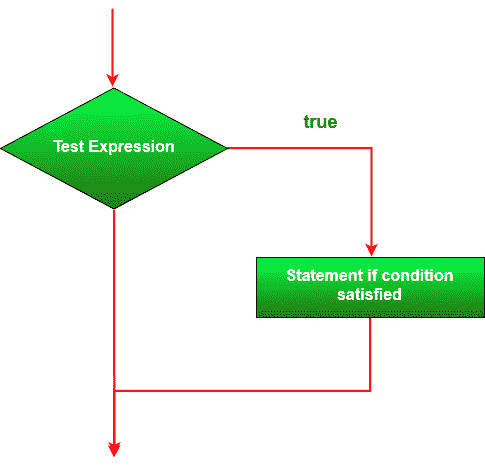
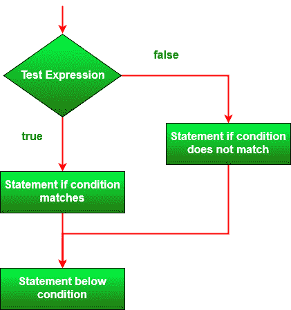
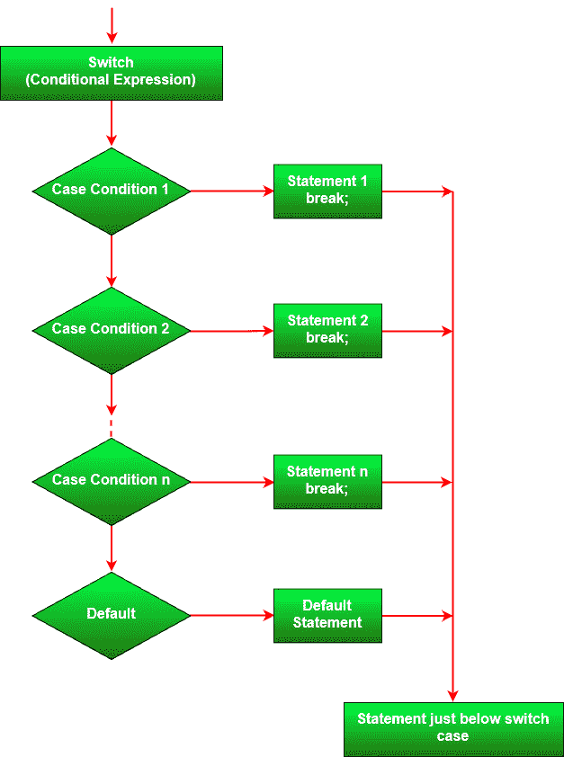

# ES6 |决策

> 原文:[https://www.geeksforgeeks.org/es6-decision-making/](https://www.geeksforgeeks.org/es6-decision-making/)

**需要编程中的 ES6 决策**来进行一些操作的逻辑决策。在 **ES6** 中，可以使用以下条件语句进行决策:

**注意:**使用 **if、if-else 或 if-else 阶梯**时应考虑以下几点。

*   **如果必须在 if 或 else 块中执行多个语句，则应使用花括号{}** 。
*   如果为真或假，则在**内评估的条件。**

**if 语句:**如果某条语句必须基于单一条件执行，则使用该语句。它用于决定是否执行某个语句或语句块，即如果某个条件为真，则执行该语句块，否则不执行。

**语法:**

```
if (condition)
{
    // Set of statement which has
    // to be executed if condition
    // is satisfied
}

```

**流程图:**

**例 1:**

```
<script>
let a = 10;

if (a > 0) {
    console.log(a + " is a natural number.");
}
</script>
```

**输出:**

```
10 is a natural number.

```

**例 2:**

```
<script>
let a = 10;
let b = 20;

if (a > b) {
    console.log("a is greater than b");
}

// Independent Statement
console.log("Hello World");
</script>
```

**输出:**

```
Hello World
```

**if-else 语句:**当必须基于某些给定条件执行某组代码时使用，否则必须执行另一组代码。if 语句单独告诉我们，如果条件为真，它将执行一个语句块，如果条件为假，则执行 else 块。当条件为假时，我们可以使用 else 语句和 if 语句来执行一段代码。

**语法:**

```
if (condition) {

    // Set of statement which has
    // to be executed if condition 
    // is satisfied
} 
else {

    // Set of statement which has
    // to be executed if condition 
    // is not satisfied
}

```

**流程图:**


**示例:**

```
<script>
    let a = 10;
    let b = 20;

    if (a > b) {
        console.log("a is greater than b");
    }
    else {
        console.log("b is greater than a");
    }
</script>                    
```

**输出:**

```
b is greater than a
```

**if-else 梯形:**当必须根据层次条件执行某组语句时使用。用户可以在多个选项中进行选择。if 语句从上到下执行。一旦控制 if 的条件之一为真，就执行与该 if 关联的语句，并绕过阶梯的其余部分。如果这些条件都不成立，那么将执行最后的 else 语句。

**语法:**

```
if (condition-1) {
    if (condition-2) {

        // statements - if condition-1 and
        // condition-2 both are satisfied
    }

    // statements - condition-1 is satisfied
}

```

**例 1:**

```
<script>
let a = 10;
let b = 20;
let c = 8;
if (b > a) {
    if (b > c) {
        console.log("b is greatest");
    } else {
        console.log("c is greatest");
    }
} else {
    if (a > c) {
        console.log("a is greatest");
    } else {
        console.log("c is greatest");
    }
}
</script>
```

**输出:**

```
b is greatest
```

**开关-大小写:**当需要基于单个变量表达式计算多个条件时使用。
**语法:**

```
switch(expression) {
    case_I :
       // statements for case_I
       break;

    case_II :
       // statements for case_II
       break;

    case_n :
       // statements for case_n
       break;

    default :
       // statements for default
}

```

**注意:**使用开关柜时必须考虑以下几点

*   switch 语句接受 n 种情况。
*   案例是**区分大小写**。
*   Default 的**优先级最低**(如果任何情况与给定的变量表达式不匹配，则无论其位置如何，都将只执行 default)，默认为**可选**。
*   案例必须是**不变且唯一的**。它不能是变量或表达式。
*   如果在满足的情况下**中断**缺失，执行将流过每个情况，直到没有遇到中断。

**流程图:**


**例 1:**

```
<script>
let day = 4;
switch(day) 
{
    case 0:
        console.log("Monday");
        break;
    case 1:
        console.log("Tuesday");
        break;
    case 2:
        console.log("Wednesday");
        break;
    case 3:
        console.log("Thursday");
        break;
    case 4:
        console.log("Friday");
        break;
    case 5:
        console.log("Saturday");
        break;
    case 6:
        console.log("Sunday");
        break;
}
</script>
```

**输出:**

```
Friday
```

**例 2:**

```
<script>
let name = "Jhon";

switch(name) {
    default :
        console.log("No data found");
        break;
         // should be used to avoid fall through other cases below
         // if no case matches the variable expression

    case "jhon" :
        console.log("I am small");
        break;
    case "Jhon" :
        console.log("I am original");
        break;
    case "JhoN" :
        console.log("I am modified");
        break;
}
</script>
```

**输出:**

```
I am original
```

**例 3:**

```
<script>
let a = 10;

switch(a) {
    default:
        console.log("I am default");
    case 12:
        console.log("I am 12");
    case 13:
        console.log("I am 13");
    case "10":
        console.log("I am string 10");
    case 15:
        console.log("I am 15");
        break;
    case 16:
        console.log("I am 16");
}
</script>
```

**输出:**

```
I am default
I am 12
I am 13
I am string 10
I am 15

```

**三元运算符:**也是 if-else 简写方法。它以三个参数作为输入，**条件，条件满足时声明，条件不满足时声明**。

**语法:**

```
(condition expression) ? statement for true : statement for false;
```

**例 1:**

```
<script>
let a = 10;
(a == 10) ? console.log("geeksforgeeks") : console.log("you are wrong");
</script>
```

**输出:**

```
geeksforgeeks
```

**例 2:**

```
<script>
let a = 10;
let b = 20;
let c = 15;
let max = (a > b) ? (a > c) ? a : c : (b > c) ? b : c;
console.log(max);
</script>
```

**输出:**

```
20
```