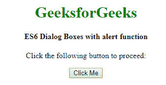
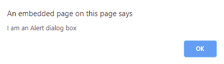
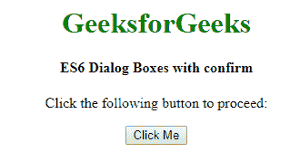
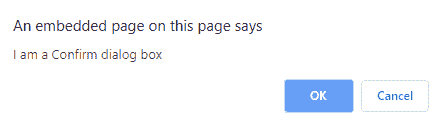
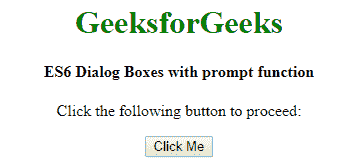
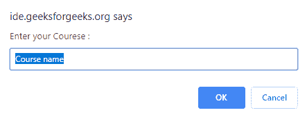

# ES6 |对话框

> 原文:[https://www.geeksforgeeks.org/es6-dialog-boxes/](https://www.geeksforgeeks.org/es6-dialog-boxes/)

ES6 有三种类型的对话框。这些对话框用于如下所述的各种目的:

1.  发出警报，使用警报功能完成任务。
2.  获得事件或输入的确认–确认功能用于完成任务。
3.  从用户那里得到一个输入——提示功能用来完成任务。

**报警对话框:**报警框用于向用户发出警告信息。警告框只有一个按钮“确定”来选择并继续下一个任务。例如，当某些输入字段是必需的，并且用户没有给该输入字段赋值时，可以使用警告框显示一个弹出窗口。

*   **语法:**

    ```
    alert(message);

    ```

*   **示例:**以下代码演示了警报对话框:

    ```
    <!DOCTYPE html>
    <html>

    <head>
        <title>ES6 Dialog Boxes</title>
        <script type="text/javascript">
            function display() {
                alert("I am an Alert dialog box");
            }
        </script>
    </head>

    <body>
        <center>
            <h1 style="color:green;">GeeksforGeeks</h1>
            <h4>ES6 Dialog Boxes with alert function</h4>
            <p>Click the following button to proceed: </p>
            <input type="button" value="Click Me" onclick="display();" />
        </center>
    </body>

    </html>
    ```

*   **输出:**
    *   **点击按钮前:**
        
    *   **点击按钮后:**
        

**确认对话框:**一个确认对话框用于接受用户的确认选项。它会显示一个包含两个按钮的对话框:确定和取消。例如，如果用户删除了一些数据，页面可以使用确认框进行确认，就好像该数据真的要被删除一样。如果用户单击“确定”按钮，该方法返回真值，而如果用户单击“取消”按钮，则 confirm()方法返回假值。

*   **语法:**

    ```
    confirm(message);

    ```

*   **示例:**以下代码演示了确认对话框:

    ```
    <!DOCTYPE html>
    <html>
    <head> 
        <script type = "text/javascript">
                function display() {
                var x = confirm ("I am a Confirm dialog box");
                if( x == true ) {
                    document.write ("User wants to continue!");

                } 
                else {
                    document.write ("User does not want to continue!");
                }
            }
        </script>     
    </head>
    <body>
        <center>
            <h1 style="color:green;">GeeksforGeeks</h1>
            <h4>ES6 Dialog Boxes with alert function</h4>
            <p>Click the following button to proceed: </p>
            <input type="button" value="Click Me" onclick="display();" />
        </center>
    </body>
    </html>                    
    ```

*   **输出:**
    *   **点击按钮前:**
        
    *   **点击按钮后:**
        

**提示对话框:**弹出文本框获取用户输入时使用提示对话框。用户需要在文本框中输入，然后单击确定。该对话框有两个按钮:确定和取消。如果用户单击“确定”按钮，提示符()会读取并返回用户输入的值。如果用户单击“取消”按钮，提示()将返回空值。

*   **语法:**

    ```
    prompt(message, defstring);

    ```

*   **示例:**以下代码演示了提示对话框。这里，消息是要在文本框中显示的文本，而 def 字符串是要在文本框中显示的默认字符串。

    ```
    <!DOCTYPE html>
    <html>

    <head>
        <script type="text/javascript">
            function getValue() {
                var retVal = prompt("Enter your Courese : ", "Course name");
                document.write("You have entered : " + retVal);
            }
        </script>
    </head>

    <body>
        <center>
            <h1 style="color:green;">GeeksforGeeks</h1>
            <h4>ES6 Dialog Boxes with prompt function</h4>
            <p>Click the following button to proceed: </p>
            <form>
                <input type="button" value="Click Me" onclick="getValue();" />
            </form>
        </center>
    </body>

    </html>            
    ```

*   **输出:**
    *   **点击按钮前:**
        
    *   **点击按钮后:**
        

**支持的浏览器:****ES6 对话框**支持的浏览器如下:

*   谷歌 Chrome
*   微软公司出品的 web 浏览器
*   火狐浏览器
*   旅行队
*   歌剧