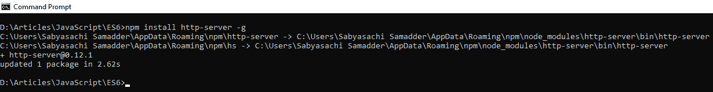
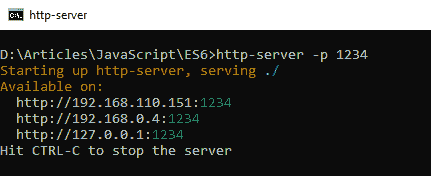
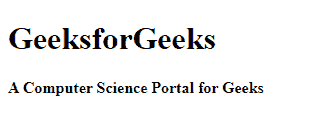

# ES6 |环境设置

> 原文:[https://www.geeksforgeeks.org/es6-environment-setup/](https://www.geeksforgeeks.org/es6-environment-setup/)

ES6 可以在本地机器上运行，只是它需要一个浏览器和一个文本编辑器。否则，ES6 可以在任何主机、任何操作系统上运行。对于 ES6，它可能不是在浏览器上一直执行。所以我们需要一些额外的机制来执行 ES6 版本。

*   **NodeJS**
*   **代码编辑器**
*   **浏览器**

**NodeJS:** 对于 web 服务器来说，NodeJS 是一个开源的、跨平台的 JavaScript 运行时环境，在浏览器之外执行 JavaScript 代码。要在您的机器上安装 NodeJS，请遵循以下链接。

*   [在 Windows 上安装 node . js](https://www.geeksforgeeks.org/installation-of-node-js-on-windows/)
*   [在 Linux 上安装 node . js](https://www.geeksforgeeks.org/installation-of-node-js-on-linux/)

**代码编辑器:**要编写可执行代码，我们需要一个文本编辑器。在我看来， **VS 代码编辑器**是你可以选择的首选。要安装 **VS 代码**，请遵循以下链接。

*   首先，您必须下载并安装 Visual Studio。具体可参考[下载安装 Visual Studio](https://www.geeksforgeeks.org/setting-environment-c-sharp/) 。

**浏览器:**运行 ES6 程序。我更喜欢使用**谷歌浏览器**，还有很多其他的浏览器，像火狐，网络浏览器，Safari。
**执行 ES6 代码:**

*   **第一步:**现在在你电脑的任何地方制作一个文件夹，在那个文件夹中运行**命令提示符**，使用 VS Code 编辑器制作一个 HTML 文件，将下面的代码粘贴到文件中并保存。

## 超文本标记语言

```
<!DOCTYPE HTML>
<html lang="en">
    <head>
        <meta charset="UTF-8"/>
        <meta name="viewport"
              content="width=device-width,
              initial-scale=1.0"/>
        <meta http-equiv= "X-UA-Compatible"
              content="ie=edge"/>
        <title>hello world!</title>
    </head>
    <body>
        <h1>GeeksforGeeks</h1>
        <b>A Computer Science Portal for Geeks</b>
    </body>
</html>
```

*   **第二步:**然后在命令提示符下写下下面的命令，点击回车。

```
npm install http-server -g
```

*   [**npm**](https://www.geeksforgeeks.org/node-js-npm-node-package-manager/) 是 JavaScript 编程的包管理器，默认情况下由 **NodeJS** 提供。npm 的完整形式是**节点包管理器**。它有许多库，我们可以通过 Node 轻松使用它们。这里我们是用一个库 **http-server** 来建立服务器。



*   **第三步:**然后，安装后下面的命令将打开服务器。

```
http-server -p 1234
//1234 is a random port number
```



*   **第四步:**之后打开浏览器，在搜索框中写下下面的 URL。然后，在创建文件夹后，您之前创建的 HTML 页面将显示在网络上。

```
localhost:1234/filename.html
```

