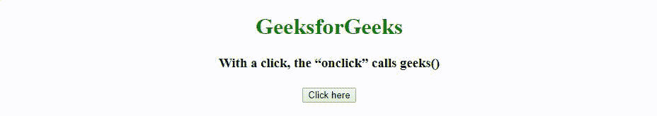
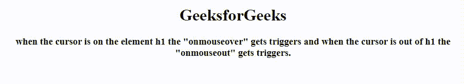
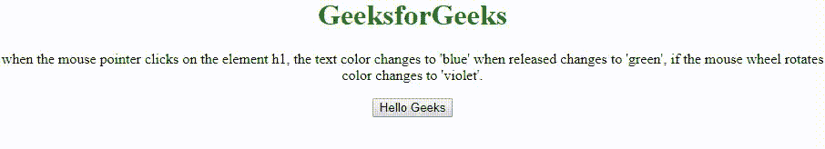

# ES6 |事件

> 原文:[https://www.geeksforgeeks.org/es6-events/](https://www.geeksforgeeks.org/es6-events/)

**ES6 事件**是每个 HTML 元素的一部分，它包含一组可以触发 JavaScript 代码的事件。事件是软件识别的动作或事件。它可以由用户或系统触发。事件主要用于按钮、超链接、悬停、页面加载等。所有这些东西都在事件处理程序的帮助下开始行动(处理)。

**事件处理程序:**简单来说，当一个提到的事件发生时，它就会被处理。当事件被引发时，它以一组指令(function())的形式被处理。

以下是一些最常用的 HTML 事件:

**onclick:** 通过鼠标左键点击按钮激活该事件。点击一下，“onclick”调用分配给它的相应的**函数()**。

*   **例:**

    ```
    <!DOCTYPE html>
    <html> 
    <head> 
        <title>
            ES6 Events using onclick
        </title>

        <script> 
            function geeks() { 
                document.write ("A Computer"
                + " Science Portal for Geeks") 
            } 
        </script> 
    </head> 

    <body style="text-align:center;"> 

        <h1 style="color:green;">
            GeeksforGeeks
        </h1>

        <h3> 
            With a click, the “onclick”
            calls geeks()
        </h3>

        <input type = "button" onclick =
            "geeks()"    value = "Click here" /> 
    </body> 

    </html>
    ```

*   **输出:**
    

**onmouseover 和 onmouseout:** 这些事件类型将帮助我们用图像甚至文本创建良好的效果。当您将鼠标光标移至任何元素上时，会触发“onmouseover”事件，当您将鼠标光标移出该元素时，会触发“onmouseout”事件。

*   **例:**

    ```
    <!DOCTYPE html>
    <html>

    <head>
        <title>
            ES6 Events using onmouseover
            and onmouseout
        </title>

        <script type="text/javascript">
            function mouseOver() {
                document.getElementById("d1").style.color
                                = "green";

                document.getElementById("d2").innerHTML
                                = "mouseOver triggered";
            }

            function mouseOut() {
                document.getElementById("d1").style.color
                                = "black";

                document.getElementById("d2").innerHTML
                                = "mouseOut triggered";
            }
        </script>
    </head>

    <body style="text-align:center;">

        <h1 id="d1" onmouseover="mouseOver()"
                    onmouseout="mouseOut()">
            GeeksforGeeks
        </h1>

        <h3>
            when the cursor is on the element
            h1 the "onmouseover" gets triggers
            and when the cursor is out of h1
            the "onmouseout" gets triggers.
        </h3>

        <p id="d2"></p>
    </body>

    </html>
    ```

*   **输出:**
    

**onmousedown、onmouseup、onmousewheel :** 这些事件类型将帮助我们用图像甚至文本创建良好的效果。“onmousedown”事件在您单击元素时触发，当您释放它时，直到您抓住它为止“onmouseup”事件触发，“onmousewheel”事件在鼠标滚轮稍微旋转时触发。

*   **Example:**

    ```
    <!DOCTYPE hmtl>
    <html>

    <head>

        <title>
            ES6 Events using onmousedown,
            onmouseup and onmousewheel
        </title>

        <script>
            function mouseDown() {
                document.getElementById("d1").style.color
                            = "blue";

                document.getElementById("d2").innerHTML
                            = "mouseDown triggered";
            }

            function mouseUp() {
                document.getElementById("d1").style.color
                            = "green";

                document.getElementById("d2").innerHTML
                            = "mouseUp triggered";
            }

            function mouseWheel() {
                document.getElementById("d1").style.color
                            = "violet";

                document.getElementById("d2").innerHTML
                            = "mouseWheel triggered";
            }
        </script>
    </head>

    <body style="text-align:center;">

        <h1 style="color:green;">
            GeeksforGeeks
        </h1>

        <p>
            when the mouse pointer clicks on the element h1,
            the text color changes to 'blue' when released 
            changes to 'green', if the mouse wheel rotates color
            changes to 'violet'.
        </p>

        <input id="d1" type="button" onmousedown="mouseDown()"
            onmouseup="mouseUp()" onmousewheel="mouseWheel()"
            value="Hello Geeks" />

        <p id="d2"></p>
    </body>

    </html>
    ```

    **输出:**
    [](https://media.geeksforgeeks.org/wp-content/uploads/20191022130115/RR5.gif)

**onsubmit:** 这是一个事件，当您尝试在将表单提交给下一个操作(服务器)之前验证表单时发生。您可以针对此事件类型进行表单验证。只需单击一下,“onsubmit”就会调用分配给它的相应“return function()”，并以 true 或 false 的形式接受 function()的响应，然后决定操作。查看本页 [ES6 |验证](https://www.geeksforgeeks.org/es6-validation/)了解关于**【on submit】**的基本和详细示例。

**查看下表，了解一些最常用的事件处理程序:**

| 属性 | 描述 |
| 昂哥 | 当元素更改时获取触发器 |
| 聚焦 | 当窗口获得焦点时获取触发器 |
| 推理能力 | 当元素获得用户输入时获取触发器 |
| onformchange | 获取窗体更改时的触发器 |
| 按键 | 按下并释放关键字键时获取触发器 |
| 叔叔家 | 按下某个键时获取触发器 |
| 上基乌普 | 释放键时获取触发器 |
| onmousemove | 当鼠标指针移动时获取触发器 |
| ONP 原因 | 获取媒体数据暂停时的触发器 |
| 翁克罗尔 | 获取滚动元素滚动条时的触发器 |
| onselect | 选择元素时获取触发器 |
| 等待 | 当媒体已停止播放，但预计将继续播放时获取触发器 |
| ONP 原因 | 获取媒体数据暂停时的触发器 |
| 蒙皮 | 获取媒体数据开始播放时的触发器 |
| 正在播放 | 媒体数据开始播放时获取触发器 |