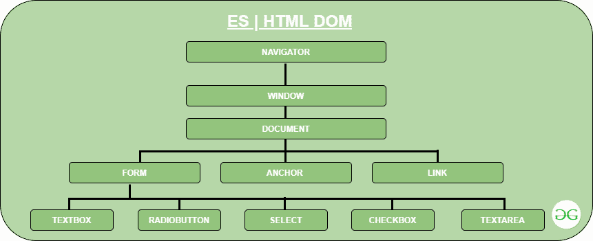
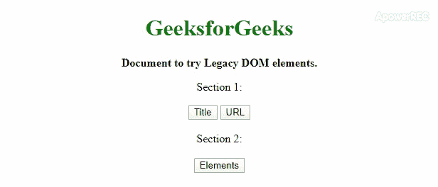
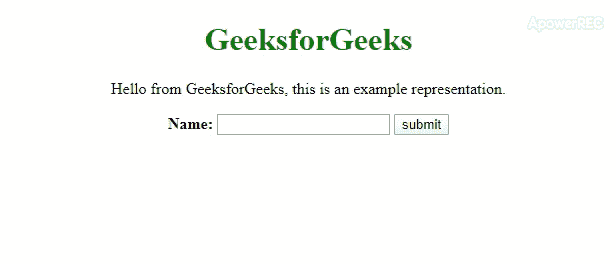
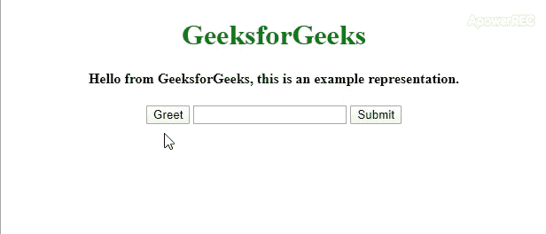

# 是 6 | HTML DOM

> 哎哎哎:# t0]https://www . geeksforgeeks . org/es 6-html-DOM/

**DOM** 代表 **D** 文档 **O** 对象 **M** 模型。网页在浏览器中呈现。浏览器将网页中包含的所有元素从 web 服务器下载到内存中。完成后，浏览器将在浏览器窗口中显示这些对象，一旦完成，浏览器将无法再识别单个的 HTML 元素。启用 JavaScript 的浏览器能够在网页在浏览器中呈现后识别网页中的单个对象，因为启用 JavaScript 的浏览器能够识别并使用 DOM。因此，允许随意控制对象的功能。

**DOM 的优势:**

*   帮助创建交互式网页，因为它允许浏览器识别单个的 HTML 对象，即使它们在浏览器窗口中呈现。
*   允许随意控制对象的功能
*   帮助更新或修改数据

**结构**



*   **导航器:**浏览器。例如:网景导航器、互联网浏览器、歌剧、马赛克等。
*   **窗口:**浏览器的窗口。
*   **文档:**文档显示在浏览器的窗口中。这又有其自身的多重因素。我们在这里只讨论形式。
*   **表单:**DOM 层次结构继续向下，以包含表单的各个元素。

**DOM 类别:**JavaScript 支持的 DOM 有三种类型，但我们只讨论那些适用于 ES6 的。

**1。遗留 DOM:** 这是早期版本的 JavaScript 使用的模型。该模型提供了标题、网址等只读属性。它还提供了关于整个文档的最后修改信息。这个模型有很多方法可以用来设置和获取文档属性值。

**遗留 DOM 的文档属性:**

*   **alinkColor:** 该属性定义激活链接的颜色。

```
Eg. document.alinkColor
```

*   **锚点[]:** 它是每个锚点对象的数组，当它出现在文档中时，每个锚点一个。

```
Eg. document.anchors[0],document.anchors[1],...
```

*   **小程序[]:** 它是小程序对象的数组，当小程序出现在文档中时，每个小程序对应一个对象。

```
Eg. document.applets[0],document.applets[1],..
```

*   **bgColor:** 该属性定义文档的背景颜色。

```
Eg. document.bgColor
```

*   **Cookie:** 该属性定义了具有特殊行为的值属性，允许设置与要查询的文档相关联的 Cookie。

```
Eg. document.cookie
```

*   **域:**该属性定义了文档所属的域已经被用于安全目的。

```
Eg. document.domain
```

*   **嵌入[]:** 插件[]的同义词。它是表示嵌入在文档中的数据的对象数组

```
Eg. document.embeds[0],document.embeds[1],...
```

*   **fgColor:** 该属性定义文档的默认文本颜色。

```
Eg. document.fgColor
```

*   **forms[]:** 它是表单对象的数组，每个对象一个，就像它出现在表单中一样。

```
Eg. document.forms[0],document.forms[1],...
```

*   **images[]:** 它是表单对象的数组，每个元素对应一个表单中出现的带有< img >标签的元素。

```
Eg. document.images[0[,document.images[1],...
```

*   **最后修改:**该属性定义最近更新的日期。

```
Eg. document.lastModified
```

*   **链接颜色:**该属性定义未访问链接的颜色，与 **vlinkColor** 相反。

```
Eg. document.linkColor
```

*   **链接[]:** 文档链接数组。

```
Eg. document.links[0],document.links[1],...
```

*   **位置:**该属性保存文档的 URL。

```
Eg. document.location
```

*   **插件[]:** 该属性是嵌入[]的同义词。

```
Eg. document.plugins[0],document.plugins[1],...
```

*   **引用者:**包含文档网址的字符串，如果它与任何链接。

```
Eg. document.referrer
```

*   **标题:**T2 标题>标签的内容。

```
Eg. document.title
```

*   **URL:** 该属性定义 URL。

```
Eg. document.URL
```

*   **vlinkColor:** 该属性定义了访问链接的颜色(未激活)。

```
Eg. document.vlinkColor
```

**遗留 DOM 中的文档方法:**

*   **清除():**清除文档内容，不返回任何内容。

```
Eg. document.clear()
```

*   **关闭():**关闭打开的文档()。

```
Eg. document.close()
```

*   **open():** 删除现有文档内容，并打开一个可以写入新文档内容的流。不返回任何内容。

```
Eg. document.open()
```

*   **write():** 在文档中插入指定的字符串。

```
Eg. document.write()
```

*   **writeln():** 与 write()相同，但在追加完成后插入新行。

```
Eg. document.writeln()
```

**示例:**

## 超文本标记语言

```
<!DOCTYPE html>
<html>

<head>
    <title>Legacy DOM example</title>
    <script type="text/javascript">
        function func1() {
            var a = document.title;
            alert("Document title: " + a);

        }

        function func2() {
            var b = document.URL;
            var c = document.lastModified;
            var d = document.location;

            document.write("Document URL: " + b);
            document.write("Document last modified: " + c);
            document.write("Document location: " + d);

        }

        function func3() {
            var n = document.forms[1];
            document.write("Second form elements: " + n);
        }
    </script>
</head>

<body>
    <center>
        <h1 style="color: green">GeeksforGeeks</h1>
        <b>Document to try Legacy DOM elements.</b>
        <form name="form1">

<p>Section 1:</p>

            <button name="b1" id="1"
                    value="title" onclick="func1()">
              Title
            </button>
            <button name="b2" id="2"
                    value="INFO" onclick="func2()">
              URL
            </button>
        </form>
        <br>

        <form name="form2">
            Section 2:
            <br>
            <br>
            <button name="bt1" id="1"
                    value="submit" onclick="func3()">
              Elements
            </button>
        </form>
  </center>
</body>

</html>
```

**输出:**



**2。W3C DOM:** 这个 DOM 遵循标准的万维网联盟，它说:

> 文档对象模型是一个平台和语言中立的界面，允许程序和脚本动态访问和更新文档的内容、结构和样式

该模型主要关注语言中立性，因此可以轻松编写文档的脚本和样式。

**W3C DOM 中的文档属性:**

*   **正文:**标签的内容。

```
Eg. document.body
```

*   **默认视图:**表示显示文档的窗口。

```
Eg. document.defaultView
```

*   **文档元素:**对文档标签的引用。

```
Eg. document.documentElement
```

*   **实现:**表示多米 implementation 对象，该对象表示创建此文档的实现。

```
Eg. document.implementation
```

**W3C DOM 中的文档方法:**

*   **create attribute(name _ of _ attr):**返回新创建的具有指定名称的 Attr 节点。

```
Eg. document.createAttribute(name_of_attr)
```

*   **创建注释(文本):**创建并返回包含指定文本的新注释节点。

```
Eg. document.createComment(some_text)
```

*   **createDocumentFragment():**创建并返回一个空的 DocumentFragment 节点。

```
Eg. document.createDocumentFragment()
```

*   **创建元素(标记名 _of_new_ele):** 用指定的标记名创建并返回一个新的元素节点。

```
Eg. document.createElement(tagname_of_new_ele)
```

*   **创建文本节点(文本):**创建并返回包含指定文本的新文本节点。

```
Eg. document.createTextNode(text)
```

*   **getElementById(Id):** 从具有所述 Id 的元素的文档中返回值。

```
Eg. document.getElementById(Id)
```

*   **getElementsByName(名称):**从文档中返回具有指定名称的节点数组。

```
Eg. document.getElementsByName(name)
```

*   **getElementsByTagName(标记名):**返回文档中具有指定标记名的所有元素节点的数组。

```
Eg. document.getElementsByTagName(tagname)
```

*   **importNode(importedNode，deep):** 从某个其他文档中创建并返回一个适合插入到该文档中的节点副本。如果深度参数为真，它也会递归复制节点的子节点。

```
Eg. document.importNode(importedNode, deep)
```

**示例:**

## 超文本标记语言

```
<!DOCTYPE html>
<html>

<head>
    <title>W3c example</title>
    <script type="text/javascript">
        function hello() {
            var n = document.getElementById('2').value;
            document.write("Hello " + n);

            var a = document.body;
            document.write("</br>Document body:" + a);

            var b = document.defaultView;
            document.write("</br>Document default view: " + b);

        }
    </script>
</head>

<body>
    <center>

        <h1 style="color: green">
          GeeksforGeeks
        </h1>

<p>
          Hello from GeeksforGeeks, this is
          an example representation.
        </p>

        <form name="myform">
            <b>Name:</b>
            <input type="text" name="name" id="2">
            <input type="submit" name="submit"
                   value="submit" onclick="hello()">

        </form>
    </center>

</body>

</html>           
```

**输出:**



**3。IE4 DOM:** 这个 DOM 是在 4 版的 Internet Explorer 中引入的。后来的版本扩展并包含了 W3C DOM 的特性。

**IE4 DOM 中的文档属性:**

*   **活动元素:**指当前活动的输入元素。

```
Eg. document.activeElement
```

*   **all[]:** 文档中所有元素对象的可索引数组。

```
Eg. document.all[]
```

*   **字符集:**文档的字符集。

```
Eg. document.charset
```

*   **子级[]:** 数组，包含作为文档直接子级的 HTML 元素。

```
Eg. document.children[]
```

*   **默认字符集:**文档的默认字符集。

```
Eg. document.defaultCharset
```

*   **expando:** 当该属性设置为 false 时，它防止客户端对象被扩展。

```
Eg. document.expando
```

*   **父窗口:**包含窗口的文档。

```
Eg. document.parentWindow
```

*   **readyState:** 指定文档的加载状态。

```
Eg. document.readyState
```

*   **未初始化:**文档尚未开始加载。

```
Eg. document.uninitialized
```

*   **加载:**文件正在加载

```
Eg. document.loading
```

*   **交互:**文档已经加载到足以让用户交互的程度。

```
Eg. document.interactive
```

*   **完成:**文件已加载。

```
Eg. document.complete
```

**IE4 DOM 中的文档方法:**

*   **elementFromPoint(x，y):** 返回位于指定点的元素。

```
Eg. document.elementFromPoint(x,y)
```

**示例:**

## 超文本标记语言

```
<!DOCTYPE html>
<html>

<head>
    <title>IE4 DOM example</title>
    <script type="text/javascript">
        function func1() {
            var a = document.all["greetings"];
            alert("Hey, " + a.innerHTML);

        }

        function func2() {
            var b = document.activeElement;
            document.write("Active element: " + b);

        }
    </script>
</head>

<body>
    <center>
        <h1 style="color: green">
          GeeksforGeeks
        </h1>

        <h4 id="greetings">
          Hello from GeeksforGeeks, this is
        an example representation.
        </h4>

        <form name="myform">
            <input type="submit" name="b1"
                   value="Greet" onclick="func1()">
            <input type="text" name="text1">
            <input type="submit" name="b2"
                   onclick="func2()">
        </form>
    </center>

</body>

</html>
```

**输出:**

