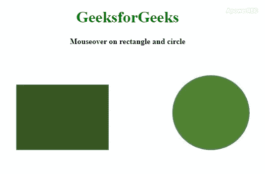
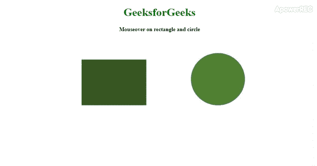

# ES6 |影像地图

> 哎哎哎:# t0]https://www . geeksforgeeks . org/es 6-image map/

**JavaScript 中的图像映射**用于从网页上的任何图像导航到其他网页或同一网页的某些部分的各种链接。也就是让一个图片出现在网页上，这个图片分成几个部分，每个部分对应一些链接，点击那个图片的那些部分后，链接就打开了。这部分图像称为**图像图**。该部分有不同的形状，如**矩形、圆形**等。使用 **[< img >](https://www.geeksforgeeks.org/html-images/)** 标签将图像插入到网页中，在该标签下有一个名为 **usemap** 的属性，该属性将地图描述定义到该图像中。简单来说， **usemap** 属性调用应用于图像的地图描述。该地图的定义方式是将图像分成若干部分。这些部分是通过指定像素坐标来定义的，像素坐标定义了每个可点击部分的边界。在**地图**下定义了另一个标签 **[<区域>](https://www.geeksforgeeks.org/html-area-tag/)** 。在这个 **<区域>** 标签下定义了每个截面的坐标和形状。这些部分被称为**热点**。

**语法:**

```

<map name="mapName">
    <area shape=shapeName coords="x, y" />
    <area shape=shapeName coords="x, y, r" />
</map>
```

以下示例说明了 ES6 中的**图像映射**:

*   **Example:**

    ```
    <!Doctype html>
    <html>
    <head>
        <script type="text/javascript">
            function fn(name) {
                document.getElementById("typ").innerHTML = name;
            }
        </script>
    </head>

    <body>
        <center>
            <h1 style="color:green;">GeeksforGeeks</h1>
            <b>Mouseover on rectangle and circle</b>
            <br>
        <span id="typ" style="color:#008000;"></span>
        <br>
        

        <!--image in which the section are created-->
        <map name="gfg">

            <!-- area tag -->
            <!--coordinates are defined for
               "rectangle" and "circle"-->
            <area shape="rect" coords="75, 60, 250, 200"
                  onmouseover="fn('RECTANGLE')" 
                  onmouseout="fn('')" />
            <area shape="circle" 
                  coords="500, 80, 110" 
                  onmouseover="fn('CIRCLE')" 
                  onmouseout="fn('')">
        </map>
    </body>

    </html>
    ```

    **输出:**本代码中坐标 **75、60、250、200** 为矩形，坐标 **500、80、110** 为圆形。在图像中，对应于坐标的部分被创建，事件发生在这些部分中。

*   **示例 2:** 在本例中，我们将使用图像地图打开一个链接。

    ```
    <!Doctype html>
    <html>
    <head>
        <script type="text/javascript">
            function fn(name) {
                document.getElementById("typ").innerHTML = name;
            }
        </script>
    </head>

    <body>
        <center>
            <h1 style="color:green;">GeeksforGeeks</h1>
            <b>Mouseover on rectangle and circle</b>
            <br>
        <span id="typ" style="color:#008000;"></span>
        <br>
        

        <!--image in which the section are created-->
        <map name="gfg">

            <!-- area tag -->
            <!--coordinates are defined for "rectangle" and "circle"-->
            <area shape="rect" coords="75, 60, 250, 200"
                  href="https://ide.geeksforgeeks.org/tryit.php"
                  onmouseover="fn('RECTANGLE')" 
                  onmouseout="fn('')" />
            <area shape="circle" 
                  coords="500, 80, 110" 
                  onmouseover="fn('CIRCLE')" 
                  onmouseout="fn('')">
        </map>
    </body>

    </html>           
    ```

*   **输出:** 