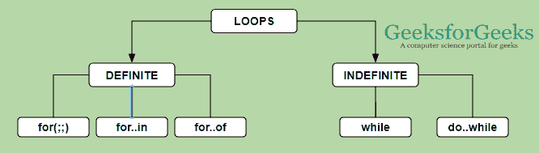

# 是 6 |回路

> 原文:[https://www.geeksforgeeks.org/es6-loops/](https://www.geeksforgeeks.org/es6-loops/)

循环是以循环的方式一次又一次地完成相同任务的方式。循环表示一组必须重复的指令。在循环的上下文中，重复被称为迭代。

下图说明了循环的分类:
[](https://media.geeksforgeeks.org/wp-content/uploads/20191023174139/1021.png)

**定形:**ES6 中有三种定形环。下面用例子来描述它们:

| 类型 | 描述 |
| for(；；) | 在终止条件下执行循环块指定次数。 |
| 为了…在 | 通过对象的属性执行循环块。 |
| 为了…的 | 执行循环块以迭代可迭代的而不是对象文字。 |

*   **for( ; ; )** The for loop executes the code block for a specified number of times.

    **语法:**

    ```
    for( Initialization; Terminate Condition; Increment/Decrement )
    ```

    **初始化**也可以被称为计数值，因为该变量一直跟踪计数直到终止符。**增加/减少**变量到某个步长值。**终止条件**确定不定或定范畴，因为如果终止符语句有效，那么循环在某个确定的时间终止，否则它将进行无限循环，并且将是不定循环。

*   **for…in** The for…in loop is used to loop through an object’s properties.

    **语法:**

    ```
    for(variable_name in object) {  
        . . . 
    }

    ```

    在每次迭代中，对象的一个属性被分配给变量 _name，这个循环一直持续到对象属性结束。它肯定会结束它的迭代，所以它会进入一个确定的循环。

*   **for…of** The for…of loop is used to execute the loop block to iterates the iterable instead of object literals.

    **语法:**

    ```
    for(variable_name of object) {  
        . . .
    }

    ```

    在每次迭代中，iterable 的一个属性(数组、字符串等)被赋给变量 _name，这个循环一直持续到迭代结束，它肯定会结束它的迭代，所以，它进入了一个确定的循环。

*   **示例:**该示例说明了上述所有三个循环。

    ```
    <script>
    function geeks() {
        var obj = {Geeks:1, on:2, one:3};
        document.write("for(;;)<br>")

        for( var i = 0 ; i <= 10; i+=2) {
            document.write(i+" ")
        }

        document.write("<br>for...of<br>")

        // If 'of' is replaced by 'in' it throws an error 
        // as 'in' and literal are not compatible
        for (var i of ['hello', "Geeks", 3000]) {
            document.write(i+" ") 
        }

        // If 'in' is replaced by 'of' it throws an error 
        // as 'of' and objects are not compatible
        document.write("<br>for...in<br>")

        for (var i in  obj) {
            document.write(obj[i]+" "); 
        }
    }
    geeks();
    </script>
    ```

*   **输出:**

    ```
    for(;;)
    0 2 4 6 8 10
    for...of
    hello Geeks 3000
    for...in
    1 2 3

    ```

**不定:**ES6 中有两类不定环。下面用例子来描述它们:

| 类型 | 描述 |
| 在…期间 | 在终止条件下执行循环块指定次数。 |
| 做…同时 | 类似于 while 循环，但首先执行循环并计算。 |

*   **While 循环:**这个循环属于不定循环，它可能会进入不确定或无穷大阶段。这个循环有两种类型。
    每次指定条件评估为真时， **while** 循环执行指令。
    **语法:**

    ```
    while (terminator condition) {  
        . . .
    } 
    ```

*   **do…while:**do…while 循环类似于 while 循环，不同的是 do…while 循环不会在循环第一次执行时评估条件。不管终止条件如何，它至少执行一次循环。
    **语法:**

    ```
    do {  
        . . .
    } 
    while (terminator condition);  

    ```

*   **示例**该示例说明了上述所有三个循环。

    ```
    <script>
    function geeks() {
        var i = 1;
        document.write("while<br>");
        while(i <= 10) {
            document.write(i+" ");
            i += 2
        }
        document.write("<br>do...while<br>");
        var j = 11;
        do {

            // Prints j even though it is not satisfying
            // the condition because the condition is
            // not checked yet
            document.write(j + " ");
            j += 2;
        }

    while(j <= 10); // ; is necessary
    }
    geeks();
    </script>
    ```

*   **输出:**

    ```
    while
    1 3 5 7 9
    do...while
    11

    ```

**循环控制语句:**为了中断流程的执行或控制执行流程，我们使用循环控制语句。

| 关键字 | 描述 |
| 破裂 | break 语句用于将控件从循环中取出。 |
| 继续 | continue 语句跳过当前迭代中的后续语句，并将控制带回到循环的开始。 |
| 返回 | return 语句结束函数调用的执行，并“返回”结果 |

**示例:**

```
<script>
function geeks() {
    var i = 1;
    document.write("break<br>");
    while(i <= 10) {
        document.write(i + " ");
        if(i == 3) {
            document.write("break executed as i==3 is"
                    + " true and breaks the loop.");
            break;
        }
        i += 1;
    }
    var j = 0;
    document.write("<br>continue<br>");
    while(j <= 10) {
        j += 1;
        if(j == 4) {
            document.write("<br>continue executed as i==3"
                + " is true and skips the remaining loop "
                + "for that iteration<br>");
            continue;
        }

        if(j == 8)
            return;
        document.write(j + " ");
    }
}
geeks();
document.write("<br>returned to main as j==8 is true.<br>");
</script>                  
```

**输出:**

```
break
1 2 3 break executed as i==3 is true and breaks the loop.
continue
1 2 3
continue executed as i==3 is true and and skips the remaining
loop for that iteration
5 6 7
returned to main as j==8 is true.

```

**用于控制流程的标签:**一个**标签**只是一个标识符，后跟一个冒号( **:** )，用于一条语句或一段代码。标签可以在中断时使用，并继续更精确地控制流，但是标签的使用没有被广泛使用，因为它会导致时间复杂性问题，并且随着更多的内部循环而变得更加复杂。

**示例:**

```
<script>
function geeks() {
    outerloop:

    for (var i = 0; i <=3; i++) { 
        document.write("Outerloop: " + i); 
        innerloop: 

        for (var j = 0; j<=3; j++) {

            // Quit the innermost loop 
            if (i == 1 && j>1){
                document.write("<br>innerloop skips the"
                    + "rest of the loop as i == 1 && j>1"
                    + " outerloop still in execution")
                continue innerloop;
            }

            // Do the same thing 
            if (i == 2) {
                document.write(" outerloop breaks as i==2 <br>")
                break outerloop; // Quit the outer loop 
            }
            document.write("<br>Innerloop: " + j); 
        }
        document.write("<br>")
    }
}
geeks();
</script>             
```

**输出:**

```
Outerloop: 0
Innerloop: 0
Innerloop: 1
Innerloop: 2
Innerloop: 3
Outerloop: 1
Innerloop: 0
Innerloop: 1
innerloop skips the rest of the loop as i == 1 && j>1 outerloop still in execution
innerloop skips the rest of the loop as i == 1 && j>1 outerloop still in execution
Outerloop: 2 outerloop breaks as i==2

```

简而言之，我们使用**标签**来命名循环，并且每当根据执行，我们可以在任何地方获得特定循环的**中断**和**继续**。