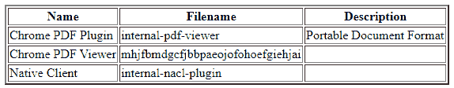
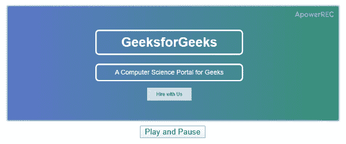

# 是 6 |多媒体

> 原文:[https://www.geeksforgeeks.org/es6-multimedia/](https://www.geeksforgeeks.org/es6-multimedia/)

JavaScript 多媒体基本上用于在 web 应用程序中包含任何电影、音频、文本和音乐等。要在 web 应用中使用这些多媒体对象 JavaScript 提供了一种方式，那就是被称为**的 JavaScript 多媒体**。在这种情况下，JavaScript 中的多媒体有一个导航器对象，该对象包括名为**插件**的子对象。这些插件是数组类型的，包含浏览器上安装的每个插件的一个条目。插件是扩展浏览器功能的小程序。

**插件:**使用 **<嵌入>** 和 **<对象>** 标签将其添加到 HTML 页面。

*   使用 **<嵌入>** 标签:

    ```
    <embed height="600" width="400" src="vd.mp4"> </embed>
    ```

*   使用 **<对象>** 标记:

    ```
    <object height="600" width="400" src="vd.mp4"> </object>
    ```

**属性值:**插件包含以下描述的一些属性:

*   **名称:**这是字段的名称。
*   **文件名:**这是正在执行以安装插件的文件的名称。
*   **描述:**是插件的描述。
*   **mimeTypes:** 它是一个数组，插件支持的每个 *MIME* 类型都有一个条目。

**查找浏览器中安装的所有插件:**

*   **程序:**

    ```
    <!DOCTYPE html>
    <html>

    <head>
        <title>
            Find all the plug-ins
            installed in a browser
        </title>
    </head>

    <body>
        <table border="2px" align ="center">
        <tr>
            <th>Name</th>
            <th>Filename</th>
            <th>Description</th>
        </tr>

        <script> 
            for (i = 0; i<navigator.plugins.length; i++) {

                // Row wise preinting
                document.write("<tr><td>"); 
                document.write(navigator.plugins[i].name);

                // Print name of the field 
                document.write("</td><td>"); 
                document.write(navigator.plugins[i].filename);

                // Print the executable filename
                document.write("</td><td>"); 
                document.write(navigator.plugins[i].description );

                // Print description of the plug-in 
                document.write("</td></tr>"); 
            } 
        </script> 
        </table>
    </body>

    </html>
    ```

    *   **Output:**
    

    **使用<视频>标签播放视频:**在这种情况下，我们需要添加播放、暂停按钮来播放和暂停视频。如果我们不添加这些按钮，那么视频就不会播放或暂停。 **<【视频】>** 标签仅用于在 HTML 页面的特定部分添加视频。

    *   **程序:**

        ```
        <!DOCTYPE html>
        <html>

        <head>
            <title>
                Playing a video using video tag
            </title>
        </head>

        <body>
            <script language="javascript">
                function playPause() {
                    var a = document.getElementsByTagName('video')[0];
                    if (a.paused)
                        a.play();
                    else
                        a.pause();
                }
            </script>

            <center>
                <video src=
         "https://media.geeksforgeeks.org/wp-content/uploads/20200110154656/20191210_115921.mp4"
                        width="600" height="200">
                </video>
                <br>

                <button type="button" onclick="playPause()">
                    Play and Pause
                </button>
            </center>
        </body>

        </html>
        ```

    *   **输出:**
        

    **使用<嵌入>标签播放视频:**在这种情况下，使用 **<嵌入>** 标签不需要添加任何类型的播放或暂停视频的按钮或选项。使用 **<嵌入>** 标签是自动在视频中添加播放或暂停按钮就像 **YouTube** 一样。所以这利用 **<嵌入>** 标签的优势。

    *   **程序:**

        ```
        <!DOCTYPE html>
        <html>

        <body>
            <center>
                <embed src=
        "https://media.geeksforgeeks.org/wp-content/uploads/20200110154656/20191210_115921.mp4" 
                       width="600" height="400">
            </center>
        </body>

        </html>
        ```

    *   **输出:** 

    **注意:**下面是另外两个不需要 JavaScript 的过程。

    **使用< iframe >标签播放视频:**我们还可以使用**T10】iframe>**标签在网页中链接 **YouTube** 视频。这是 **<嵌入>** 标签的一部分:

    *   **程序:**

        ```
        <!DOCTYPE html>
        <html>
        <body>
            <center>
                <iframe width="560" height="315" src=
        "https://www.youtube.com/embed/lcJzw0JGfeE" 
                        frameborder="0" allow="accelerometer; autoplay; 
                   encrypted-media; gyroscope; 
                   picture-in-picture" allowfullscreen></iframe>
            </center>
        </body>

        </html>
        ```

    *   **输出:** 